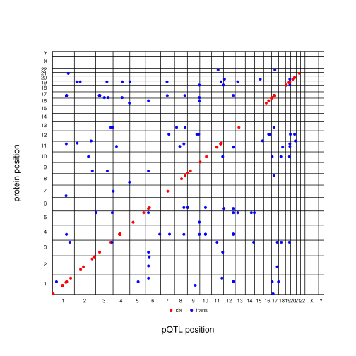

<!-- badges: start -->

[](https://github.com/jinghuazhao/pQTLtools/actions/workflows/pages/pages-build-deployment)
[](https://github.com/jinghuazhao/pQTLtools/actions/workflows/R-CMD-check.yaml)
<!-- badges: end -->

## A protein Quantitative Trait Locus toolkit

It seeds collection of data and utilities for pQTL analysis. At this
early stage, the repository contains 1. Articles linking functions for
cis/trans classification, 2d Manhattan plots, 2d/3d-plotly plots, forest
plots among others available from
[gap](https://github.com/jinghuazhao/R/tree/master/gap); 2. Query on
genes, regions, and SNPs via
[PhenoScanner](http://www.phenoscanner.medschl.cam.ac.uk/), adding
functionality to check for replication across platforms; 3. Downstream
analysis such as colocalization, pQTL-Mendelian Randomization via
[TwoSampleMR](https://github.com/MRCIEU/TwoSampleMR), linkage through
UniProt IDs to other resources; 4. Bioconductor notes and a showcase of
snakemake workflow.

## Installation

The latest version of pQTLtools can be installed as usual:

### 1. Install from R

``` r
if (!requireNamespace("remotes", quietly = TRUE)) install.packages("remotes")
remotes::install_github("jinghuazhao/pQTLtools")
```

### 2. Install from GitHub repository

``` bash
git clone https://github.com/jinghuazhao/pQTLtools
R CMD INSTALL pQTLtools
```

Dependencies are detailed in the DECRIPTION file of the package at
GitHub.

## A summary of functions

This can be seen from R with

``` r
library(help=pQTLtools)
```

or

``` r
library(pQTLtools)
?pQTLtools
```
