# Bioconductor notes

This article collects notes on Bioconductor packages, made available
here to faciliate their use and extensions.

``` r
pkgs <- c("AnnotationDbi", "AnnotationFilter", "ComplexHeatmap", "DESeq2", "EnsDb.Hsapiens.v86",
          "FlowSorted.DLPFC.450k", "GeneNet", "GenomicFeatures", "IlluminaHumanMethylation450kmanifest",
          "OUTRIDER","RColorBrewer", "RMariaDB", "Rgraphviz", "S4Vectors", "SummarizedExperiment",
          "TxDb.Hsapiens.UCSC.hg38.knownGene", "bladderbatch", "clusterProfiler",
          "corpcor", "doParallel", "ensembldb", "fdrtool", "graph", "graphite", "heatmaply",
          "minfi", "org.Hs.eg.db", "plyr", "quantro", "recount3", "sva")
es_pkgs <- c("Biobase", "arrayQualityMetrics", "dplyr", "knitr", "mclust", "pQTLtools", "rgl", "scatterplot3d")
se_pkgs <- c("BiocGenerics", "GenomicRanges", "IRanges", "MsCoreUtils", "SummarizedExperiment", "impute")
sp_pkgs <- c("Biostrings", "CAMERA", "MSnbase", "MSstats", "Spectra", "mzR", "protViz", "rawrr")
pkgs <- c(pkgs, es_pkgs,se_pkgs,sp_pkgs)
for (p in pkgs) if (length(grep(paste("^package:", p, "$", sep=""), search())) == 0) {
    if (!requireNamespace(p)) warning(paste0("This vignette needs package `", p, "'; please install"))
}
invisible(suppressMessages(lapply(pkgs, require, character.only = TRUE)))
```

## 1 liftover

See `inst/turboman`in the source,
<https://github.com/jinghuazhao/pQTLtools/tree/master/inst/turboman>, or
`turboman/` directory in the installed package.

## 2 ExpressionSet

We start with Bioconductor/Biobase’s ExpressionSet example and finish
with a real application.

``` r
dataDirectory <- system.file("extdata", package="Biobase")
exprsFile <- file.path(dataDirectory, "exprsData.txt")
exprs <- as.matrix(read.table(exprsFile, header=TRUE, sep="\t", row.names=1, as.is=TRUE))
pDataFile <- file.path(dataDirectory, "pData.txt")
pData <- read.table(pDataFile, row.names=1, header=TRUE, sep="\t")
all(rownames(pData)==colnames(exprs))
metadata <- data.frame(labelDescription=c("Patient gender",
                                          "Case/control status",
                                          "Tumor progress on XYZ scale"),
                       row.names=c("gender", "type", "score"))
phenoData <- Biobase::AnnotatedDataFrame(data=pData, varMetadata=metadata)
experimentData <- Biobase::MIAME(name="Pierre Fermat",
                                 lab="Francis Galton Lab",
                                 contact="pfermat@lab.not.exist",
                                 title="Smoking-Cancer Experiment",
                                 abstract="An example ExpressionSet",
                                 url="www.lab.not.exist",
                                 other=list(notes="Created from text files"))
exampleSet <- pQTLtools::make_ExpressionSet(exprs,phenoData,experimentData=experimentData,
                                            annotation="hgu95av2")
data(sample.ExpressionSet, package="Biobase")
identical(exampleSet,sample.ExpressionSet)
```

### 2.1 data.frame

The great benefit is to use the object directly as a data.frame.

``` r
lm.result <- Biobase::esApply(exampleSet,1,function(x) lm(score~gender+x))
beta.x <- unlist(lapply(lapply(lm.result,coef),"[",3))
beta.x[1]
#> AFFX-MurIL2_at.x 
#>    -0.0001907472
lm(score~gender+AFFX.MurIL2_at,data=exampleSet)
#> 
#> Call:
#> lm(formula = score ~ gender + AFFX.MurIL2_at, data = exampleSet)
#> 
#> Coefficients:
#>    (Intercept)      genderMale  AFFX.MurIL2_at  
#>      0.5531725       0.0098932      -0.0001907
```

### 2.2 Composite plots

We wish to examine the distribution of each feature via histogram,
scatter and boxplot. One could resort to `esApply()` for its simplicity
as before

``` r
invisible(Biobase::esApply(exampleSet[1:2],1,function(x)
                           {par(mfrow=c(3,1));boxplot(x);hist(x);plot(x)}
))
```

but it is nicer to add feature name in the title.

``` r
par(mfrow=c(1,3))
f <- Biobase::featureNames(exampleSet[1:2])
invisible(sapply(f,function(x) {
                     d <- t(Biobase::exprs(exampleSet[x]))
                     fn <- Biobase::featureNames(exampleSet[x])
                     hist(d,main="",xlab=fn); plot(d, ylab=fn); boxplot(d,ylab=fn)
                   }
          )
)
```

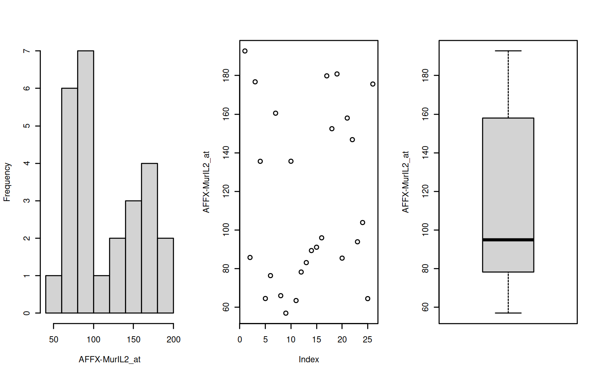

Figure 2.1: Histogram, scatter & boxplots

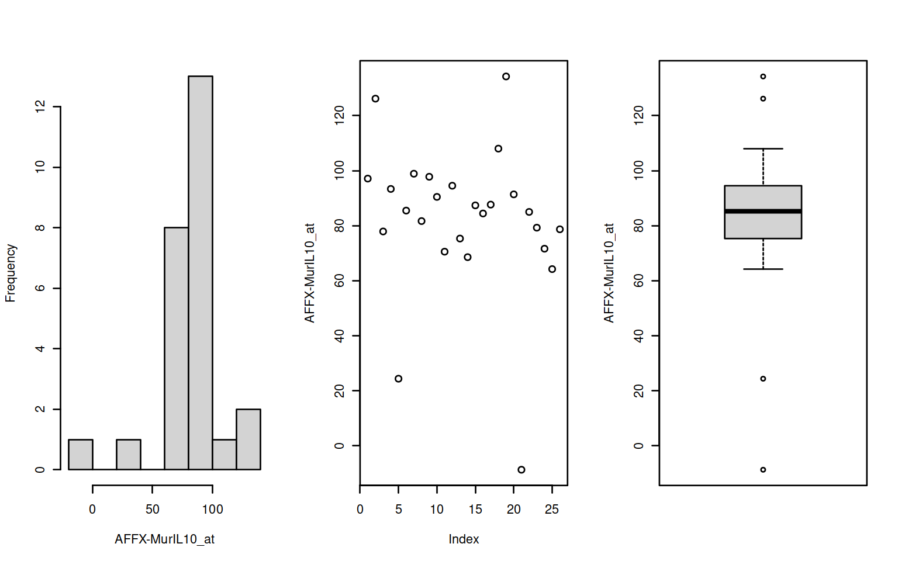

Figure 2.2: Histogram, scatter & boxplots

where the expression set is indexed using feature name(s).

### 2.3 Outlier detections

This illustrates one mechanism,

``` r
list_outliers <- function(es, method="upperquartile")
                 arrayQualityMetrics::outliers(exprs(es),method=method)
for (method in c("KS","sum","upperquartile"))
{
  ZWK_outliers <- list_outliers(protein_ZWK,method=method)
  print(ZWK_outliers@statistic[ZWK_outliers@which])
}
```

### 2.4 Clustering

We employ model-based clustering absed on principal compoents to see
potential groupings in the data,

``` r
  pca <- prcomp(na.omit(t(Biobase::exprs(exampleSet))), rank=10, scale=TRUE)
  pc1pc2pc3 <- with(pca,x)[,1:3]
  mc <- mclust::Mclust(pc1pc2pc3,G=3)
  with(mc, {
      cols <- c("blue","red", "purple")
      s3d <- scatterplot3d::scatterplot3d(with(pca,x[,c(2,1,3)]),
                                          color=cols[classification],
                                          pch=16,
                                          type="h",
                                          main="Plot of the PC1, PC2 and PC3")
      s3d.coords <- s3d$xyz.convert(with(pca,x[,c(2,1,3)]))
      text(s3d.coords$x, 
           s3d.coords$y,   
           cex = 1.2,
           col = cols[classification],
           labels = row.names(pc1pc2pc3),
           pos = 4)
      legend("right", legend=levels(as.factor(classification)), col=cols[classification], pch=16)
      rgl::open3d(width = 500, height = 500)
      rgl::plot3d(with(pca,x[,c(2,1,3)]),cex=1.2,col=cols[classification],size=5)
      rgl::text3d(with(pca,x[,c(2,1,3)]),cex=1.2,col=cols[classification],texts=row.names(pc1pc2pc3))
      widget <- rgl::rglwidget()
      htmlwidgets::saveWidget(widget, "mcpca3d.html")
  })
```

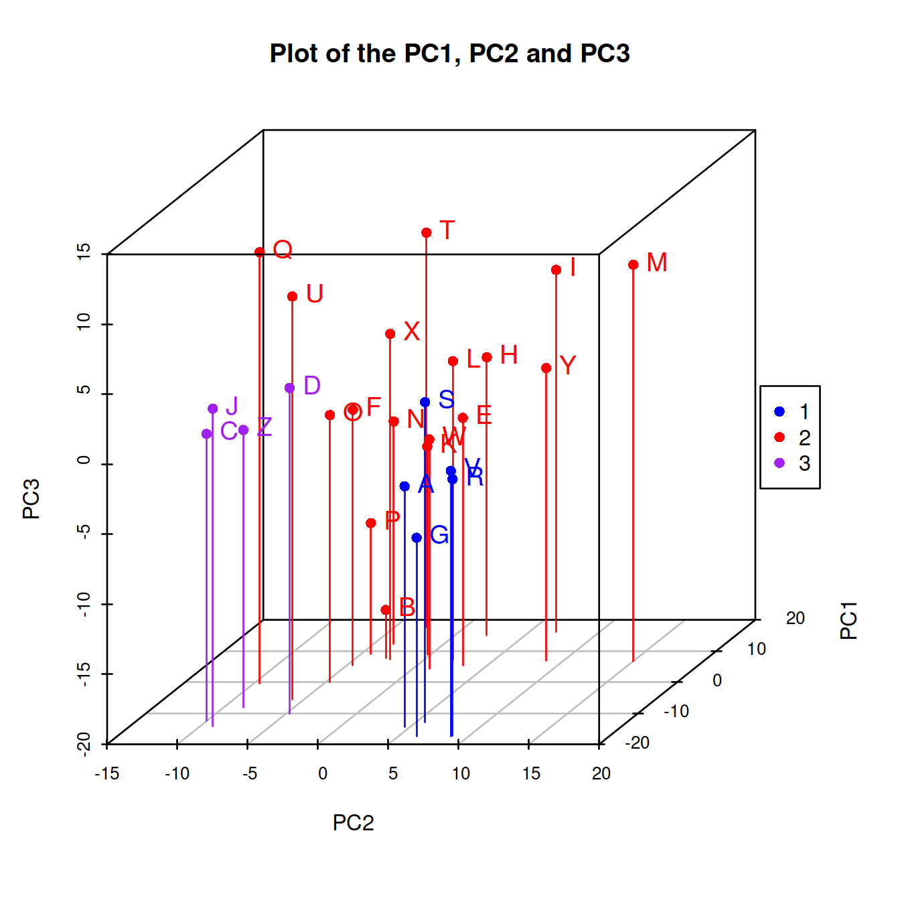

Figure 2.3: Three-group Clustering

    #> Warning in par3d(userMatrix = structure(c(1, 0, 0, 0, 0, 0.342020143325668, :
    #> parameter "width" cannot be set
    #> Warning in par3d(userMatrix = structure(c(1, 0, 0, 0, 0, 0.342020143325668, :
    #> parameter "height" cannot be set

An interactive version is also available,

### 2.5 Data transformation

Suppose we wish use log2 for those greater than zero but set those
negative values to be missing.

``` r
log2.na <- function(x) log2(ifelse(x>0, x, NA))
Biobase::exprs(exampleSet) <- log2.na(Biobase::exprs(exampleSet))
```

### 2.6 Limit of detection (LOD)

We generate a `lod.max` \~ U\[0,1\] variable to experiment

``` r
Biobase::fData(exampleSet)
#> data frame with 0 columns and 500 rows
Biobase::fData(exampleSet)$lod.max <- apply(Biobase::exprs(exampleSet),1,quantile,runif(nrow(exampleSet)))
lod <- pQTLtools::get.prop.below.LLOD(exampleSet)
x <- dplyr::arrange(Biobase::fData(lod),desc(pc.belowLOD.new))
knitr::kable(head(lod))
```

|     | AFFX.MurIL2_at | AFFX.MurIL10_at | AFFX.MurIL4_at | AFFX.MurFAS_at | AFFX.BioB.5_at | AFFX.BioB.M_at | gender | type    | score |
|:----|---------------:|----------------:|---------------:|---------------:|---------------:|---------------:|:-------|:--------|------:|
| A   |       192.7420 |        97.13700 |       45.81920 |       22.54450 |        96.7875 |        89.0730 | Female | Control |  0.75 |
| B   |        85.7533 |       126.19600 |        8.83135 |        3.60093 |        30.4380 |        25.8461 | Male   | Case    |  0.40 |
| C   |       176.7570 |        77.92160 |       33.06320 |       14.68830 |        46.1271 |        57.2033 | Male   | Control |  0.73 |
| D   |       135.5750 |        93.37130 |       28.70720 |       12.33970 |        70.9319 |        69.9766 | Male   | Case    |  0.42 |
| E   |        64.4939 |        24.39860 |        5.94492 |       36.86630 |        56.1744 |        49.5822 | Female | Case    |  0.93 |
| F   |        76.3569 |        85.50880 |       28.29250 |       11.25680 |        42.6756 |        26.1262 | Male   | Control |  0.22 |
| G   |       160.5050 |        98.90860 |       30.96940 |       23.00340 |        86.5156 |        75.0083 | Male   | Case    |  0.96 |
| H   |        65.9631 |        81.69320 |       14.79230 |       16.21340 |        30.7927 |        42.3352 | Male   | Case    |  0.79 |
| I   |        56.9039 |        97.80150 |       14.23990 |       12.03750 |        19.7183 |        41.1207 | Female | Case    |  0.37 |
| J   |       135.6080 |        90.48380 |       34.48740 |        4.54978 |        46.3520 |        91.5307 | Male   | Control |  0.63 |
| K   |        63.4432 |        70.57330 |       20.35210 |        8.51782 |        39.1326 |        39.9136 | Male   | Case    |  0.26 |
| L   |        78.2126 |        94.54180 |       14.15540 |       27.28520 |        41.7698 |        49.8397 | Female | Control |  0.36 |
| M   |        83.0943 |        75.34550 |       20.62510 |       10.16160 |        80.2197 |        63.4794 | Male   | Case    |  0.41 |
| N   |        89.3372 |        68.58270 |       15.92310 |       20.24880 |        36.4903 |        24.7007 | Male   | Case    |  0.80 |
| O   |        91.0615 |        87.40500 |       20.15790 |       15.78490 |        36.4021 |        47.4641 | Female | Case    |  0.10 |
| P   |        95.9377 |        84.45810 |       27.81390 |       14.32760 |        35.3054 |        47.3578 | Female | Control |  0.41 |
| Q   |       179.8450 |        87.68060 |       32.79110 |       15.94880 |        58.6239 |        58.1331 | Female | Case    |  0.16 |
| R   |       152.4670 |       108.03200 |       33.52920 |       14.67530 |       114.0620 |       104.1220 | Male   | Control |  0.72 |
| S   |       180.8340 |       134.26300 |       19.81720 |       -7.91911 |        93.4402 |       115.8310 | Male   | Case    |  0.17 |
| T   |        85.4146 |        91.40310 |       20.41900 |       12.88750 |        22.5168 |        58.1224 | Female | Case    |  0.74 |
| U   |       157.9890 |        -8.68811 |       26.87200 |       11.91860 |        48.6462 |        73.4221 | Male   | Control |  0.35 |
| V   |       146.8000 |        85.02120 |       31.14880 |       12.83240 |        90.2215 |        64.6066 | Female | Control |  0.77 |
| W   |        93.8829 |        79.29980 |       22.34200 |       11.13900 |        42.0053 |        40.3068 | Male   | Control |  0.27 |
| X   |       103.8550 |        71.65520 |       19.01350 |        7.55564 |        57.5738 |        41.8209 | Male   | Control |  0.98 |
| Y   |        64.4340 |        64.23690 |       12.16860 |       19.98490 |        44.8216 |        46.1087 | Female | Case    |  0.94 |
| Z   |       175.6150 |        78.70680 |       17.37800 |        8.96849 |        61.7044 |        49.4122 | Female | Case    |  0.32 |

``` r
plot(x[,2], main="Random quantile cutoff", ylab="<lod%")
```

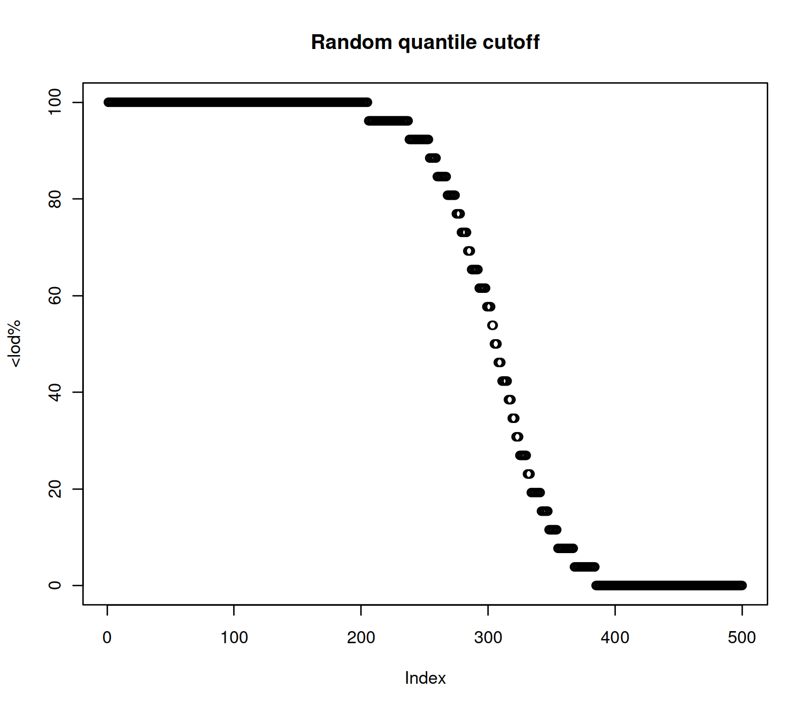

Figure 2.4: LOD based on a random cutoff

The quantity has been shown to have a big impact on protein abundance
and therefore pQTL detection as is shown with a real example.

``` r
rm(list=ls())
dir <- "~/rds/post_qc_data/interval/phenotype/olink_proteomics/post-qc/"
eset <- readRDS(paste0(dir,"eset.inf1.flag.out.outlier.in.rds"))
x <- pQTLtools::get.prop.below.LLOD(eset)
annot <- Biobase::fData(x)
annot$MissDataProp <- as.numeric(gsub("\\%$", "", annot$MissDataProp))
plot(annot$MissDataProp, annot$pc.belowLOD.new, xlab="% <LLOD in Original",
     ylab="% <LLOD in post QC dataset", pch=19)
INF <- Sys.getenv("INF")
np <- read.table(paste(INF, "work", "INF1.merge.nosig", sep="/"), header=FALSE,
                 col.names = c("prot", "uniprot"))
kable(np, caption="Proteins with no pQTL")
annot$pQTL <- rep(NA, nrow(annot))
no.pQTL.ind <- which(annot$uniprot.id %in% np$uniprot)
annot$pQTL[no.pQTL.ind] <- "red"
annot$pQTL[-no.pQTL.ind] <- "blue"
annot <- annot[order(annot$pc.belowLOD.new, decreasing = TRUE),]
annot <- annot[-grep("^BDNF$", annot$ID),]
saveRDS(annot,file=file.path("~","pQTLtools","tests","annot.RDS"))
```

``` r
annot <- readRDS(file.path(find.package("pQTLtools"),"tests","annot.RDS")) %>%
         dplyr::left_join(pQTLdata::inf1[c("prot","target.short","alt_name")],by=c("ID"="prot")) %>%
         dplyr::mutate(prot=if_else(is.na(alt_name),target.short,alt_name),order=1:n()) %>%
         dplyr::arrange(desc(order))
xtick <- seq(1, nrow(annot))
attach(annot)
par(mar=c(10,5,1,1))
plot(100-pc.belowLOD.new,cex=2,pch=19,col=pQTL,xaxt="n",xlab="",ylab="",cex.axis=0.8)
text(66,16,"IL-17C",offset=0,pos=2,cex=1.5,font=2,srt=0)
arrows(67,16,71,16,lwd=2)
axis(1, at=xtick, labels=prot, lwd.tick=0.5, lwd=0, las=2, hadj=1, cex.axis=0.8)
mtext("% samples above LLOD",side=2,line=2.5,cex=1.2)
mtext("Ordered protein",side=1,line=6.5,cex=1.2,font=1)
legend(x=1,y=25,c("without pQTL","with pQTL"),box.lwd=0,cex=2,col=c("red","blue"),pch=19)
```

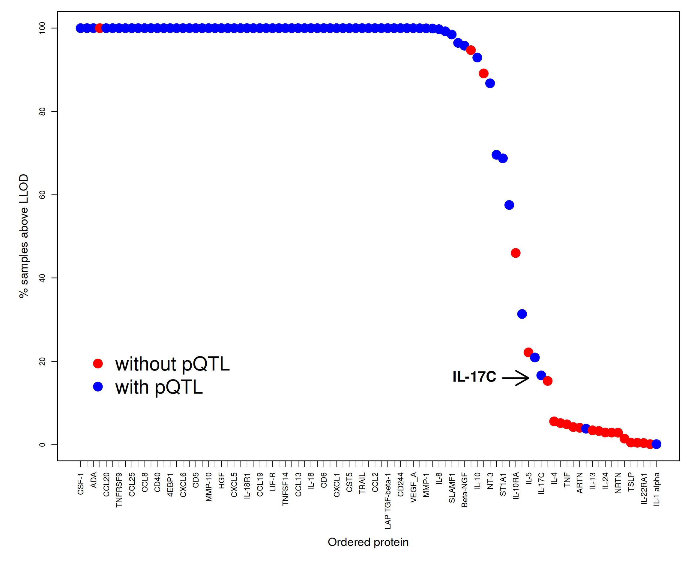

Figure 2.5: LOD in SCALLOP-INF/INTERVAL

``` r
detach(annot)
knitr::kable(annot,caption="Summary statistics",row.names=FALSE)
```

| ID             | dichot | olink.id           | uniprot.id | lod.max | MissDataProp | pc.belowLOD.new | pQTL | target.short   | alt_name | prot           | order |
|:---------------|:-------|:-------------------|:-----------|--------:|-------------:|----------------:|:-----|:---------------|:---------|:---------------|------:|
| CSF.1          | FALSE  | 196_CSF-1          | P09603     |    1.02 |         0.02 |       0.0000000 | blue | CSF-1          | NA       | CSF-1          |    91 |
| TNFB           | FALSE  | 195_TNFB           | P01374     |    1.10 |         0.04 |       0.0000000 | blue | TNFB           | NA       | TNFB           |    90 |
| ADA            | FALSE  | 194_ADA            | P00813     |    1.80 |         0.04 |       0.0000000 | blue | ADA            | NA       | ADA            |    89 |
| STAMPB         | FALSE  | 192_STAMPB         | O95630     |    1.40 |         0.06 |       0.0000000 | red  | STAMPB         | NA       | STAMPB         |    88 |
| CCL20          | FALSE  | 190_CCL20          | P78556     |    1.42 |         0.02 |       0.0000000 | blue | CCL20          | NA       | CCL20          |    87 |
| TWEAK          | FALSE  | 189_TWEAK          | O43508     |    1.78 |         0.02 |       0.0000000 | blue | TWEAK          | NA       | TWEAK          |    86 |
| TNFRSF9        | FALSE  | 187_TNFRSF9        | Q07011     |    1.86 |         0.02 |       0.0000000 | blue | TNFRSF9        | NA       | TNFRSF9        |    85 |
| CX3CL1         | FALSE  | 186_CX3CL1         | P78423     |    1.76 |         0.02 |       0.0000000 | blue | CX3CL1         | NA       | CX3CL1         |    84 |
| CCL25          | FALSE  | 185_CCL25          | O15444     |    1.32 |         0.02 |       0.0000000 | blue | CCL25          | NA       | CCL25          |    83 |
| CASP.8         | FALSE  | 184_CASP-8         | Q14790     |    1.38 |         0.04 |       0.0000000 | blue | CASP-8         | NA       | CASP-8         |    82 |
| MCP.2          | FALSE  | 183_MCP-2          | P80075     |    2.10 |         0.02 |       0.0000000 | blue | MCP-2          | CCL8     | CCL8           |    81 |
| FGF.19         | FALSE  | 179_FGF-19         | O95750     |    1.25 |         0.02 |       0.0000000 | blue | FGF-19         | NA       | FGF-19         |    80 |
| CD40           | FALSE  | 176_CD40           | P25942     |    1.91 |         0.04 |       0.0000000 | blue | CD40           | NA       | CD40           |    79 |
| DNER           | FALSE  | 174_DNER           | Q8NFT8     |    1.63 |         0.02 |       0.0000000 | blue | DNER           | NA       | DNER           |    78 |
| 4E.BP1         | FALSE  | 170_4E-BP1         | Q13541     |    1.04 |         0.10 |       0.0000000 | blue | 4EBP1          | NA       | 4EBP1          |    77 |
| CXCL10         | FALSE  | 169_CXCL10         | P02778     |    2.03 |         0.02 |       0.0000000 | blue | CXCL10         | NA       | CXCL10         |    76 |
| CXCL6          | FALSE  | 168_CXCL6          | P80162     |    1.80 |         0.02 |       0.0000000 | blue | CXCL6          | CXCL6    | CXCL6          |    75 |
| Flt3L          | FALSE  | 167_Flt3L          | P49771     |    2.12 |         0.02 |       0.0000000 | blue | FIt3L          | NA       | FIt3L          |    74 |
| CD5            | FALSE  | 165_CD5            | P06127     |    1.42 |         0.02 |       0.0000000 | blue | CD5            | NA       | CD5            |    73 |
| CCL23          | FALSE  | 164_CCL23          | P55773     |    2.10 |         0.02 |       0.0000000 | blue | CCL23          | NA       | CCL23          |    72 |
| MMP.10         | FALSE  | 161_MMP-10         | P09238     |    1.56 |         0.02 |       0.0000000 | blue | MMP-10         | NA       | MMP-10         |    71 |
| IL.12B         | FALSE  | 157_IL-12B         | P29460     |    0.85 |         0.02 |       0.0000000 | blue | IL-12B         | NA       | IL-12B         |    70 |
| HGF            | FALSE  | 156_HGF            | P14210     |    1.77 |         0.02 |       0.0000000 | blue | HGF            | NA       | HGF            |    69 |
| TRANCE         | FALSE  | 155_TRANCE         | O14788     |    1.51 |         0.04 |       0.0000000 | blue | TRANCE         | NA       | TRANCE         |    68 |
| CXCL5          | FALSE  | 154_CXCL5          | P42830     |    1.92 |         0.02 |       0.0000000 | blue | CXCL5          | NA       | CXCL5          |    67 |
| PD.L1          | FALSE  | 152_PD-L1          | Q9NZQ7     |    2.14 |         0.04 |       0.0000000 | blue | PD-L1          | NA       | PD-L1          |    66 |
| IL.18R1        | FALSE  | 151_IL-18R1        | Q13478     |    1.21 |         0.02 |       0.0000000 | blue | IL-18R1        | NA       | IL-18R1        |    65 |
| IL.10RB        | FALSE  | 149_IL-10RB        | Q08334     |    1.72 |         0.02 |       0.0000000 | blue | IL10RB         | NA       | IL10RB         |    64 |
| CCL19          | FALSE  | 145_CCL19          | Q99731     |    2.13 |         0.02 |       0.0000000 | blue | CCL19          | NA       | CCL19          |    63 |
| FGF.21         | FALSE  | 144_FGF-21         | Q9NSA1     |    1.14 |         0.02 |       0.0000000 | blue | FGF-21         | NA       | FGF-21         |    62 |
| LIF.R          | FALSE  | 143_LIF-R          | P42702     |    2.08 |         0.04 |       0.0000000 | blue | LIF-R          | NA       | LIF-R          |    61 |
| FGF.23         | FALSE  | 139_FGF-23         | Q9GZV9     |    0.66 |         0.04 |       0.0000000 | blue | FGF-23         | NA       | FGF-23         |    60 |
| TNFSF14        | FALSE  | 138_TNFSF14        | O43557     |    1.81 |         0.02 |       0.0000000 | blue | TNFSF14        | NA       | TNFSF14        |    59 |
| CCL11          | FALSE  | 137_CCL11          | P51671     |    2.09 |         0.02 |       0.0000000 | blue | CCL11          | CCL11    | CCL11          |    58 |
| MCP.4          | FALSE  | 136_MCP-4          | Q99616     |    0.56 |         0.04 |       0.0000000 | blue | MCP-4          | CCL13    | CCL13          |    57 |
| TGF.alpha      | FALSE  | 135_TGF-alpha      | P01135     |    0.07 |         0.02 |       0.0000000 | blue | TGF-alpha      | NA       | TGF-alpha      |    56 |
| IL.18          | FALSE  | 133_IL-18          | Q14116     |    2.79 |         0.02 |       0.0000000 | blue | IL-18          | NA       | IL-18          |    55 |
| SCF            | FALSE  | 132_SCF            | P21583     |    2.30 |         0.02 |       0.0000000 | blue | SCF            | NA       | SCF            |    54 |
| CD6            | FALSE  | 131_CD6            | Q8WWJ7     |    1.78 |         0.04 |       0.0000000 | blue | CD6            | NA       | CD6            |    53 |
| CCL4           | FALSE  | 130_CCL4           | P13236     |    2.15 |         0.02 |       0.0000000 | blue | CCL4           | NA       | CCL4           |    52 |
| CXCL1          | FALSE  | 128_CXCL1          | P09341     |    3.45 |         0.02 |       0.0000000 | blue | CXCL1          | NA       | CXCL1          |    51 |
| OSM            | FALSE  | 126_OSM            | P13725     |    1.32 |         0.06 |       0.0000000 | blue | OSM            | NA       | OSM            |    50 |
| CST5           | FALSE  | 123_CST5           | P28325     |    4.34 |         0.04 |       0.0000000 | blue | CST5           | NA       | CST5           |    49 |
| CXCL9          | FALSE  | 122_CXCL9          | Q07325     |    1.04 |         0.02 |       0.0000000 | blue | CXCL9          | NA       | CXCL9          |    48 |
| TRAIL          | FALSE  | 120_TRAIL          | P50591     |    1.22 |         0.02 |       0.0000000 | blue | TRAIL          | NA       | TRAIL          |    47 |
| CXCL11         | FALSE  | 117_CXCL11         | O14625     |    1.40 |         0.02 |       0.0000000 | blue | CXCL11         | NA       | CXCL11         |    46 |
| MCP.1          | FALSE  | 115_MCP-1          | P13500     |    1.90 |         0.02 |       0.0000000 | blue | MCP-1          | CCL2     | CCL2           |    45 |
| uPA            | FALSE  | 112_uPA            | P00749     |    1.75 |         0.02 |       0.0000000 | blue | uPA            | NA       | uPA            |    44 |
| LAP.TGF.beta.1 | FALSE  | 111_LAP TGF-beta-1 | P01137     |    0.86 |         0.02 |       0.0000000 | blue | LAP TGF-beta-1 | NA       | LAP TGF-beta-1 |    43 |
| OPG            | FALSE  | 110_OPG            | O00300     |    1.81 |         0.02 |       0.0000000 | blue | OPG            | NA       | OPG            |    42 |
| CD244          | FALSE  | 108_CD244          | Q9BZW8     |    1.09 |         0.02 |       0.0000000 | blue | CD244          | NA       | CD244          |    41 |
| CDCP1          | FALSE  | 107_CDCP1          | Q9H5V8     |    0.21 |         0.04 |       0.0000000 | blue | CDCP1          | NA       | CDCP1          |    40 |
| VEGF.A         | FALSE  | 102_VEGF-A         | P15692     |    3.15 |         0.02 |       0.0000000 | blue | VEGF_A         | NA       | VEGF_A         |    39 |
| MIP.1.alpha    | FALSE  | 166_MIP-1 alpha    | P10147     |    1.92 |         0.06 |       0.0203998 | blue | MIP-1 alpha    | NA       | MIP-1 alpha    |    38 |
| MMP.1          | FALSE  | 142_MMP-1          | P03956     |    1.89 |         0.06 |       0.0407997 | blue | MMP-1          | NA       | MMP-1          |    37 |
| SIRT2          | FALSE  | 172_SIRT2          | Q8IXJ6     |    1.52 |         1.00 |       0.0815993 | blue | SIRT2          | NA       | SIRT2          |    36 |
| IL.8           | FALSE  | 101_IL-8           | P10145     |    3.17 |         0.25 |       0.2447980 | blue | IL-8           | NA       | IL-8           |    35 |
| IL.7           | FALSE  | 109_IL-7           | P13232     |    1.39 |         1.43 |       0.7547940 | blue | IL-7           | NA       | IL-7           |    34 |
| SLAMF1         | FALSE  | 134_SLAMF1         | Q13291     |    1.55 |         2.13 |       1.5299878 | blue | SLAMF1         | NA       | SLAMF1         |    33 |
| EN.RAGE        | FALSE  | 175_EN-RAGE        | P80511     |    1.57 |         3.28 |       3.5291718 | blue | EN-RAGE        | NA       | EN-RAGE        |    32 |
| Beta.NGF       | FALSE  | 153_Beta-NGF       | P01138     |    1.23 |         3.96 |       4.2227662 | blue | Beta-NGF       | NA       | Beta-NGF       |    31 |
| CCL28          | FALSE  | 173_CCL28          | Q9NRJ3     |    0.92 |         5.49 |       5.2835577 | red  | CCL28          | NA       | CCL28          |    30 |
| IL.10          | FALSE  | 162_IL-10          | P22301     |    1.50 |         7.71 |       7.0583435 | blue | IL-10          | NA       | IL-10          |    29 |
| AXIN1          | FALSE  | 118_AXIN1          | O15169     |    1.30 |        13.04 |      10.8731130 | red  | AXIN1          | NA       | AXIN1          |    28 |
| NT.3           | FALSE  | 188_NT-3           | P20783     |    0.85 |        12.77 |      13.2394941 | blue | NT-3           | NA       | NT-3           |    27 |
| FGF.5          | FALSE  | 141_FGF-5          | Q8NF90     |    1.00 |        31.71 |      30.3957568 | blue | FGF-5          | NA       | FGF-5          |    26 |
| ST1A1          | FALSE  | 191_ST1A1          | P50225     |    1.34 |        32.68 |      31.2525500 | blue | ST1A1          | NA       | ST1A1          |    25 |
| GDNF           | FALSE  | 106_GDNF           | P39905     |    1.13 |        43.26 |      42.4520604 | blue | hGDNF          | NA       | hGDNF          |    24 |
| IL.10RA        | FALSE  | 140_IL-10RA        | Q13651     |    1.14 |        53.30 |      53.9779682 | red  | IL-10RA        | NA       | IL-10RA        |    23 |
| IL.6           | FALSE  | 113_IL-6           | P05231     |    1.97 |        69.06 |      68.6250510 | blue | IL-6           | NA       | IL-6           |    22 |
| IL.5           | FALSE  | 193_IL-5           | P05113     |    1.55 |        78.21 |      77.8457772 | red  | IL-5           | NA       | IL-5           |    21 |
| MCP.3          | FALSE  | 105_MCP-3          | P80098     |    1.31 |        79.30 |      79.0697674 | blue | MCP-3          | CCL7     | CCL7           |    20 |
| IL.17C         | FALSE  | 114_IL-17C         | Q9P0M4     |    1.28 |        83.07 |      83.3741330 | blue | IL-17C         | NA       | IL-17C         |    19 |
| IL.17A         | FALSE  | 116_IL-17A         | Q16552     |    0.97 |        84.73 |      84.7001224 | red  | IL-17A         | NA       | IL-17A         |    18 |
| IL.4           | FALSE  | 180_IL-4           | P05112     |    1.11 |        93.91 |      94.4104447 | red  | IL-4           | NA       | IL-4           |    17 |
| LIF            | FALSE  | 181_LIF            | P15018     |    1.45 |        94.90 |      94.8184415 | red  | LIF            | NA       | LIF            |    16 |
| TNF            | FALSE  | 163_TNF            | P01375     |    1.19 |        95.22 |      95.1244390 | red  | TNF            | NA       | TNF            |    15 |
| IL.20RA        | FALSE  | 121_IL-20RA        | Q9UHF4     |    0.79 |        95.16 |      95.7772338 | red  | IL-20RA        | NA       | IL-20RA        |    14 |
| ARTN           | FALSE  | 160_ARTN           | Q5T4W7     |    0.73 |        95.84 |      95.9404325 | red  | ARTN           | NA       | ARTN           |    13 |
| IL.15RA        | FALSE  | 148_IL-15RA        | Q13261     |    1.18 |        96.10 |      96.1648307 | blue | IL-15RA        | NA       | IL-15RA        |    12 |
| IL.13          | FALSE  | 159_IL-13          | P35225     |    1.71 |        96.51 |      96.5524276 | red  | IL-13          | NA       | IL-13          |    11 |
| IL.20          | FALSE  | 171_IL-20          | Q9NYY1     |    1.30 |        96.72 |      96.7156263 | red  | IL-20          | NA       | IL-20          |    10 |
| IL.24          | FALSE  | 158_IL-24          | Q13007     |    1.95 |        97.13 |      97.0828233 | red  | IL-24          | NA       | IL-24          |     9 |
| IL.2RB         | FALSE  | 124_IL-2RB         | P14784     |    1.47 |        97.11 |      97.1032232 | red  | IL-2RB         | NA       | IL-2RB         |     8 |
| NRTN           | FALSE  | 182_NRTN           | Q99748     |    1.39 |        97.11 |      97.1236230 | red  | NRTN           | NA       | NRTN           |     7 |
| IL.33          | FALSE  | 177_IL-33          | O95760     |    1.17 |        98.54 |      98.5516116 | red  | IL-33          | NA       | IL-33          |     6 |
| TSLP           | FALSE  | 129_TSLP           | Q969D9     |    1.80 |        99.49 |      99.4900041 | red  | TSLP           | NA       | TSLP           |     5 |
| IFN.gamma      | FALSE  | 178_IFN-gamma      | P01579     |    1.40 |        99.53 |      99.5308038 | red  | IFN-gamma      | NA       | IFN-gamma      |     4 |
| IL.22.RA1      | FALSE  | 150_IL-22 RA1      | Q8N6P7     |    1.79 |        99.61 |      99.6124031 | red  | IL-22RA1       | NA       | IL-22RA1       |     3 |
| IL.2           | FALSE  | 127_IL-2           | P60568     |    0.93 |        99.86 |      99.8776010 | red  | IL-2           | NA       | IL-2           |     2 |
| IL.1.alpha     | FALSE  | 125_IL-1 alpha     | P01583     |    4.76 |        99.88 |      99.8776010 | blue | IL-1 alpha     | NA       | IL-1 alpha     |     1 |

Table 2.1: Summary statistics

### 2.7 maEndtoEnd

Web:
<https://bioconductor.org/packages/release/workflows/html/maEndToEnd.html>.

Examples can be found on PCA, heatmap, normalisation, linear models, and
enrichment analysis from this Bioconductor package.

## 3 SummarizedExperiment

This is a more modern construct. Based on the documentation example,
ranged summarized experiment (rse) and imputation are shown below.

``` r
set.seed(123)
nrows <- 20
ncols <- 4
counts <- matrix(runif(nrows * ncols, 1, 1e4), nrows)
missing_indices <- sample(length(counts), size = 5, replace = FALSE)
counts[missing_indices] <- NA
rowRanges <- GenomicRanges::GRanges(rep(c("chr1", "chr2"), c(1, 3) * nrows / 4),
                            IRanges::IRanges(floor(runif(nrows, 1e5, 1e6)), width=ncols),
                            strand=sample(c("+", "-"), nrows, TRUE),
                            feature_id=sprintf("ID%03d", 1:nrows))
colData <- S4Vectors::DataFrame(Treatment=rep(c("ChIP", "Input"), ncols/2),
                                row.names=LETTERS[1:ncols])
rse <- SummarizedExperiment::SummarizedExperiment(assays=S4Vectors::SimpleList(counts=counts),
                                                  rowRanges=rowRanges, colData=colData)
SummarizedExperiment::assay(rse)
#>               A         B         C           D
#>  [1,] 2876.4876 8895.5036 1428.8574 6651.486831
#>  [2,] 7883.2630 6928.3413 4146.0488  949.311769
#>  [3,] 4090.3602 6405.4276 4137.8295 3840.312408
#>  [4,] 8830.2910 9942.7035 3689.0857 2744.562062
#>  [5,] 9404.7324 6557.4023 1525.2950 8146.585749
#>  [6,]        NA 7085.5962 1388.9218 4485.714898
#>  [7,] 5281.5268 5441.1162 2331.1080 8100.833466
#>  [8,] 8924.2980 5941.8261 4660.1585 8124.082706
#>  [9,] 5514.7987 2892.3082 2660.4604 7943.628869
#> [10,] 4566.6907 1471.9894        NA 4398.877044
#> [11,] 9568.3766        NA  459.2658 7544.997111
#> [12,] 4533.8882 9023.0882 4422.5585          NA
#> [13,] 6776.0288 6907.3621 7989.4495 7102.113831
#> [14,] 5726.7614 7954.8787 1219.8707    7.247108
#> [15,] 1030.1439  247.1122 5609.9189 4753.690424
#> [16,] 8998.3499 4778.4819 2066.1074 2201.968733
#> [17,] 2461.6313 7584.8369 1276.1890 3798.785561
#> [18,]  421.5533 2164.8630 7533.3253 6128.097262
#> [19,] 3279.8793        NA 8950.5585 3518.627295
#> [20,] 9545.0820 2317.0262 3745.2533 1112.243108
imputed <- MsCoreUtils::impute_knn(as.matrix(SummarizedExperiment::assay(rse)),2)
imputed_counts <- MsCoreUtils::impute_RF(as.matrix(SummarizedExperiment::assay(rse)),2)
imputed-imputed_counts
#>              A          B        C        D
#>  [1,]    0.000     0.0000    0.000    0.000
#>  [2,]    0.000     0.0000    0.000    0.000
#>  [3,]    0.000     0.0000    0.000    0.000
#>  [4,]    0.000     0.0000    0.000    0.000
#>  [5,]    0.000     0.0000    0.000    0.000
#>  [6,] 1661.249     0.0000    0.000    0.000
#>  [7,]    0.000     0.0000    0.000    0.000
#>  [8,]    0.000     0.0000    0.000    0.000
#>  [9,]    0.000     0.0000    0.000    0.000
#> [10,]    0.000     0.0000 1632.214    0.000
#> [11,]    0.000 -1253.3641    0.000    0.000
#> [12,]    0.000     0.0000    0.000 3109.097
#> [13,]    0.000     0.0000    0.000    0.000
#> [14,]    0.000     0.0000    0.000    0.000
#> [15,]    0.000     0.0000    0.000    0.000
#> [16,]    0.000     0.0000    0.000    0.000
#> [17,]    0.000     0.0000    0.000    0.000
#> [18,]    0.000     0.0000    0.000    0.000
#> [19,]    0.000   745.3773    0.000    0.000
#> [20,]    0.000     0.0000    0.000    0.000
SummarizedExperiment::assays(rse) <- S4Vectors::SimpleList(counts=imputed_counts)
SummarizedExperiment::assay(rse)
#>               A         B         C           D
#>  [1,] 2876.4876 8895.5036 1428.8574 6651.486831
#>  [2,] 7883.2630 6928.3413 4146.0488  949.311769
#>  [3,] 4090.3602 6405.4276 4137.8295 3840.312408
#>  [4,] 8830.2910 9942.7035 3689.0857 2744.562062
#>  [5,] 9404.7324 6557.4023 1525.2950 8146.585749
#>  [6,] 5337.3847 7085.5962 1388.9218 4485.714898
#>  [7,] 5281.5268 5441.1162 2331.1080 8100.833466
#>  [8,] 8924.2980 5941.8261 4660.1585 8124.082706
#>  [9,] 5514.7987 2892.3082 2660.4604 7943.628869
#> [10,] 4566.6907 1471.9894 4972.0817 4398.877044
#> [11,] 9568.3766 6089.8420  459.2658 7544.997111
#> [12,] 4533.8882 9023.0882 4422.5585 3970.354132
#> [13,] 6776.0288 6907.3621 7989.4495 7102.113831
#> [14,] 5726.7614 7954.8787 1219.8707    7.247108
#> [15,] 1030.1439  247.1122 5609.9189 4753.690424
#> [16,] 8998.3499 4778.4819 2066.1074 2201.968733
#> [17,] 2461.6313 7584.8369 1276.1890 3798.785561
#> [18,]  421.5533 2164.8630 7533.3253 6128.097262
#> [19,] 3279.8793 5119.1973 8950.5585 3518.627295
#> [20,] 9545.0820 2317.0262 3745.2533 1112.243108
SummarizedExperiment::assays(rse) <- S4Vectors::endoapply(SummarizedExperiment::assays(rse), asinh)
SummarizedExperiment::assay(rse)
#>              A        B        C        D
#>  [1,] 8.657472 9.786448 7.957778 9.495743
#>  [2,] 9.665644 9.536523 9.023058 7.548885
#>  [3,] 9.009536 9.458048 9.021074 8.946456
#>  [4,] 9.779090 9.897741 8.906281 8.610524
#>  [5,] 9.842115 9.481497 8.023090 9.698501
#>  [6,] 9.275638 9.558966 7.929430 9.101800
#>  [7,] 9.265118 9.294887 8.447246 9.692869
#>  [8,] 9.789680 9.382919 9.139952 9.695735
#>  [9,] 9.308338 8.662957 8.579402 9.673273
#> [10,] 9.119691 7.987517 9.204741 9.082252
#> [11,] 9.859366 9.407525 6.822778 9.621787
#> [12,] 9.112482 9.800689 9.087621 8.979758
#> [13,] 9.514294 9.533490 9.679024 9.561295
#> [14,] 9.346053 9.674688 7.799647 2.678476
#> [15,] 7.630601 6.202994 9.325439 9.159824
#> [16,] 9.797944 9.165025 8.326569 8.390254
#> [17,] 8.501727 9.627054 7.844781 8.935584
#> [18,] 6.737095 8.373260 9.620239 9.413787
#> [19,] 8.788709 9.233900 9.792618 8.858973
#> [20,] 9.856929 8.441187 8.921392 7.707281

SummarizedExperiment::rowRanges(rse)
#> GRanges object with 20 ranges and 1 metadata column:
#>        seqnames        ranges strand |  feature_id
#>           <Rle>     <IRanges>  <Rle> | <character>
#>    [1]     chr1 409164-409167      - |       ID001
#>    [2]     chr1 691082-691085      + |       ID002
#>    [3]     chr1 388335-388338      + |       ID003
#>    [4]     chr1 268922-268925      - |       ID004
#>    [5]     chr1 804064-804067      - |       ID005
#>    ...      ...           ...    ... .         ...
#>   [16]     chr2 647861-647864      + |       ID016
#>   [17]     chr2 469620-469623      + |       ID017
#>   [18]     chr2 232385-232388      + |       ID018
#>   [19]     chr2 941769-941772      - |       ID019
#>   [20]     chr2 371106-371109      + |       ID020
#>   -------
#>   seqinfo: 2 sequences from an unspecified genome; no seqlengths
SummarizedExperiment::rowData(rse)
#> DataFrame with 20 rows and 1 column
#>      feature_id
#>     <character>
#> 1         ID001
#> 2         ID002
#> 3         ID003
#> 4         ID004
#> 5         ID005
#> ...         ...
#> 16        ID016
#> 17        ID017
#> 18        ID018
#> 19        ID019
#> 20        ID020
SummarizedExperiment::colData(rse)
#> DataFrame with 4 rows and 1 column
#>     Treatment
#>   <character>
#> A        ChIP
#> B       Input
#> C        ChIP
#> D       Input
```

## 4 Normalisation

### 4.1 ComBat

This is the documentation example, based on Bioconductor 3.14.

``` r
data(bladderdata, package="bladderbatch")
edat <- bladderEset[1:50]

pheno <- Biobase::pData(edat)
batch <- pheno$batch
table(batch)
#> batch
#>  1  2  3  4  5 
#> 11 18  4  5 19
quantro::matboxplot(edat,batch,cex.axis=0.6,notch=TRUE,pch=19,ylab="Expression")
```

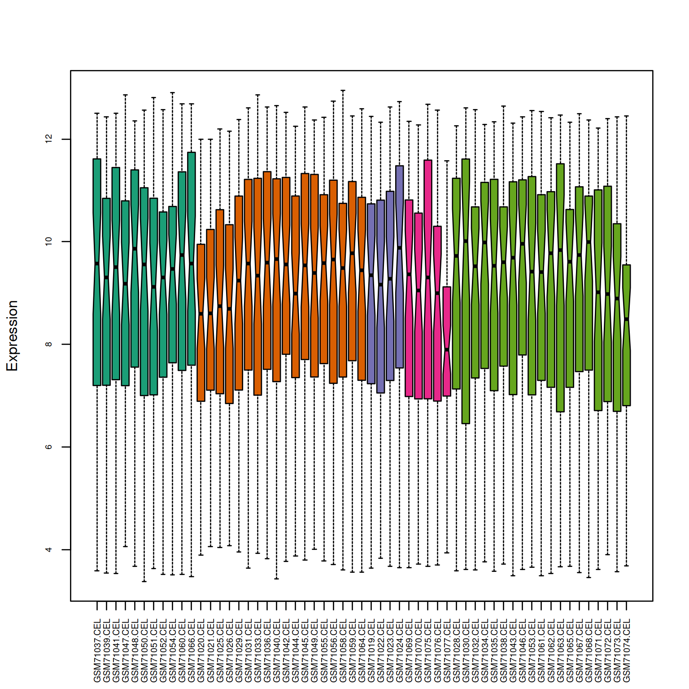

Figure 4.1: ComBat example

``` r
quantro::matdensity(edat,batch,xlab=" ",ylab="density")
legend("topleft",legend=1:5,col=1:5,lty=1)
```

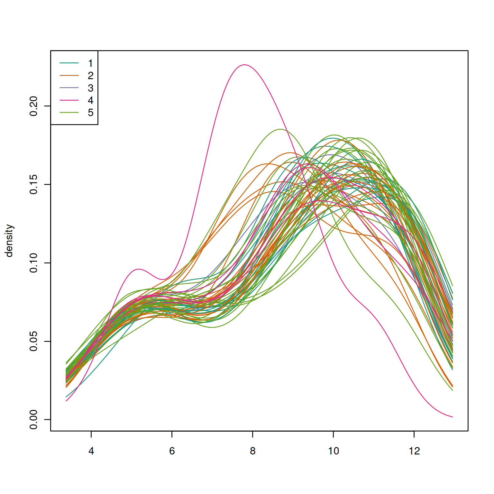

Figure 4.2: ComBat example

``` r

# 1. parametric adjustment
combat_edata1 <- sva::ComBat(dat=edat, batch=batch, par.prior=TRUE, prior.plots=TRUE)
#> Found5batches
#> Adjusting for0covariate(s) or covariate level(s)
#> Standardizing Data across genes
#> Fitting L/S model and finding priors
```

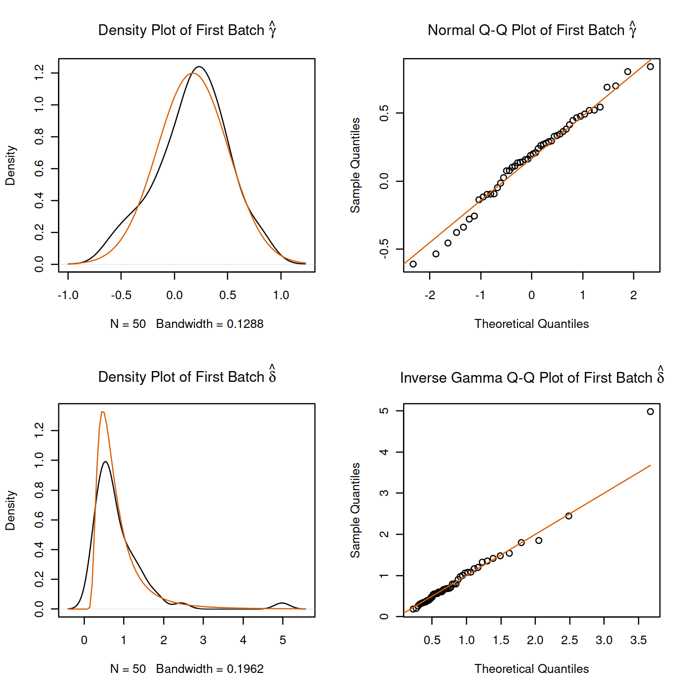

Figure 4.3: ComBat example

    #> Finding parametric adjustments
    #> Adjusting the Data

    # 2. non-parametric adjustment, mean-only version
    combat_edata2 <- sva::ComBat(dat=edat, batch=batch, par.prior=FALSE, mean.only=TRUE)
    #> Using the 'mean only' version of ComBat
    #> Found5batches
    #> Adjusting for0covariate(s) or covariate level(s)
    #> Standardizing Data across genes
    #> Fitting L/S model and finding priors
    #> Finding nonparametric adjustments
    #> Adjusting the Data

    # 3. reference-batch version, with covariates
    mod <- model.matrix(~as.factor(cancer), data=pheno)
    combat_edata3 <- sva::ComBat(dat=edat, batch=batch, mod=mod, par.prior=TRUE, ref.batch=3, prior.plots=TRUE)
    #> Using batch =3as a reference batch (this batch won't change)
    #> Found5batches
    #> Adjusting for2covariate(s) or covariate level(s)
    #> Standardizing Data across genes
    #> Fitting L/S model and finding priors

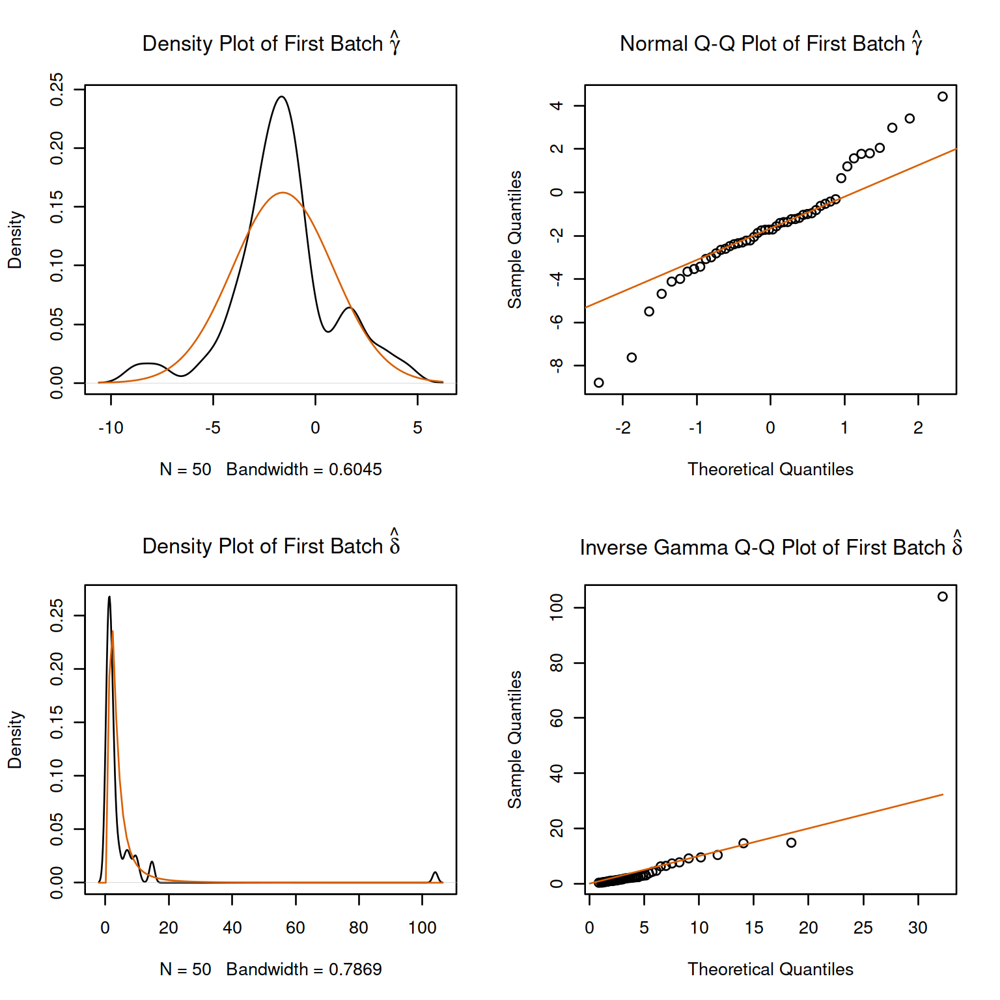

Figure 4.4: ComBat example

    #> Finding parametric adjustments
    #> Adjusting the Data

### 4.2 quantro

This is also adapted from the package vignette but with
`FlowSorted.DLPFC.450k` in place of `FlowSorted`.

``` r
data(FlowSorted.DLPFC.450k,package="FlowSorted.DLPFC.450k")
p <- getBeta(FlowSorted.DLPFC.450k,offset=100)
pd <- Biobase::pData(FlowSorted.DLPFC.450k)
quantro::matboxplot(p, groupFactor = pd$CellType, xaxt = "n", main = "Beta Values", pch=19)
```

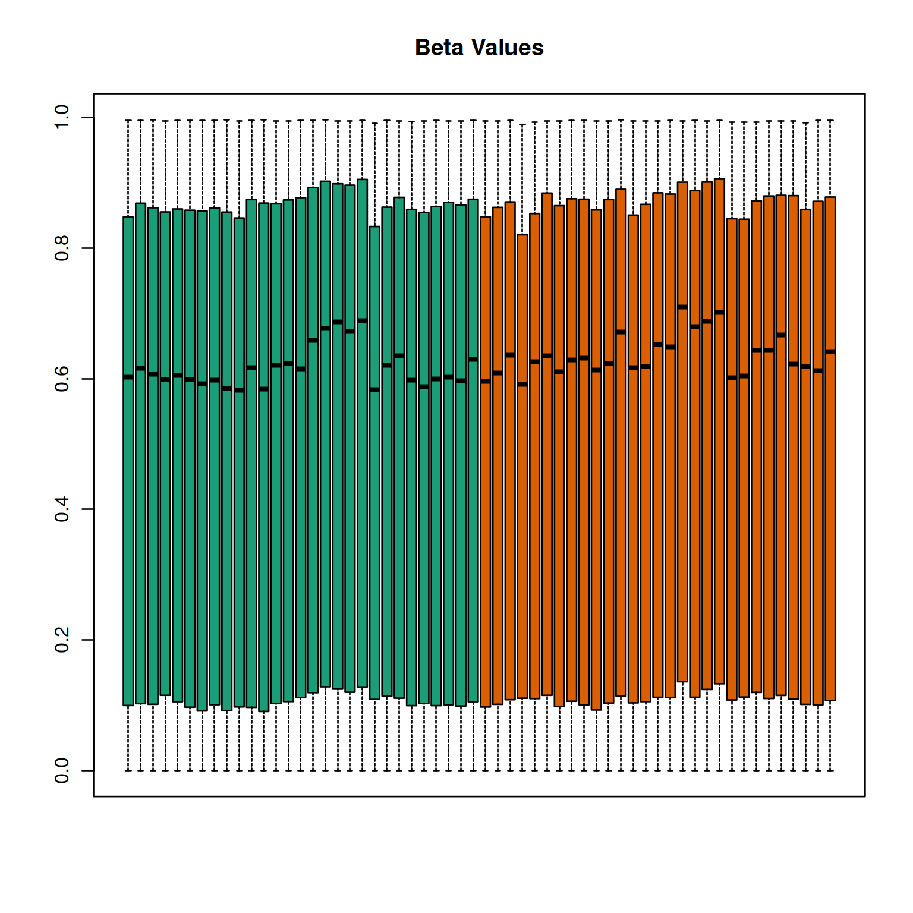

Figure 4.5: quantro example

``` r
quantro::matdensity(p, groupFactor = pd$CellType, xlab = " ", ylab = "density",
                    main = "Beta Values", brewer.n = 8, brewer.name = "Dark2")
legend('top', c("NeuN_neg", "NeuN_pos"), col = c(1, 2), lty = 1, lwd = 3)
```

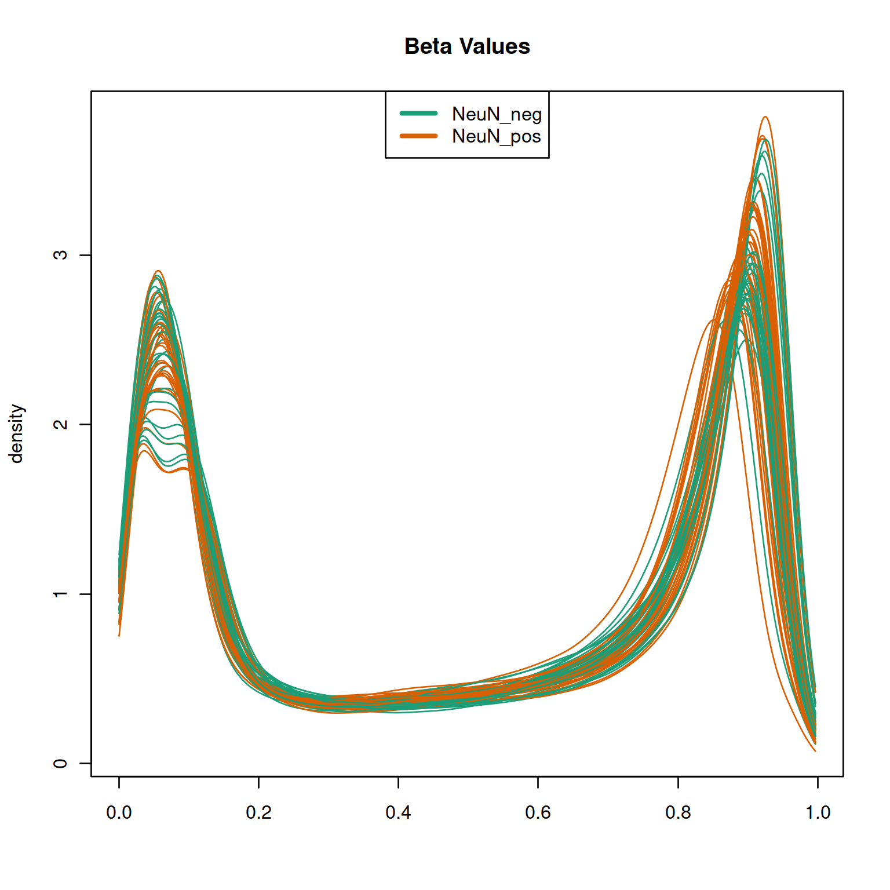

Figure 4.6: quantro example

``` r
qtest <- quantro::quantro(object = p, groupFactor = pd$CellType)
#> [quantro] Average medians of the distributions are 
#>                         not equal across groups.
#> [quantro] Calculating the quantro test statistic.
#> [quantro] No permutation testing performed. 
#>                          Use B > 0 for permutation testing.
if (FALSE)
{
  doParallel::registerDoParallel(cores=10)
  qtestPerm <- quantro::quantro(p, groupFactor = pd$CellType, B = 1000)
  quantro::quantroPlot(qtestPerm)
}
```

## 5 Outlier detection in RNA-Seq

The following is adapted from package OUTRIDER, noting its plotQQ() has
issues

``` r
ctsFile <- system.file('extdata', 'KremerNBaderSmall.tsv', package='OUTRIDER')
ctsTable <- read.table(ctsFile, check.names=FALSE)
ods <- OUTRIDER::OutriderDataSet(countData=ctsTable)
ods <- OUTRIDER::filterExpression(ods, minCounts=TRUE, filterGenes=TRUE)
ods <- OUTRIDER::OUTRIDER(ods)
res <- OUTRIDER::results(ods)
knitr::kable(res,caption="A check list of outliers")
if ("geneID" %in% colnames(res) & FALSE)
  OUTRIDER::plotQQ(ods, res$geneID, global=TRUE)
```

## 6 Differential expression

``` r
ex <- DESeq2::makeExampleDESeqDataSet(m=4)
dds <- DESeq2::DESeq(ex)
#> estimating size factors
#> estimating dispersions
#> gene-wise dispersion estimates
#> mean-dispersion relationship
#> final dispersion estimates
#> fitting model and testing
res <- DESeq2::results(dds, contrast=c("condition","B","A"))
rld <- DESeq2::rlogTransformation(ex, blind=TRUE)
dat <- DESeq2::plotPCA(rld, intgroup=c("condition"),returnData=TRUE)
#> using ntop=500 top features by variance
percentVar <- round(100 * attr(dat,"percentVar"))
ggplot2::ggplot(dat, ggplot2::aes(PC1, PC2, color=condition, shape=condition)) +
ggplot2::geom_point(size=3) +
ggplot2::xlab(paste0("PC1:",percentVar[1],"% variance")) +
ggplot2::ylab(paste0("PC2:",percentVar[2],"% variance"))
```

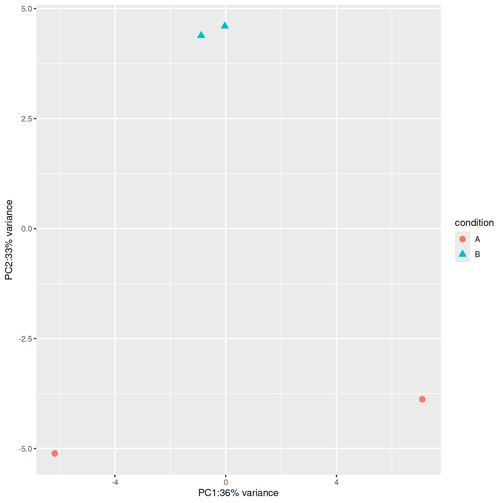

Figure 6.1: DESeq2 example

``` r
ex$condition <- relevel(ex$condition, ref="B")
dds2 <- DESeq2::DESeq(dds)
#> using pre-existing size factors
#> estimating dispersions
#> found already estimated dispersions, replacing these
#> gene-wise dispersion estimates
#> mean-dispersion relationship
#> final dispersion estimates
#> fitting model and testing
res <- DESeq2::results(dds2)
knitr::kable(head(as.data.frame(res)))
```

|       |  baseMean | log2FoldChange |     lfcSE |       stat |    pvalue |      padj |
|:------|----------:|---------------:|----------:|-----------:|----------:|----------:|
| gene1 | 32.066278 |      0.6915335 | 0.8953643 |  0.7723488 | 0.4399079 | 0.9961926 |
| gene2 |  4.412314 |     -1.0016303 | 2.0623610 | -0.4856717 | 0.6272000 | 0.9961926 |
| gene3 | 30.498821 |     -0.9328430 | 0.8577129 | -1.0875936 | 0.2767745 | 0.9961926 |
| gene4 | 36.510796 |     -0.9515118 | 0.8692174 | -1.0946764 | 0.2736584 | 0.9961926 |
| gene5 |  4.622864 |      3.0727212 | 2.1197063 |  1.4495976 | 0.1471708 | 0.9961926 |
| gene6 | 39.111363 |     -1.1866091 | 0.7171454 | -1.6546282 | 0.0979999 | 0.9961926 |

See the package in action from a snakemake
workflow^([1](#ref-koster21)).

## 7 Gene co-expression and network analysis

A simple network is furnished with the `GeneNet` documentation example,

``` r
## A random network with 40 nodes 
# it contains 780=40*39/2 edges of which 5 percent (=39) are non-zero
true.pcor <- GeneNet::ggm.simulate.pcor(40)
  
# A data set with 40 observations
m.sim <- GeneNet::ggm.simulate.data(40, true.pcor)

# A simple estimate of partial correlations
estimated.pcor <- corpcor::cor2pcor( cor(m.sim) )

# A comparison of estimated and true values
sum((true.pcor-estimated.pcor)^2)
#> [1] 259.8131

# A slightly better estimate ...
estimated.pcor.2 <- GeneNet::ggm.estimate.pcor(m.sim)
#> Estimating optimal shrinkage intensity lambda (correlation matrix): 0.1511
sum((true.pcor-estimated.pcor.2)^2)
#> [1] 12.37069

## ecoli data 
data(ecoli, package="GeneNet")

# partial correlation matrix 
inferred.pcor <- GeneNet::ggm.estimate.pcor(ecoli)
#> Estimating optimal shrinkage intensity lambda (correlation matrix): 0.1804

# p-values, q-values and posterior probabilities for each potential edge 
test.results <- GeneNet::network.test.edges(inferred.pcor)
#> Estimate (local) false discovery rates (partial correlations):
#> Step 1... determine cutoff point
#> Step 2... estimate parameters of null distribution and eta0
#> Step 3... compute p-values and estimate empirical PDF/CDF
#> Step 4... compute q-values and local fdr
#> Step 5... prepare for plotting
```

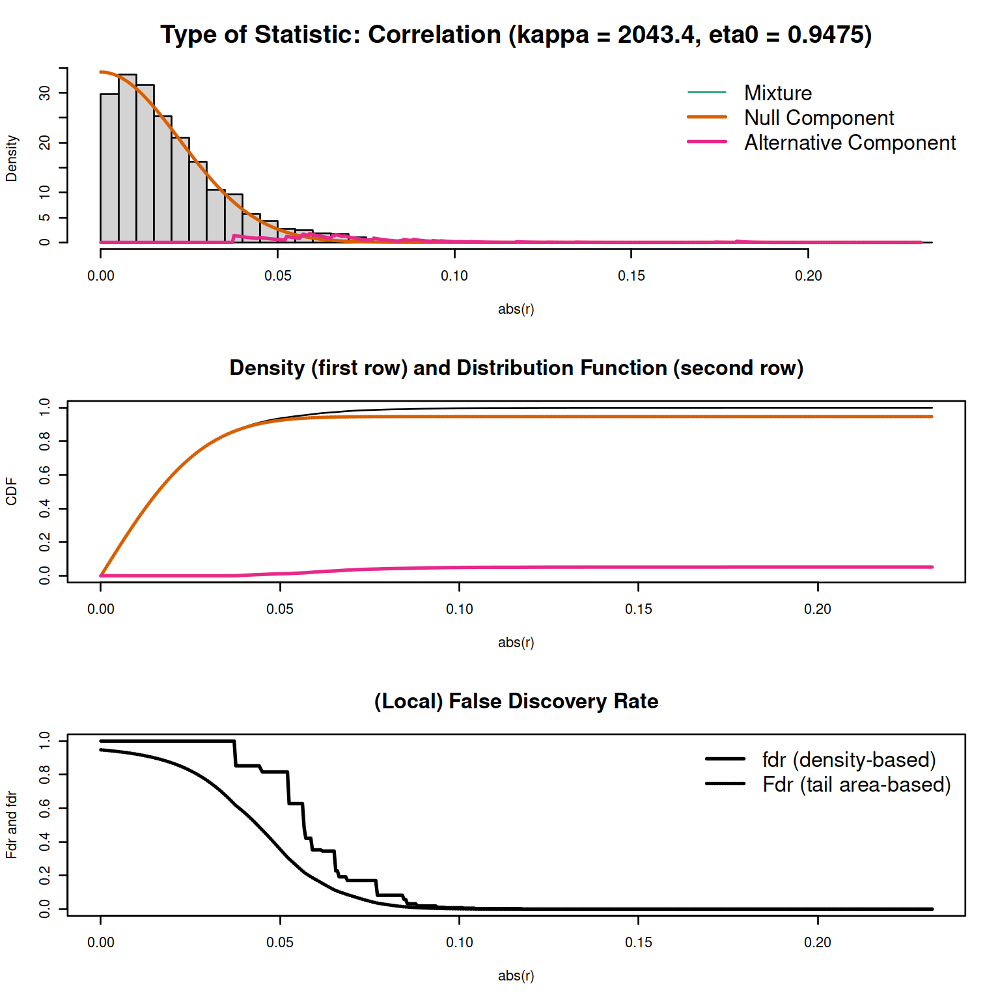

Figure 7.1: GeneNet example

``` r

# best 20 edges (strongest correlation)
test.results[1:20,]
#>           pcor node1 node2         pval         qval      prob
#> 1   0.23185664    51    53 2.220446e-16 3.612205e-13 1.0000000
#> 2   0.22405545    52    53 2.220446e-16 3.612205e-13 1.0000000
#> 3   0.21507824    51    52 2.220446e-16 3.612205e-13 1.0000000
#> 4   0.17328863     7    93 3.108624e-15 3.792816e-12 0.9999945
#> 5  -0.13418892    29    86 1.120812e-09 1.093997e-06 0.9999516
#> 6   0.12594697    21    72 1.103836e-08 8.978563e-06 0.9998400
#> 7   0.11956105    28    86 5.890924e-08 3.853590e-05 0.9998400
#> 8  -0.11723897    26    80 1.060526e-07 5.816172e-05 0.9998400
#> 9  -0.11711625    72    89 1.093655e-07 5.930499e-05 0.9972804
#> 10  0.10658013    20    21 1.366610e-06 5.925275e-04 0.9972804
#> 11  0.10589778    21    73 1.596859e-06 6.678429e-04 0.9972804
#> 12  0.10478689    20    91 2.053403e-06 8.024425e-04 0.9972804
#> 13  0.10420836     7    52 2.338382e-06 8.778605e-04 0.9944557
#> 14  0.10236077    87    95 3.525186e-06 1.224964e-03 0.9944557
#> 15  0.10113550    27    95 4.610444e-06 1.500047e-03 0.9920084
#> 16  0.09928954    21    51 6.868357e-06 2.046549e-03 0.9920084
#> 17  0.09791914    21    88 9.192373e-06 2.520616e-03 0.9920084
#> 18  0.09719685    18    95 1.070232e-05 2.790102e-03 0.9920084
#> 19  0.09621791    28    90 1.313007e-05 3.171817e-03 0.9920084
#> 20  0.09619099    12    80 1.320374e-05 3.182526e-03 0.9920084

# network containing edges with prob > 0.9 (i.e. local fdr < 0.1)
net <- GeneNet::extract.network(test.results, cutoff.ggm=0.9)
#> 
#> Significant edges:  65 
#>     Corresponding to  1.26 %  of possible edges
net
#>           pcor node1 node2         pval         qval      prob
#> 1   0.23185664    51    53 2.220446e-16 3.612205e-13 1.0000000
#> 2   0.22405545    52    53 2.220446e-16 3.612205e-13 1.0000000
#> 3   0.21507824    51    52 2.220446e-16 3.612205e-13 1.0000000
#> 4   0.17328863     7    93 3.108624e-15 3.792816e-12 0.9999945
#> 5  -0.13418892    29    86 1.120812e-09 1.093997e-06 0.9999516
#> 6   0.12594697    21    72 1.103836e-08 8.978563e-06 0.9998400
#> 7   0.11956105    28    86 5.890924e-08 3.853590e-05 0.9998400
#> 8  -0.11723897    26    80 1.060526e-07 5.816172e-05 0.9998400
#> 9  -0.11711625    72    89 1.093655e-07 5.930499e-05 0.9972804
#> 10  0.10658013    20    21 1.366610e-06 5.925275e-04 0.9972804
#> 11  0.10589778    21    73 1.596859e-06 6.678429e-04 0.9972804
#> 12  0.10478689    20    91 2.053403e-06 8.024425e-04 0.9972804
#> 13  0.10420836     7    52 2.338382e-06 8.778605e-04 0.9944557
#> 14  0.10236077    87    95 3.525186e-06 1.224964e-03 0.9944557
#> 15  0.10113550    27    95 4.610444e-06 1.500047e-03 0.9920084
#> 16  0.09928954    21    51 6.868357e-06 2.046549e-03 0.9920084
#> 17  0.09791914    21    88 9.192373e-06 2.520616e-03 0.9920084
#> 18  0.09719685    18    95 1.070232e-05 2.790102e-03 0.9920084
#> 19  0.09621791    28    90 1.313007e-05 3.171817e-03 0.9920084
#> 20  0.09619099    12    80 1.320374e-05 3.182526e-03 0.9920084
#> 21  0.09576091    89    95 1.443542e-05 3.354777e-03 0.9891317
#> 22  0.09473210     7    51 1.784126e-05 3.864825e-03 0.9891317
#> 23 -0.09386896    53    58 2.127622e-05 4.313590e-03 0.9891317
#> 24 -0.09366615    29    83 2.217013e-05 4.421099e-03 0.9891317
#> 25 -0.09341148    21    89 2.334321e-05 4.556947e-03 0.9810727
#> 26 -0.09156391    49    93 3.380043e-05 5.955972e-03 0.9810727
#> 27 -0.09150710    80    90 3.418363e-05 6.002083e-03 0.9810727
#> 28  0.09101505     7    53 3.767966e-05 6.408102e-03 0.9810727
#> 29  0.09050688    21    84 4.164471e-05 6.838782e-03 0.9810727
#> 30  0.08965490    72    73 4.919365e-05 7.581866e-03 0.9810727
#> 31 -0.08934025    29    99 5.229604e-05 7.861416e-03 0.9810727
#> 32 -0.08906819     9    95 5.512708e-05 8.104759e-03 0.9810727
#> 33  0.08888345     2    49 5.713144e-05 8.270673e-03 0.9810727
#> 34  0.08850681    86    90 6.143363e-05 8.610161e-03 0.9810727
#> 35  0.08805868    17    53 6.695170e-05 9.015175e-03 0.9810727
#> 36  0.08790809    28    48 6.890884e-05 9.151291e-03 0.9810727
#> 37  0.08783471    33    58 6.988211e-05 9.217597e-03 0.9682377
#> 38 -0.08705796     7    49 8.101244e-05 1.021362e-02 0.9682377
#> 39  0.08645033    20    46 9.086547e-05 1.102466e-02 0.9682377
#> 40  0.08609950    48    86 9.705862e-05 1.150392e-02 0.9682377
#> 41  0.08598769    21    52 9.911458e-05 1.165816e-02 0.9682377
#> 42  0.08555275    32    95 1.075099e-04 1.226435e-02 0.9682377
#> 43  0.08548231    17    51 1.089311e-04 1.236337e-02 0.9424721
#> 44  0.08470370    80    83 1.258659e-04 1.382356e-02 0.9424721
#> 45  0.08442510    80    82 1.325062e-04 1.437068e-02 0.9174573
#> 46  0.08271606    80    93 1.810275e-04 1.845632e-02 0.9174573
#> 47  0.08235175    46    91 1.933329e-04 1.941579e-02 0.9174573
#> 48  0.08217787    25    95 1.994788e-04 1.988432e-02 0.9174573
#> 49 -0.08170331    29    87 2.171999e-04 2.119715e-02 0.9174573
#> 50  0.08123632    19    29 2.360716e-04 2.253606e-02 0.9174573
#> 51  0.08101702    51    84 2.454547e-04 2.318024e-02 0.9174573
#> 52  0.08030748    16    93 2.782643e-04 2.532796e-02 0.9174573
#> 53  0.08006503    28    52 2.903870e-04 2.608271e-02 0.9174573
#> 54 -0.07941656    41    80 3.252833e-04 2.814824e-02 0.9174573
#> 55  0.07941410    54    89 3.254229e-04 2.815620e-02 0.9174573
#> 56 -0.07934653    28    80 3.292784e-04 2.837511e-02 0.9174573
#> 57  0.07916783    29    92 3.396802e-04 2.895702e-02 0.9174573
#> 58 -0.07866905    17    86 3.703635e-04 3.060293e-02 0.9174573
#> 59  0.07827749    16    29 3.962446e-04 3.191462e-02 0.9174573
#> 60 -0.07808262    73    89 4.097452e-04 3.257290e-02 0.9174573
#> 61  0.07766261    52    67 4.403165e-04 3.400207e-02 0.9174573
#> 62  0.07762917    25    87 4.428396e-04 3.411637e-02 0.9174573
#> 63 -0.07739378     9    93 4.609872e-04 3.492295e-02 0.9174573
#> 64  0.07738885    31    80 4.613747e-04 3.493988e-02 0.9174573
#> 65 -0.07718681    80    94 4.775136e-04 3.563444e-02 0.9174573

# significant based on FDR cutoff Q=0.05?
num.significant.1 <- sum(test.results$qval <= 0.05)
test.results[1:num.significant.1,]
#>           pcor node1 node2         pval         qval      prob
#> 1   0.23185664    51    53 2.220446e-16 3.612205e-13 1.0000000
#> 2   0.22405545    52    53 2.220446e-16 3.612205e-13 1.0000000
#> 3   0.21507824    51    52 2.220446e-16 3.612205e-13 1.0000000
#> 4   0.17328863     7    93 3.108624e-15 3.792816e-12 0.9999945
#> 5  -0.13418892    29    86 1.120812e-09 1.093997e-06 0.9999516
#> 6   0.12594697    21    72 1.103836e-08 8.978563e-06 0.9998400
#> 7   0.11956105    28    86 5.890924e-08 3.853590e-05 0.9998400
#> 8  -0.11723897    26    80 1.060526e-07 5.816172e-05 0.9998400
#> 9  -0.11711625    72    89 1.093655e-07 5.930499e-05 0.9972804
#> 10  0.10658013    20    21 1.366610e-06 5.925275e-04 0.9972804
#> 11  0.10589778    21    73 1.596859e-06 6.678429e-04 0.9972804
#> 12  0.10478689    20    91 2.053403e-06 8.024425e-04 0.9972804
#> 13  0.10420836     7    52 2.338382e-06 8.778605e-04 0.9944557
#> 14  0.10236077    87    95 3.525186e-06 1.224964e-03 0.9944557
#> 15  0.10113550    27    95 4.610444e-06 1.500047e-03 0.9920084
#> 16  0.09928954    21    51 6.868357e-06 2.046549e-03 0.9920084
#> 17  0.09791914    21    88 9.192373e-06 2.520616e-03 0.9920084
#> 18  0.09719685    18    95 1.070232e-05 2.790102e-03 0.9920084
#> 19  0.09621791    28    90 1.313007e-05 3.171817e-03 0.9920084
#> 20  0.09619099    12    80 1.320374e-05 3.182526e-03 0.9920084
#> 21  0.09576091    89    95 1.443542e-05 3.354777e-03 0.9891317
#> 22  0.09473210     7    51 1.784126e-05 3.864825e-03 0.9891317
#> 23 -0.09386896    53    58 2.127622e-05 4.313590e-03 0.9891317
#> 24 -0.09366615    29    83 2.217013e-05 4.421099e-03 0.9891317
#> 25 -0.09341148    21    89 2.334321e-05 4.556947e-03 0.9810727
#> 26 -0.09156391    49    93 3.380043e-05 5.955972e-03 0.9810727
#> 27 -0.09150710    80    90 3.418363e-05 6.002083e-03 0.9810727
#> 28  0.09101505     7    53 3.767966e-05 6.408102e-03 0.9810727
#> 29  0.09050688    21    84 4.164471e-05 6.838782e-03 0.9810727
#> 30  0.08965490    72    73 4.919365e-05 7.581866e-03 0.9810727
#> 31 -0.08934025    29    99 5.229604e-05 7.861416e-03 0.9810727
#> 32 -0.08906819     9    95 5.512708e-05 8.104759e-03 0.9810727
#> 33  0.08888345     2    49 5.713144e-05 8.270673e-03 0.9810727
#> 34  0.08850681    86    90 6.143363e-05 8.610161e-03 0.9810727
#> 35  0.08805868    17    53 6.695170e-05 9.015175e-03 0.9810727
#> 36  0.08790809    28    48 6.890884e-05 9.151291e-03 0.9810727
#> 37  0.08783471    33    58 6.988211e-05 9.217597e-03 0.9682377
#> 38 -0.08705796     7    49 8.101244e-05 1.021362e-02 0.9682377
#> 39  0.08645033    20    46 9.086547e-05 1.102466e-02 0.9682377
#> 40  0.08609950    48    86 9.705862e-05 1.150392e-02 0.9682377
#> 41  0.08598769    21    52 9.911458e-05 1.165816e-02 0.9682377
#> 42  0.08555275    32    95 1.075099e-04 1.226435e-02 0.9682377
#> 43  0.08548231    17    51 1.089311e-04 1.236337e-02 0.9424721
#> 44  0.08470370    80    83 1.258659e-04 1.382356e-02 0.9424721
#> 45  0.08442510    80    82 1.325062e-04 1.437068e-02 0.9174573
#> 46  0.08271606    80    93 1.810275e-04 1.845632e-02 0.9174573
#> 47  0.08235175    46    91 1.933329e-04 1.941579e-02 0.9174573
#> 48  0.08217787    25    95 1.994788e-04 1.988432e-02 0.9174573
#> 49 -0.08170331    29    87 2.171999e-04 2.119715e-02 0.9174573
#> 50  0.08123632    19    29 2.360716e-04 2.253606e-02 0.9174573
#> 51  0.08101702    51    84 2.454547e-04 2.318024e-02 0.9174573
#> 52  0.08030748    16    93 2.782643e-04 2.532796e-02 0.9174573
#> 53  0.08006503    28    52 2.903870e-04 2.608271e-02 0.9174573
#> 54 -0.07941656    41    80 3.252833e-04 2.814824e-02 0.9174573
#> 55  0.07941410    54    89 3.254229e-04 2.815620e-02 0.9174573
#> 56 -0.07934653    28    80 3.292784e-04 2.837511e-02 0.9174573
#> 57  0.07916783    29    92 3.396802e-04 2.895702e-02 0.9174573
#> 58 -0.07866905    17    86 3.703635e-04 3.060293e-02 0.9174573
#> 59  0.07827749    16    29 3.962446e-04 3.191462e-02 0.9174573
#> 60 -0.07808262    73    89 4.097452e-04 3.257290e-02 0.9174573
#> 61  0.07766261    52    67 4.403165e-04 3.400207e-02 0.9174573
#> 62  0.07762917    25    87 4.428396e-04 3.411637e-02 0.9174573
#> 63 -0.07739378     9    93 4.609872e-04 3.492295e-02 0.9174573
#> 64  0.07738885    31    80 4.613747e-04 3.493988e-02 0.9174573
#> 65 -0.07718681    80    94 4.775136e-04 3.563444e-02 0.9174573
#> 66  0.07706275    27    58 4.876831e-04 3.606179e-02 0.8297811
#> 67 -0.07610709    16    83 5.730532e-04 4.085920e-02 0.8297811
#> 68  0.07550557    53    84 6.337143e-04 4.406472e-02 0.8297811

# significant based on "local fdr" cutoff (prob > 0.9)?
num.significant.2 <- sum(test.results$prob > 0.9)
test.results[test.results$prob > 0.9,]
#>           pcor node1 node2         pval         qval      prob
#> 1   0.23185664    51    53 2.220446e-16 3.612205e-13 1.0000000
#> 2   0.22405545    52    53 2.220446e-16 3.612205e-13 1.0000000
#> 3   0.21507824    51    52 2.220446e-16 3.612205e-13 1.0000000
#> 4   0.17328863     7    93 3.108624e-15 3.792816e-12 0.9999945
#> 5  -0.13418892    29    86 1.120812e-09 1.093997e-06 0.9999516
#> 6   0.12594697    21    72 1.103836e-08 8.978563e-06 0.9998400
#> 7   0.11956105    28    86 5.890924e-08 3.853590e-05 0.9998400
#> 8  -0.11723897    26    80 1.060526e-07 5.816172e-05 0.9998400
#> 9  -0.11711625    72    89 1.093655e-07 5.930499e-05 0.9972804
#> 10  0.10658013    20    21 1.366610e-06 5.925275e-04 0.9972804
#> 11  0.10589778    21    73 1.596859e-06 6.678429e-04 0.9972804
#> 12  0.10478689    20    91 2.053403e-06 8.024425e-04 0.9972804
#> 13  0.10420836     7    52 2.338382e-06 8.778605e-04 0.9944557
#> 14  0.10236077    87    95 3.525186e-06 1.224964e-03 0.9944557
#> 15  0.10113550    27    95 4.610444e-06 1.500047e-03 0.9920084
#> 16  0.09928954    21    51 6.868357e-06 2.046549e-03 0.9920084
#> 17  0.09791914    21    88 9.192373e-06 2.520616e-03 0.9920084
#> 18  0.09719685    18    95 1.070232e-05 2.790102e-03 0.9920084
#> 19  0.09621791    28    90 1.313007e-05 3.171817e-03 0.9920084
#> 20  0.09619099    12    80 1.320374e-05 3.182526e-03 0.9920084
#> 21  0.09576091    89    95 1.443542e-05 3.354777e-03 0.9891317
#> 22  0.09473210     7    51 1.784126e-05 3.864825e-03 0.9891317
#> 23 -0.09386896    53    58 2.127622e-05 4.313590e-03 0.9891317
#> 24 -0.09366615    29    83 2.217013e-05 4.421099e-03 0.9891317
#> 25 -0.09341148    21    89 2.334321e-05 4.556947e-03 0.9810727
#> 26 -0.09156391    49    93 3.380043e-05 5.955972e-03 0.9810727
#> 27 -0.09150710    80    90 3.418363e-05 6.002083e-03 0.9810727
#> 28  0.09101505     7    53 3.767966e-05 6.408102e-03 0.9810727
#> 29  0.09050688    21    84 4.164471e-05 6.838782e-03 0.9810727
#> 30  0.08965490    72    73 4.919365e-05 7.581866e-03 0.9810727
#> 31 -0.08934025    29    99 5.229604e-05 7.861416e-03 0.9810727
#> 32 -0.08906819     9    95 5.512708e-05 8.104759e-03 0.9810727
#> 33  0.08888345     2    49 5.713144e-05 8.270673e-03 0.9810727
#> 34  0.08850681    86    90 6.143363e-05 8.610161e-03 0.9810727
#> 35  0.08805868    17    53 6.695170e-05 9.015175e-03 0.9810727
#> 36  0.08790809    28    48 6.890884e-05 9.151291e-03 0.9810727
#> 37  0.08783471    33    58 6.988211e-05 9.217597e-03 0.9682377
#> 38 -0.08705796     7    49 8.101244e-05 1.021362e-02 0.9682377
#> 39  0.08645033    20    46 9.086547e-05 1.102466e-02 0.9682377
#> 40  0.08609950    48    86 9.705862e-05 1.150392e-02 0.9682377
#> 41  0.08598769    21    52 9.911458e-05 1.165816e-02 0.9682377
#> 42  0.08555275    32    95 1.075099e-04 1.226435e-02 0.9682377
#> 43  0.08548231    17    51 1.089311e-04 1.236337e-02 0.9424721
#> 44  0.08470370    80    83 1.258659e-04 1.382356e-02 0.9424721
#> 45  0.08442510    80    82 1.325062e-04 1.437068e-02 0.9174573
#> 46  0.08271606    80    93 1.810275e-04 1.845632e-02 0.9174573
#> 47  0.08235175    46    91 1.933329e-04 1.941579e-02 0.9174573
#> 48  0.08217787    25    95 1.994788e-04 1.988432e-02 0.9174573
#> 49 -0.08170331    29    87 2.171999e-04 2.119715e-02 0.9174573
#> 50  0.08123632    19    29 2.360716e-04 2.253606e-02 0.9174573
#> 51  0.08101702    51    84 2.454547e-04 2.318024e-02 0.9174573
#> 52  0.08030748    16    93 2.782643e-04 2.532796e-02 0.9174573
#> 53  0.08006503    28    52 2.903870e-04 2.608271e-02 0.9174573
#> 54 -0.07941656    41    80 3.252833e-04 2.814824e-02 0.9174573
#> 55  0.07941410    54    89 3.254229e-04 2.815620e-02 0.9174573
#> 56 -0.07934653    28    80 3.292784e-04 2.837511e-02 0.9174573
#> 57  0.07916783    29    92 3.396802e-04 2.895702e-02 0.9174573
#> 58 -0.07866905    17    86 3.703635e-04 3.060293e-02 0.9174573
#> 59  0.07827749    16    29 3.962446e-04 3.191462e-02 0.9174573
#> 60 -0.07808262    73    89 4.097452e-04 3.257290e-02 0.9174573
#> 61  0.07766261    52    67 4.403165e-04 3.400207e-02 0.9174573
#> 62  0.07762917    25    87 4.428396e-04 3.411637e-02 0.9174573
#> 63 -0.07739378     9    93 4.609872e-04 3.492295e-02 0.9174573
#> 64  0.07738885    31    80 4.613747e-04 3.493988e-02 0.9174573
#> 65 -0.07718681    80    94 4.775136e-04 3.563444e-02 0.9174573

# parameters of the mixture distribution used to compute p-values etc.
c <- fdrtool::fdrtool(corpcor::sm2vec(inferred.pcor), statistic="correlation")
#> Step 1... determine cutoff point
#> Step 2... estimate parameters of null distribution and eta0
#> Step 3... compute p-values and estimate empirical PDF/CDF
#> Step 4... compute q-values and local fdr
#> Step 5... prepare for plotting
c$param
#>          cutoff N.cens      eta0     eta0.SE    kappa kappa.SE
#> [1,] 0.03553068   4352 0.9474623 0.005656465 2043.377 94.72265

## A random network with 20 nodes and 10 percent (=19) edges
true.pcor <- GeneNet::ggm.simulate.pcor(20, 0.1)

# convert to edge list
test.results <- GeneNet::ggm.list.edges(true.pcor)[1:19,]
nlab <- LETTERS[1:20]

# graphviz
# network.make.dot(filename="test.dot", test.results, nlab, main = "A graph")
# system("fdp -T svg -o test.svg test.dot")

# Rgraphviz
gr <- GeneNet::network.make.graph( test.results, nlab)
gr
#> A graphNEL graph with directed edges
#> Number of Nodes = 20 
#> Number of Edges = 38
num.nodes(gr)
#> [1] 20
edge.info(gr)
#> $weight
#>      A~T      A~K      A~G      B~M      C~D      C~P      D~G      E~G 
#> -0.10241  0.29365 -0.49576 -0.99954 -0.17986 -0.88697 -0.48185 -0.32599 
#>      E~F      E~S      F~N      F~T      F~K      G~J      J~S      J~O 
#> -0.40175  0.40466  0.14147 -0.29806 -0.34034  0.03677 -0.34159 -0.50914 
#>      K~R      N~O      R~T 
#> -0.26140  0.68240 -0.60957 
#> 
#> $dir
#>    A~T    A~K    A~G    B~M    C~D    C~P    D~G    E~G    E~F    E~S    F~N 
#> "none" "none" "none" "none" "none" "none" "none" "none" "none" "none" "none" 
#>    F~T    F~K    G~J    J~S    J~O    K~R    N~O    R~T 
#> "none" "none" "none" "none" "none" "none" "none" "none"
gr2 <- GeneNet::network.make.graph( test.results, nlab, drop.singles=TRUE)
gr2
#> A graphNEL graph with directed edges
#> Number of Nodes = 16 
#> Number of Edges = 38
GeneNet::num.nodes(gr2)
#> [1] 16
GeneNet::edge.info(gr2)
#> $weight
#>      A~T      A~K      A~G      B~M      C~D      C~P      D~G      E~G 
#> -0.10241  0.29365 -0.49576 -0.99954 -0.17986 -0.88697 -0.48185 -0.32599 
#>      E~F      E~S      F~N      F~T      F~K      G~J      J~S      J~O 
#> -0.40175  0.40466  0.14147 -0.29806 -0.34034  0.03677 -0.34159 -0.50914 
#>      K~R      N~O      R~T 
#> -0.26140  0.68240 -0.60957 
#> 
#> $dir
#>    A~T    A~K    A~G    B~M    C~D    C~P    D~G    E~G    E~F    E~S    F~N 
#> "none" "none" "none" "none" "none" "none" "none" "none" "none" "none" "none" 
#>    F~T    F~K    G~J    J~S    J~O    K~R    N~O    R~T 
#> "none" "none" "none" "none" "none" "none" "none" "none"

# plot network
plot(gr, "fdp")
```

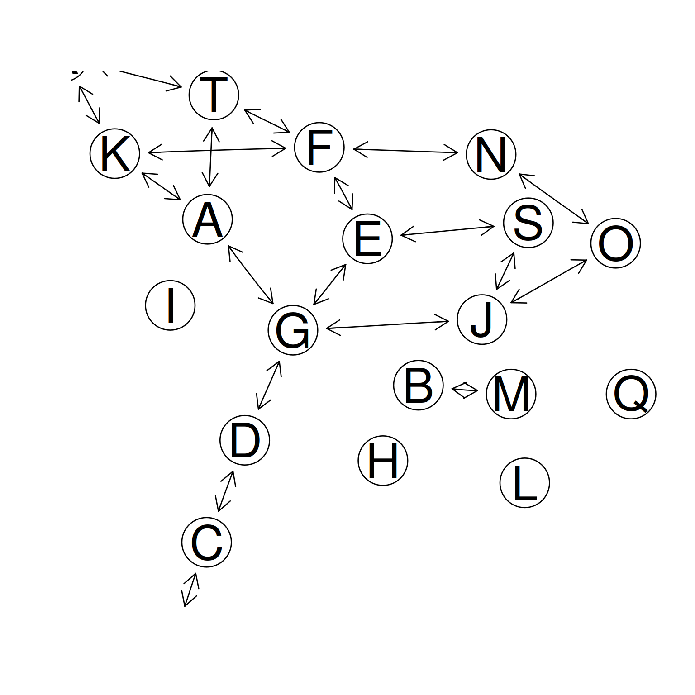

Figure 7.2: GeneNet example

``` r
plot(gr2, "fdp")
```

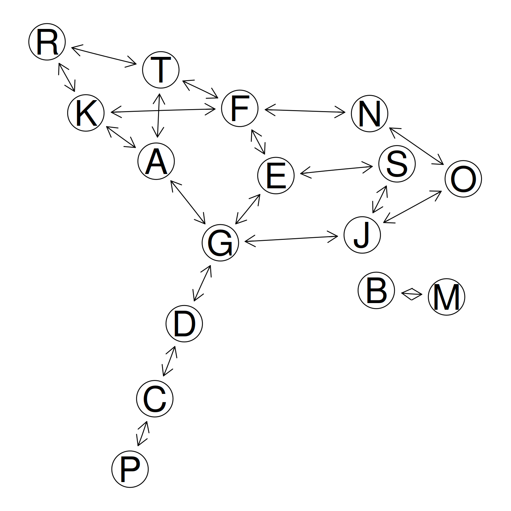

Figure 7.3: GeneNet example

A side-by-side heatmaps

``` r
set.seed(123454321)
m <- matrix(runif(2500),50)
r <- cor(m)
g <- as.matrix(r>=0.7)+0
f1 <- ComplexHeatmap::Heatmap(r)
f2 <- ComplexHeatmap::Heatmap(g)
f <- f1+f2
ComplexHeatmap::draw(f)
```

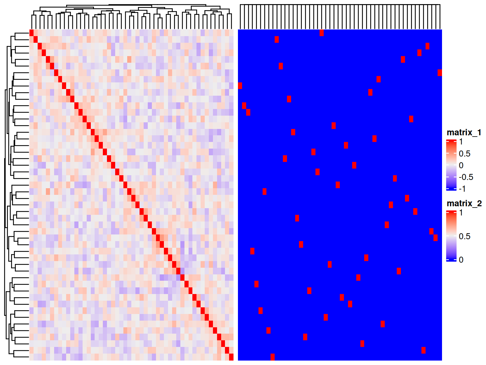

Figure 7.4: Heatmaps

``` r

df <- heatmaply::normalize(mtcars)
hm <- heatmaply::heatmaply(df,k_col=5,k_row=5,
                           colors = grDevices::colorRampPalette(RColorBrewer::brewer.pal(3, "RdBu"))(256))
#> Warning: Using `size` aesthetic for lines was deprecated in ggplot2 3.4.0.
#> ℹ Please use `linewidth` instead.
#> ℹ The deprecated feature was likely used in the dendextend package.
#>   Please report the issue at <https://github.com/talgalili/dendextend/issues>.
#> This warning is displayed once per session.
#> Call `lifecycle::last_lifecycle_warnings()` to see where this warning was
#> generated.
htmlwidgets::saveWidget(hm,file="heatmaply.html")
htmltools::tags$iframe(src = "/articles/heatmaply.html", width = "100%", height = "600px")
```

and a module analysis with WGCNA,

``` r
pwr <- c(1:10, seq(from=12, to=30, by=2))
sft <- WGCNA::pickSoftThreshold(dat, powerVector=pwr, verbose=5)
ADJ <- abs(cor(dat, method="pearson", use="pairwise.complete.obs"))^6
dissADJ <- 1-ADJ
dissTOM <- WGCNA::TOMdist(ADJ)
TOM <- WGCNA::TOMsimilarityFromExpr(dat)
Tree <- hclust(as.dist(1-TOM), method="average")
for(j in pwr)
{
  pam_name <- paste0("pam",j)
  assign(pam_name, cluster::pam(as.dist(dissADJ),j))
  pamTOM_name <- paste0("pamTOM",j)
  assign(pamTOM_name,cluster::pam(as.dist(dissTOM),j))
  tc <- table(get(pam_name)$clustering,get(pamTOM_name)$clustering)
  print(tc)
  print(diag(tc))
}
colorStaticTOM <- as.character(WGCNA::cutreeStaticColor(Tree,cutHeight=.99,minSize=5))
colorDynamicTOM <- WGCNA::labels2colors(cutreeDynamic(Tree,method="tree",minClusterSize=5))
Colors <- data.frame(pamTOM6$clustering,colorStaticTOM,colorDynamicTOM)
WGCNA::plotDendroAndColors(Tree, Colors, dendroLabels=FALSE, hang=0.03, addGuide=TRUE, guideHang=0.05)
meg <- WGCNA::moduleEigengenes(dat, color=1:ncol(dat), softPower=6)
```

## 8 Metadata

This section is based on package `recount3`.

``` r
hs <- recount3::available_projects()
dim(subset(hs,file_source=="gtex"))
recount3::annotation_options("human")
blood_rse <- recount3::create_rse(subset(hs,project=="BLOOD"))
S4Vectors::metadata(blood_rse)
SummarizedExperiment::rowRanges(blood_rse)
colnames(SummarizedExperiment::colData(blood_rse))[1:20]
recount3::expand_sra_attributes(blood_rse)
```

## 9 Pathway and enrichment analysis

``` r
reactome <- graphite::pathways("hsapiens", "reactome")
kegg <- graphite::pathways("hsapiens","kegg")
pharmgkb <- graphite::pathways("hsapiens","pharmgkb")
nodes(kegg[[21]])
#>  [1] "ENTREZID:102724560" "ENTREZID:107080644" "ENTREZID:10993"    
#>  [4] "ENTREZID:113675"    "ENTREZID:132158"    "ENTREZID:1610"     
#>  [7] "ENTREZID:1738"      "ENTREZID:1757"      "ENTREZID:189"      
#> [10] "ENTREZID:211"       "ENTREZID:212"       "ENTREZID:23464"    
#> [13] "ENTREZID:2593"      "ENTREZID:26227"     "ENTREZID:2628"     
#> [16] "ENTREZID:27232"     "ENTREZID:2731"      "ENTREZID:275"      
#> [19] "ENTREZID:29958"     "ENTREZID:29968"     "ENTREZID:441531"   
#> [22] "ENTREZID:501"       "ENTREZID:51268"     "ENTREZID:5223"     
#> [25] "ENTREZID:5224"      "ENTREZID:55349"     "ENTREZID:5723"     
#> [28] "ENTREZID:635"       "ENTREZID:63826"     "ENTREZID:6470"     
#> [31] "ENTREZID:6472"      "ENTREZID:64902"     "ENTREZID:669"      
#> [34] "ENTREZID:875"       "ENTREZID:9380"      "ENTREZID:1491"
kegg_t2g <- ldply(lapply(kegg, nodes), data.frame)
names(kegg_t2g) <- c("gs_name", "gene_symbol")
VEGF <- subset(kegg_t2g,gs_name=="VEGF signaling pathway")[[2]]
eKEGG <- clusterProfiler::enricher(gene=VEGF, TERM2GENE = kegg_t2g,
                                   universe=,
                                   pAdjustMethod = "BH",
                                   pvalueCutoff = 0.1, qvalueCutoff = 0.05,
                                   minGSSize = 10, maxGSSize = 500)
```

## 10 Transcript databases

An overview of annotation is available^([2](#ref-carlson16)).

``` r
# columns(org.Hs.eg.db)
# keyref <- keys(org.Hs.eg.db, keytype="ENTREZID")
# symbol_uniprot <- select(org.Hs.eg.db,keys=keyref,columns = c("SYMBOL","UNIPROT"))
# subset(symbol_uniprot,SYMBOL=="MC4R")

x <- EnsDb.Hsapiens.v86
ensembldb::listColumns(x, "protein", skip.keys=TRUE)
#> [1] "tx_id"            "protein_id"       "protein_sequence"
ensembldb::listGenebiotypes(x)
#>  [1] "protein_coding"                     "unitary_pseudogene"                
#>  [3] "unprocessed_pseudogene"             "processed_pseudogene"              
#>  [5] "processed_transcript"               "transcribed_unprocessed_pseudogene"
#>  [7] "antisense"                          "transcribed_unitary_pseudogene"    
#>  [9] "polymorphic_pseudogene"             "lincRNA"                           
#> [11] "sense_intronic"                     "transcribed_processed_pseudogene"  
#> [13] "sense_overlapping"                  "IG_V_pseudogene"                   
#> [15] "pseudogene"                         "TR_V_gene"                         
#> [17] "3prime_overlapping_ncRNA"           "IG_V_gene"                         
#> [19] "bidirectional_promoter_lncRNA"      "snRNA"                             
#> [21] "miRNA"                              "misc_RNA"                          
#> [23] "snoRNA"                             "rRNA"                              
#> [25] "Mt_tRNA"                            "Mt_rRNA"                           
#> [27] "IG_C_gene"                          "IG_J_gene"                         
#> [29] "TR_J_gene"                          "TR_C_gene"                         
#> [31] "TR_V_pseudogene"                    "TR_J_pseudogene"                   
#> [33] "IG_D_gene"                          "ribozyme"                          
#> [35] "IG_C_pseudogene"                    "TR_D_gene"                         
#> [37] "TEC"                                "IG_J_pseudogene"                   
#> [39] "scRNA"                              "scaRNA"                            
#> [41] "vaultRNA"                           "sRNA"                              
#> [43] "macro_lncRNA"                       "non_coding"                        
#> [45] "IG_pseudogene"                      "LRG_gene"
ensembldb::listTxbiotypes(x)
#>  [1] "protein_coding"                     "processed_transcript"              
#>  [3] "nonsense_mediated_decay"            "retained_intron"                   
#>  [5] "unitary_pseudogene"                 "TEC"                               
#>  [7] "miRNA"                              "misc_RNA"                          
#>  [9] "non_stop_decay"                     "unprocessed_pseudogene"            
#> [11] "processed_pseudogene"               "transcribed_unprocessed_pseudogene"
#> [13] "lincRNA"                            "antisense"                         
#> [15] "transcribed_unitary_pseudogene"     "polymorphic_pseudogene"            
#> [17] "sense_intronic"                     "transcribed_processed_pseudogene"  
#> [19] "sense_overlapping"                  "IG_V_pseudogene"                   
#> [21] "pseudogene"                         "TR_V_gene"                         
#> [23] "3prime_overlapping_ncRNA"           "IG_V_gene"                         
#> [25] "bidirectional_promoter_lncRNA"      "snRNA"                             
#> [27] "snoRNA"                             "rRNA"                              
#> [29] "Mt_tRNA"                            "Mt_rRNA"                           
#> [31] "IG_C_gene"                          "IG_J_gene"                         
#> [33] "TR_J_gene"                          "TR_C_gene"                         
#> [35] "TR_V_pseudogene"                    "TR_J_pseudogene"                   
#> [37] "IG_D_gene"                          "ribozyme"                          
#> [39] "IG_C_pseudogene"                    "TR_D_gene"                         
#> [41] "IG_J_pseudogene"                    "scRNA"                             
#> [43] "scaRNA"                             "vaultRNA"                          
#> [45] "sRNA"                               "macro_lncRNA"                      
#> [47] "non_coding"                         "IG_pseudogene"                     
#> [49] "LRG_gene"
ensembldb::listTables(x)
#> $gene
#> [1] "gene_id"          "gene_name"        "gene_biotype"     "gene_seq_start"  
#> [5] "gene_seq_end"     "seq_name"         "seq_strand"       "seq_coord_system"
#> [9] "symbol"          
#> 
#> $tx
#> [1] "tx_id"            "tx_biotype"       "tx_seq_start"     "tx_seq_end"      
#> [5] "tx_cds_seq_start" "tx_cds_seq_end"   "gene_id"          "tx_name"         
#> 
#> $tx2exon
#> [1] "tx_id"    "exon_id"  "exon_idx"
#> 
#> $exon
#> [1] "exon_id"        "exon_seq_start" "exon_seq_end"  
#> 
#> $chromosome
#> [1] "seq_name"    "seq_length"  "is_circular"
#> 
#> $protein
#> [1] "tx_id"            "protein_id"       "protein_sequence"
#> 
#> $uniprot
#> [1] "protein_id"           "uniprot_id"           "uniprot_db"          
#> [4] "uniprot_mapping_type"
#> 
#> $protein_domain
#> [1] "protein_id"            "protein_domain_id"     "protein_domain_source"
#> [4] "interpro_accession"    "prot_dom_start"        "prot_dom_end"         
#> 
#> $entrezgene
#> [1] "gene_id"  "entrezid"
#> 
#> $metadata
#> [1] "name"  "value"
ensembldb::metadata(x)
#>                  name                               value
#> 1             Db type                               EnsDb
#> 2     Type of Gene ID                     Ensembl Gene ID
#> 3  Supporting package                           ensembldb
#> 4       Db created by ensembldb package from Bioconductor
#> 5      script_version                               0.3.0
#> 6       Creation time            Thu May 18 16:32:27 2017
#> 7     ensembl_version                                  86
#> 8        ensembl_host                           localhost
#> 9            Organism                        homo_sapiens
#> 10        taxonomy_id                                9606
#> 11       genome_build                              GRCh38
#> 12    DBSCHEMAVERSION                                 2.0
ensembldb::organism(x)
#> [1] "Homo sapiens"
ensembldb::returnFilterColumns(x)
#> [1] TRUE
ensembldb::seqinfo(x)
#> Seqinfo object with 357 sequences (1 circular) from GRCh38 genome:
#>   seqnames seqlengths isCircular genome
#>   X         156040895      FALSE GRCh38
#>   20         64444167      FALSE GRCh38
#>   1         248956422      FALSE GRCh38
#>   6         170805979      FALSE GRCh38
#>   3         198295559      FALSE GRCh38
#>   ...             ...        ...    ...
#>   LRG_239      114904      FALSE GRCh38
#>   LRG_311      115492      FALSE GRCh38
#>   LRG_721       33396      FALSE GRCh38
#>   LRG_741      231167      FALSE GRCh38
#>   LRG_93        22459      FALSE GRCh38
ensembldb::seqlevels(x)
#>   [1] "1"                                     
#>   [2] "10"                                    
#>   [3] "11"                                    
#>   [4] "12"                                    
#>   [5] "13"                                    
#>   [6] "14"                                    
#>   [7] "15"                                    
#>   [8] "16"                                    
#>   [9] "17"                                    
#>  [10] "18"                                    
#>  [11] "19"                                    
#>  [12] "2"                                     
#>  [13] "20"                                    
#>  [14] "21"                                    
#>  [15] "22"                                    
#>  [16] "3"                                     
#>  [17] "4"                                     
#>  [18] "5"                                     
#>  [19] "6"                                     
#>  [20] "7"                                     
#>  [21] "8"                                     
#>  [22] "9"                                     
#>  [23] "CHR_HG107_PATCH"                       
#>  [24] "CHR_HG126_PATCH"                       
#>  [25] "CHR_HG1311_PATCH"                      
#>  [26] "CHR_HG1342_HG2282_PATCH"               
#>  [27] "CHR_HG1362_PATCH"                      
#>  [28] "CHR_HG142_HG150_NOVEL_TEST"            
#>  [29] "CHR_HG151_NOVEL_TEST"                  
#>  [30] "CHR_HG1651_PATCH"                      
#>  [31] "CHR_HG1832_PATCH"                      
#>  [32] "CHR_HG2021_PATCH"                      
#>  [33] "CHR_HG2022_PATCH"                      
#>  [34] "CHR_HG2023_PATCH"                      
#>  [35] "CHR_HG2030_PATCH"                      
#>  [36] "CHR_HG2058_PATCH"                      
#>  [37] "CHR_HG2062_PATCH"                      
#>  [38] "CHR_HG2063_PATCH"                      
#>  [39] "CHR_HG2066_PATCH"                      
#>  [40] "CHR_HG2072_PATCH"                      
#>  [41] "CHR_HG2095_PATCH"                      
#>  [42] "CHR_HG2104_PATCH"                      
#>  [43] "CHR_HG2116_PATCH"                      
#>  [44] "CHR_HG2128_PATCH"                      
#>  [45] "CHR_HG2191_PATCH"                      
#>  [46] "CHR_HG2213_PATCH"                      
#>  [47] "CHR_HG2217_PATCH"                      
#>  [48] "CHR_HG2232_PATCH"                      
#>  [49] "CHR_HG2233_PATCH"                      
#>  [50] "CHR_HG2235_PATCH"                      
#>  [51] "CHR_HG2239_PATCH"                      
#>  [52] "CHR_HG2247_PATCH"                      
#>  [53] "CHR_HG2249_PATCH"                      
#>  [54] "CHR_HG2288_HG2289_PATCH"               
#>  [55] "CHR_HG2290_PATCH"                      
#>  [56] "CHR_HG2291_PATCH"                      
#>  [57] "CHR_HG2334_PATCH"                      
#>  [58] "CHR_HG26_PATCH"                        
#>  [59] "CHR_HG986_PATCH"                       
#>  [60] "CHR_HSCHR10_1_CTG1"                    
#>  [61] "CHR_HSCHR10_1_CTG2"                    
#>  [62] "CHR_HSCHR10_1_CTG3"                    
#>  [63] "CHR_HSCHR10_1_CTG4"                    
#>  [64] "CHR_HSCHR10_1_CTG6"                    
#>  [65] "CHR_HSCHR11_1_CTG1_2"                  
#>  [66] "CHR_HSCHR11_1_CTG5"                    
#>  [67] "CHR_HSCHR11_1_CTG6"                    
#>  [68] "CHR_HSCHR11_1_CTG7"                    
#>  [69] "CHR_HSCHR11_1_CTG8"                    
#>  [70] "CHR_HSCHR11_2_CTG1"                    
#>  [71] "CHR_HSCHR11_2_CTG1_1"                  
#>  [72] "CHR_HSCHR11_3_CTG1"                    
#>  [73] "CHR_HSCHR12_1_CTG1"                    
#>  [74] "CHR_HSCHR12_1_CTG2_1"                  
#>  [75] "CHR_HSCHR12_2_CTG1"                    
#>  [76] "CHR_HSCHR12_2_CTG2"                    
#>  [77] "CHR_HSCHR12_2_CTG2_1"                  
#>  [78] "CHR_HSCHR12_3_CTG2"                    
#>  [79] "CHR_HSCHR12_3_CTG2_1"                  
#>  [80] "CHR_HSCHR12_4_CTG2"                    
#>  [81] "CHR_HSCHR12_4_CTG2_1"                  
#>  [82] "CHR_HSCHR12_5_CTG2"                    
#>  [83] "CHR_HSCHR12_5_CTG2_1"                  
#>  [84] "CHR_HSCHR12_6_CTG2_1"                  
#>  [85] "CHR_HSCHR13_1_CTG1"                    
#>  [86] "CHR_HSCHR13_1_CTG3"                    
#>  [87] "CHR_HSCHR13_1_CTG5"                    
#>  [88] "CHR_HSCHR13_1_CTG8"                    
#>  [89] "CHR_HSCHR14_1_CTG1"                    
#>  [90] "CHR_HSCHR14_2_CTG1"                    
#>  [91] "CHR_HSCHR14_3_CTG1"                    
#>  [92] "CHR_HSCHR14_7_CTG1"                    
#>  [93] "CHR_HSCHR15_1_CTG1"                    
#>  [94] "CHR_HSCHR15_1_CTG3"                    
#>  [95] "CHR_HSCHR15_1_CTG8"                    
#>  [96] "CHR_HSCHR15_2_CTG3"                    
#>  [97] "CHR_HSCHR15_2_CTG8"                    
#>  [98] "CHR_HSCHR15_3_CTG3"                    
#>  [99] "CHR_HSCHR15_3_CTG8"                    
#> [100] "CHR_HSCHR15_4_CTG8"                    
#> [101] "CHR_HSCHR15_5_CTG8"                    
#> [102] "CHR_HSCHR15_6_CTG8"                    
#> [103] "CHR_HSCHR16_1_CTG1"                    
#> [104] "CHR_HSCHR16_1_CTG3_1"                  
#> [105] "CHR_HSCHR16_2_CTG3_1"                  
#> [106] "CHR_HSCHR16_3_CTG1"                    
#> [107] "CHR_HSCHR16_4_CTG1"                    
#> [108] "CHR_HSCHR16_4_CTG3_1"                  
#> [109] "CHR_HSCHR16_5_CTG1"                    
#> [110] "CHR_HSCHR16_CTG2"                      
#> [111] "CHR_HSCHR17_10_CTG4"                   
#> [112] "CHR_HSCHR17_1_CTG1"                    
#> [113] "CHR_HSCHR17_1_CTG2"                    
#> [114] "CHR_HSCHR17_1_CTG4"                    
#> [115] "CHR_HSCHR17_1_CTG5"                    
#> [116] "CHR_HSCHR17_1_CTG9"                    
#> [117] "CHR_HSCHR17_2_CTG1"                    
#> [118] "CHR_HSCHR17_2_CTG2"                    
#> [119] "CHR_HSCHR17_2_CTG4"                    
#> [120] "CHR_HSCHR17_2_CTG5"                    
#> [121] "CHR_HSCHR17_3_CTG2"                    
#> [122] "CHR_HSCHR17_3_CTG4"                    
#> [123] "CHR_HSCHR17_4_CTG4"                    
#> [124] "CHR_HSCHR17_5_CTG4"                    
#> [125] "CHR_HSCHR17_6_CTG4"                    
#> [126] "CHR_HSCHR17_7_CTG4"                    
#> [127] "CHR_HSCHR17_8_CTG4"                    
#> [128] "CHR_HSCHR17_9_CTG4"                    
#> [129] "CHR_HSCHR18_1_CTG1_1"                  
#> [130] "CHR_HSCHR18_1_CTG2_1"                  
#> [131] "CHR_HSCHR18_2_CTG1_1"                  
#> [132] "CHR_HSCHR18_2_CTG2"                    
#> [133] "CHR_HSCHR18_2_CTG2_1"                  
#> [134] "CHR_HSCHR18_3_CTG2_1"                  
#> [135] "CHR_HSCHR18_5_CTG1_1"                  
#> [136] "CHR_HSCHR18_ALT21_CTG2_1"              
#> [137] "CHR_HSCHR18_ALT2_CTG2_1"               
#> [138] "CHR_HSCHR19KIR_ABC08_A1_HAP_CTG3_1"    
#> [139] "CHR_HSCHR19KIR_ABC08_AB_HAP_C_P_CTG3_1"
#> [140] "CHR_HSCHR19KIR_ABC08_AB_HAP_T_P_CTG3_1"
#> [141] "CHR_HSCHR19KIR_FH05_A_HAP_CTG3_1"      
#> [142] "CHR_HSCHR19KIR_FH05_B_HAP_CTG3_1"      
#> [143] "CHR_HSCHR19KIR_FH06_A_HAP_CTG3_1"      
#> [144] "CHR_HSCHR19KIR_FH06_BA1_HAP_CTG3_1"    
#> [145] "CHR_HSCHR19KIR_FH08_A_HAP_CTG3_1"      
#> [146] "CHR_HSCHR19KIR_FH08_BAX_HAP_CTG3_1"    
#> [147] "CHR_HSCHR19KIR_FH13_A_HAP_CTG3_1"      
#> [148] "CHR_HSCHR19KIR_FH13_BA2_HAP_CTG3_1"    
#> [149] "CHR_HSCHR19KIR_FH15_A_HAP_CTG3_1"      
#> [150] "CHR_HSCHR19KIR_FH15_B_HAP_CTG3_1"      
#> [151] "CHR_HSCHR19KIR_G085_A_HAP_CTG3_1"      
#> [152] "CHR_HSCHR19KIR_G085_BA1_HAP_CTG3_1"    
#> [153] "CHR_HSCHR19KIR_G248_A_HAP_CTG3_1"      
#> [154] "CHR_HSCHR19KIR_G248_BA2_HAP_CTG3_1"    
#> [155] "CHR_HSCHR19KIR_GRC212_AB_HAP_CTG3_1"   
#> [156] "CHR_HSCHR19KIR_GRC212_BA1_HAP_CTG3_1"  
#> [157] "CHR_HSCHR19KIR_LUCE_A_HAP_CTG3_1"      
#> [158] "CHR_HSCHR19KIR_LUCE_BDEL_HAP_CTG3_1"   
#> [159] "CHR_HSCHR19KIR_RP5_B_HAP_CTG3_1"       
#> [160] "CHR_HSCHR19KIR_RSH_A_HAP_CTG3_1"       
#> [161] "CHR_HSCHR19KIR_RSH_BA2_HAP_CTG3_1"     
#> [162] "CHR_HSCHR19KIR_T7526_A_HAP_CTG3_1"     
#> [163] "CHR_HSCHR19KIR_T7526_BDEL_HAP_CTG3_1"  
#> [164] "CHR_HSCHR19LRC_COX1_CTG3_1"            
#> [165] "CHR_HSCHR19LRC_COX2_CTG3_1"            
#> [166] "CHR_HSCHR19LRC_LRC_I_CTG3_1"           
#> [167] "CHR_HSCHR19LRC_LRC_J_CTG3_1"           
#> [168] "CHR_HSCHR19LRC_LRC_S_CTG3_1"           
#> [169] "CHR_HSCHR19LRC_LRC_T_CTG3_1"           
#> [170] "CHR_HSCHR19LRC_PGF1_CTG3_1"            
#> [171] "CHR_HSCHR19LRC_PGF2_CTG3_1"            
#> [172] "CHR_HSCHR19_1_CTG2"                    
#> [173] "CHR_HSCHR19_1_CTG3_1"                  
#> [174] "CHR_HSCHR19_2_CTG2"                    
#> [175] "CHR_HSCHR19_2_CTG3_1"                  
#> [176] "CHR_HSCHR19_3_CTG2"                    
#> [177] "CHR_HSCHR19_3_CTG3_1"                  
#> [178] "CHR_HSCHR19_4_CTG2"                    
#> [179] "CHR_HSCHR19_4_CTG3_1"                  
#> [180] "CHR_HSCHR19_5_CTG2"                    
#> [181] "CHR_HSCHR1_1_CTG11"                    
#> [182] "CHR_HSCHR1_1_CTG3"                     
#> [183] "CHR_HSCHR1_1_CTG31"                    
#> [184] "CHR_HSCHR1_1_CTG32_1"                  
#> [185] "CHR_HSCHR1_2_CTG3"                     
#> [186] "CHR_HSCHR1_2_CTG31"                    
#> [187] "CHR_HSCHR1_2_CTG32_1"                  
#> [188] "CHR_HSCHR1_3_CTG3"                     
#> [189] "CHR_HSCHR1_3_CTG31"                    
#> [190] "CHR_HSCHR1_3_CTG32_1"                  
#> [191] "CHR_HSCHR1_4_CTG3"                     
#> [192] "CHR_HSCHR1_4_CTG31"                    
#> [193] "CHR_HSCHR1_5_CTG3"                     
#> [194] "CHR_HSCHR1_5_CTG32_1"                  
#> [195] "CHR_HSCHR1_ALT2_1_CTG32_1"             
#> [196] "CHR_HSCHR20_1_CTG1"                    
#> [197] "CHR_HSCHR20_1_CTG2"                    
#> [198] "CHR_HSCHR20_1_CTG3"                    
#> [199] "CHR_HSCHR20_1_CTG4"                    
#> [200] "CHR_HSCHR21_2_CTG1_1"                  
#> [201] "CHR_HSCHR21_3_CTG1_1"                  
#> [202] "CHR_HSCHR21_4_CTG1_1"                  
#> [203] "CHR_HSCHR21_5_CTG2"                    
#> [204] "CHR_HSCHR21_6_CTG1_1"                  
#> [205] "CHR_HSCHR21_8_CTG1_1"                  
#> [206] "CHR_HSCHR22_1_CTG1"                    
#> [207] "CHR_HSCHR22_1_CTG2"                    
#> [208] "CHR_HSCHR22_1_CTG3"                    
#> [209] "CHR_HSCHR22_1_CTG4"                    
#> [210] "CHR_HSCHR22_1_CTG5"                    
#> [211] "CHR_HSCHR22_1_CTG6"                    
#> [212] "CHR_HSCHR22_1_CTG7"                    
#> [213] "CHR_HSCHR22_2_CTG1"                    
#> [214] "CHR_HSCHR22_3_CTG1"                    
#> [215] "CHR_HSCHR22_4_CTG1"                    
#> [216] "CHR_HSCHR22_5_CTG1"                    
#> [217] "CHR_HSCHR22_6_CTG1"                    
#> [218] "CHR_HSCHR22_7_CTG1"                    
#> [219] "CHR_HSCHR22_8_CTG1"                    
#> [220] "CHR_HSCHR2_1_CTG1"                     
#> [221] "CHR_HSCHR2_1_CTG15"                    
#> [222] "CHR_HSCHR2_1_CTG5"                     
#> [223] "CHR_HSCHR2_1_CTG7"                     
#> [224] "CHR_HSCHR2_1_CTG7_2"                   
#> [225] "CHR_HSCHR2_2_CTG1"                     
#> [226] "CHR_HSCHR2_2_CTG15"                    
#> [227] "CHR_HSCHR2_2_CTG7"                     
#> [228] "CHR_HSCHR2_2_CTG7_2"                   
#> [229] "CHR_HSCHR2_3_CTG1"                     
#> [230] "CHR_HSCHR2_3_CTG15"                    
#> [231] "CHR_HSCHR2_3_CTG7_2"                   
#> [232] "CHR_HSCHR2_4_CTG1"                     
#> [233] "CHR_HSCHR2_6_CTG7_2"                   
#> [234] "CHR_HSCHR3_1_CTG1"                     
#> [235] "CHR_HSCHR3_1_CTG2_1"                   
#> [236] "CHR_HSCHR3_1_CTG3"                     
#> [237] "CHR_HSCHR3_2_CTG2_1"                   
#> [238] "CHR_HSCHR3_2_CTG3"                     
#> [239] "CHR_HSCHR3_3_CTG1"                     
#> [240] "CHR_HSCHR3_3_CTG3"                     
#> [241] "CHR_HSCHR3_4_CTG2_1"                   
#> [242] "CHR_HSCHR3_4_CTG3"                     
#> [243] "CHR_HSCHR3_5_CTG2_1"                   
#> [244] "CHR_HSCHR3_5_CTG3"                     
#> [245] "CHR_HSCHR3_6_CTG3"                     
#> [246] "CHR_HSCHR3_7_CTG3"                     
#> [247] "CHR_HSCHR3_8_CTG3"                     
#> [248] "CHR_HSCHR3_9_CTG3"                     
#> [249] "CHR_HSCHR4_11_CTG12"                   
#> [250] "CHR_HSCHR4_1_CTG12"                    
#> [251] "CHR_HSCHR4_1_CTG4"                     
#> [252] "CHR_HSCHR4_1_CTG6"                     
#> [253] "CHR_HSCHR4_1_CTG9"                     
#> [254] "CHR_HSCHR4_2_CTG12"                    
#> [255] "CHR_HSCHR4_2_CTG4"                     
#> [256] "CHR_HSCHR4_3_CTG12"                    
#> [257] "CHR_HSCHR4_4_CTG12"                    
#> [258] "CHR_HSCHR4_5_CTG12"                    
#> [259] "CHR_HSCHR4_6_CTG12"                    
#> [260] "CHR_HSCHR4_7_CTG12"                    
#> [261] "CHR_HSCHR4_8_CTG12"                    
#> [262] "CHR_HSCHR4_9_CTG12"                    
#> [263] "CHR_HSCHR5_1_CTG1"                     
#> [264] "CHR_HSCHR5_1_CTG1_1"                   
#> [265] "CHR_HSCHR5_1_CTG5"                     
#> [266] "CHR_HSCHR5_2_CTG1"                     
#> [267] "CHR_HSCHR5_2_CTG1_1"                   
#> [268] "CHR_HSCHR5_2_CTG5"                     
#> [269] "CHR_HSCHR5_3_CTG1"                     
#> [270] "CHR_HSCHR5_3_CTG5"                     
#> [271] "CHR_HSCHR5_4_CTG1"                     
#> [272] "CHR_HSCHR5_4_CTG1_1"                   
#> [273] "CHR_HSCHR5_5_CTG1"                     
#> [274] "CHR_HSCHR5_6_CTG1"                     
#> [275] "CHR_HSCHR5_7_CTG1"                     
#> [276] "CHR_HSCHR6_1_CTG10"                    
#> [277] "CHR_HSCHR6_1_CTG2"                     
#> [278] "CHR_HSCHR6_1_CTG3"                     
#> [279] "CHR_HSCHR6_1_CTG4"                     
#> [280] "CHR_HSCHR6_1_CTG5"                     
#> [281] "CHR_HSCHR6_1_CTG6"                     
#> [282] "CHR_HSCHR6_1_CTG7"                     
#> [283] "CHR_HSCHR6_1_CTG8"                     
#> [284] "CHR_HSCHR6_1_CTG9"                     
#> [285] "CHR_HSCHR6_8_CTG1"                     
#> [286] "CHR_HSCHR6_MHC_APD_CTG1"               
#> [287] "CHR_HSCHR6_MHC_COX_CTG1"               
#> [288] "CHR_HSCHR6_MHC_DBB_CTG1"               
#> [289] "CHR_HSCHR6_MHC_MANN_CTG1"              
#> [290] "CHR_HSCHR6_MHC_MCF_CTG1"               
#> [291] "CHR_HSCHR6_MHC_QBL_CTG1"               
#> [292] "CHR_HSCHR6_MHC_SSTO_CTG1"              
#> [293] "CHR_HSCHR7_1_CTG1"                     
#> [294] "CHR_HSCHR7_1_CTG4_4"                   
#> [295] "CHR_HSCHR7_1_CTG6"                     
#> [296] "CHR_HSCHR7_1_CTG7"                     
#> [297] "CHR_HSCHR7_2_CTG1"                     
#> [298] "CHR_HSCHR7_2_CTG4_4"                   
#> [299] "CHR_HSCHR7_2_CTG6"                     
#> [300] "CHR_HSCHR7_2_CTG7"                     
#> [301] "CHR_HSCHR7_3_CTG6"                     
#> [302] "CHR_HSCHR8_1_CTG1"                     
#> [303] "CHR_HSCHR8_1_CTG6"                     
#> [304] "CHR_HSCHR8_1_CTG7"                     
#> [305] "CHR_HSCHR8_2_CTG1"                     
#> [306] "CHR_HSCHR8_2_CTG7"                     
#> [307] "CHR_HSCHR8_3_CTG1"                     
#> [308] "CHR_HSCHR8_3_CTG7"                     
#> [309] "CHR_HSCHR8_4_CTG1"                     
#> [310] "CHR_HSCHR8_4_CTG7"                     
#> [311] "CHR_HSCHR8_5_CTG1"                     
#> [312] "CHR_HSCHR8_5_CTG7"                     
#> [313] "CHR_HSCHR8_6_CTG1"                     
#> [314] "CHR_HSCHR8_7_CTG1"                     
#> [315] "CHR_HSCHR8_8_CTG1"                     
#> [316] "CHR_HSCHR8_9_CTG1"                     
#> [317] "CHR_HSCHR9_1_CTG1"                     
#> [318] "CHR_HSCHR9_1_CTG2"                     
#> [319] "CHR_HSCHR9_1_CTG3"                     
#> [320] "CHR_HSCHR9_1_CTG4"                     
#> [321] "CHR_HSCHR9_1_CTG5"                     
#> [322] "CHR_HSCHR9_1_CTG6"                     
#> [323] "CHR_HSCHRX_1_CTG3"                     
#> [324] "CHR_HSCHRX_2_CTG12"                    
#> [325] "CHR_HSCHRX_2_CTG3"                     
#> [326] "GL000009.2"                            
#> [327] "GL000194.1"                            
#> [328] "GL000195.1"                            
#> [329] "GL000205.2"                            
#> [330] "GL000213.1"                            
#> [331] "GL000216.2"                            
#> [332] "GL000218.1"                            
#> [333] "GL000219.1"                            
#> [334] "GL000220.1"                            
#> [335] "GL000225.1"                            
#> [336] "KI270442.1"                            
#> [337] "KI270711.1"                            
#> [338] "KI270713.1"                            
#> [339] "KI270721.1"                            
#> [340] "KI270726.1"                            
#> [341] "KI270727.1"                            
#> [342] "KI270728.1"                            
#> [343] "KI270731.1"                            
#> [344] "KI270733.1"                            
#> [345] "KI270734.1"                            
#> [346] "KI270744.1"                            
#> [347] "KI270750.1"                            
#> [348] "LRG_183"                               
#> [349] "LRG_187"                               
#> [350] "LRG_239"                               
#> [351] "LRG_311"                               
#> [352] "LRG_721"                               
#> [353] "LRG_741"                               
#> [354] "LRG_93"                                
#> [355] "MT"                                    
#> [356] "X"                                     
#> [357] "Y"
ensembldb::updateEnsDb(x)
#> EnsDb for Ensembl:
#> |Backend: SQLite
#> |Db type: EnsDb
#> |Type of Gene ID: Ensembl Gene ID
#> |Supporting package: ensembldb
#> |Db created by: ensembldb package from Bioconductor
#> |script_version: 0.3.0
#> |Creation time: Thu May 18 16:32:27 2017
#> |ensembl_version: 86
#> |ensembl_host: localhost
#> |Organism: homo_sapiens
#> |taxonomy_id: 9606
#> |genome_build: GRCh38
#> |DBSCHEMAVERSION: 2.0
#> | No. of genes: 63970.
#> | No. of transcripts: 216741.
#> |Protein data available.

ensembldb::genes(x, columns=c("gene_name"),
             filter=list(SeqNameFilter("X"), AnnotationFilter::GeneBiotypeFilter("protein_coding")))
#> GRanges object with 841 ranges and 3 metadata columns:
#>                   seqnames              ranges strand |   gene_name
#>                      <Rle>           <IRanges>  <Rle> | <character>
#>   ENSG00000182378        X       276322-303356      + |      PLCXD1
#>   ENSG00000178605        X       304529-318819      - |      GTPBP6
#>   ENSG00000167393        X       333963-386955      - |     PPP2R3B
#>   ENSG00000185960        X       624344-659411      + |        SHOX
#>   ENSG00000205755        X     1187549-1212750      - |       CRLF2
#>               ...      ...                 ...    ... .         ...
#>   ENSG00000277745        X 155459415-155460005      - |      H2AFB3
#>   ENSG00000185973        X 155490115-155669944      - |       TMLHE
#>   ENSG00000168939        X 155767812-155782459      + |       SPRY3
#>   ENSG00000124333        X 155881293-155943769      + |       VAMP7
#>   ENSG00000124334        X 155997581-156010817      + |        IL9R
#>                         gene_id  gene_biotype
#>                     <character>   <character>
#>   ENSG00000182378 ENSG000001... protein_co...
#>   ENSG00000178605 ENSG000001... protein_co...
#>   ENSG00000167393 ENSG000001... protein_co...
#>   ENSG00000185960 ENSG000001... protein_co...
#>   ENSG00000205755 ENSG000002... protein_co...
#>               ...           ...           ...
#>   ENSG00000277745 ENSG000002... protein_co...
#>   ENSG00000185973 ENSG000001... protein_co...
#>   ENSG00000168939 ENSG000001... protein_co...
#>   ENSG00000124333 ENSG000001... protein_co...
#>   ENSG00000124334 ENSG000001... protein_co...
#>   -------
#>   seqinfo: 1 sequence from GRCh38 genome
ensembldb ::transcripts(x, columns=ensembldb::listColumns(x, "tx"),
                        filter = AnnotationFilter::AnnotationFilterList(), order.type = "asc", return.type = "GRanges")
#> GRanges object with 216741 ranges and 6 metadata columns:
#>                   seqnames            ranges strand |         tx_id
#>                      <Rle>         <IRanges>  <Rle> |   <character>
#>   ENST00000456328        1       11869-14409      + | ENST000004...
#>   ENST00000450305        1       12010-13670      + | ENST000004...
#>   ENST00000488147        1       14404-29570      - | ENST000004...
#>   ENST00000619216        1       17369-17436      - | ENST000006...
#>   ENST00000473358        1       29554-31097      + | ENST000004...
#>               ...      ...               ...    ... .           ...
#>   ENST00000420810        Y 26549425-26549743      + | ENST000004...
#>   ENST00000456738        Y 26586642-26591601      - | ENST000004...
#>   ENST00000435945        Y 26594851-26634652      - | ENST000004...
#>   ENST00000435741        Y 26626520-26627159      - | ENST000004...
#>   ENST00000431853        Y 56855244-56855488      + | ENST000004...
#>                      tx_biotype tx_cds_seq_start tx_cds_seq_end       gene_id
#>                     <character>        <integer>      <integer>   <character>
#>   ENST00000456328 processed_...             <NA>           <NA> ENSG000002...
#>   ENST00000450305 transcribe...             <NA>           <NA> ENSG000002...
#>   ENST00000488147 unprocesse...             <NA>           <NA> ENSG000002...
#>   ENST00000619216         miRNA             <NA>           <NA> ENSG000002...
#>   ENST00000473358       lincRNA             <NA>           <NA> ENSG000002...
#>               ...           ...              ...            ...           ...
#>   ENST00000420810 processed_...             <NA>           <NA> ENSG000002...
#>   ENST00000456738 unprocesse...             <NA>           <NA> ENSG000002...
#>   ENST00000435945 unprocesse...             <NA>           <NA> ENSG000002...
#>   ENST00000435741 processed_...             <NA>           <NA> ENSG000002...
#>   ENST00000431853 processed_...             <NA>           <NA> ENSG000002...
#>                         tx_name
#>                     <character>
#>   ENST00000456328 ENST000004...
#>   ENST00000450305 ENST000004...
#>   ENST00000488147 ENST000004...
#>   ENST00000619216 ENST000006...
#>   ENST00000473358 ENST000004...
#>               ...           ...
#>   ENST00000420810 ENST000004...
#>   ENST00000456738 ENST000004...
#>   ENST00000435945 ENST000004...
#>   ENST00000435741 ENST000004...
#>   ENST00000431853 ENST000004...
#>   -------
#>   seqinfo: 357 sequences (1 circular) from GRCh38 genome

#txdbEnsemblGRCh38 <- GenomicFeatures::makeTxDbFromEnsembl(organism="Homo sapiens", release=98)
#txdb <- as.list(txdbEnsemblGRCh38)
#lapply(txdb,head)
```

## 11 Spectrum data analysis

This section collects notes on peptide/protein analysis, especially with
respect to spectrum data.

### 11.1 Peptide sequence

Here is an example for PROC_HUMAN, which is handled by the `Biostrings`
package,

``` r
fasta_file_path <- 'https://rest.uniprot.org/uniprotkb/P04070.fasta'
fasta_sequences <- Biostrings::readAAStringSet(fasta_file_path, format = "fasta")
AA_sequence <- fasta_sequences[[1]]
cat("Sequence:", toString(AA_sequence), "\n")
iso_442688365 <- 'TDGEGALSEPSATVTIEELAAPPPPVLMHHGESSQVLHPGNK'
match_position <- regexpr(iso_442688365, AA_sequence)
match_position
mp <- matchPattern(iso_442688365,AA_sequence)
mp
```

``` r
load(system.file("tests","PROC.rda",package="pQTLtools"))
pQTLtools::peptideAssociationPlot(protein,cistrans)
#> Joining with `by = join_by(Modified.Peptide.Sequence)`
```

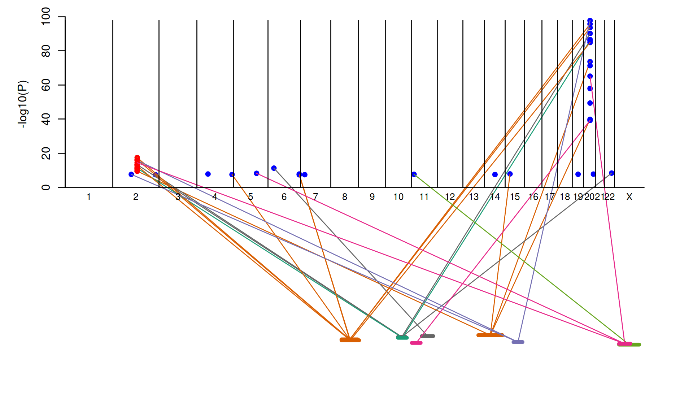

Figure 11.1: peptide association plot

### 11.2 Spectrum data analysis

#### 11.2.1 Setup

The .raw files can be handled by `rawrr` package nevertheless it
requires necessary files,

``` r
library(rawrr)
if (isFALSE(rawrr::.checkDllInMonoPath())){
   rawrr::installRawFileReaderDLLs()
}
if (isFALSE(file.exists(rawrr:::.rawrrAssembly()))){
   rawrr::installRawrrExe()
}
```

#### 11.2.2 List of.raw files

Based on a real project, the following is an example of
listing/generating multiple .raw from .zip files

``` r
# ZWK .raw data
spectra_ZWK <- "~/Caprion/pre_qc_data/spectral_library_ZWK"
raw_files <- list.files(spectra_ZWK, pattern = "\\.raw$", full.names = TRUE)
## collectively
suppressMessages(library(MsBackendRawFileReader))
ZWK <- Spectra::backendInitialize(MsBackendRawFileReader::MsBackendRawFileReader(),
       files = raw_files)
class(ZWK)
methods(class=class(ZWK))
Spectra(ZWK)
spectraData(ZWK)
ZWK
ZWKvars <- ZWK |> Spectra::spectraVariables()
ZWKdata <- ZWK |> Spectra::spectraData()
dim(ZWKdata)
# rows with >=1 non-NA value in the columns with prefix "precursor"
precursor <- apply(ZWKdata[grep("precursor",ZWKvars)], 1, function(x) any(!is.na(x)))
ZWKdata_filtered <- ZWKdata[precursor, ]
save(ZWK,file="~/Caprion/analysis/work/ZWK.rda")

# ZYQ/UDP
library(utils)
spectra <- "~/Caprion/pre_qc_data/spectra"
zip_files <- dir(spectra, recursive = TRUE, full.names=TRUE)
work_dir <- "~/Caprion/analysis/work"
for (zip_file in zip_files) unzip(zip_file, exdir=work_dir)
ZYQ_UDP <- Spectra::backendInitialize(MsBackendRawFileReader::MsBackendRawFileReader(),
           files = dir(work_dir,patt="raw",full.names=TRUE))
class(ZYQ_UDP)
ZYQ_UDP
ZYQ_UDP |> Spectra::spectraVariables()
save(ZYQ_UDP,file="~/Caprion/analysis/work/ZYQ_UDP.rda")
```

#### 11.2.3 Usage

Various facilities are shown below.

``` r
# various files
d <- "/rds/project/rds-zuZwCZMsS0w/Caprion_proteomics/analysis/crux"
f <- file.path(d,"szwk901104i19801xms1.mzML")
x <- file.path(d,"szwk901104i19801xms1.mzXML")
g <- file.path(d,"szwk901104i19801xms1.mgf")
r <- file.path(d,"szwk901104i19801xms1.rda")
z <- file.path(d,"szwk901104i19801xms1.mzML.gz")

# mzML
mz <- mzR::openMSfile(f)
header_info <- mzR::header(mz)
table(header_info$msLevel)
peak_data <- mzR::peaks(mz)
spec <- mzR::spectra(mz)
class(spec)
length(spec)
lapply(spec,head,3)
methods(class="mzRpwiz")
mzR::close(mz)

mz <- mzR::openMSfile(z, backend = "pwiz")
mz
nChrom(mz)
head(tic(mz))
head(chromatogram(mz, 1L)) ## same as tic(x)
str(chromatogram(mz))
head(peaks(mz, scan=4))

# MSnbase
mzXML <- MSnbase::readMSData(x)
mgf <- MSnbase::readMgfData(g)
save(mzXML,mgf,file=r)

MSnbase::extractSpectraData(mzXML)
MSnbase::hasSpectra(z)
MSnbase::hasChromatograms(z)
MSnbase::plot2d(mzXML,z="peaks.count")
MSnbase::plotDensity(mzXML,z="precursor.mz")

MSnbase::extractSpectraData(mgf)
methods(class="MSpectra")
MSnbase::mz(mgf)
MSnbase::intensity(mgf)
MSnbase::rtime(mgf)
MSnbase::precursorMz(mgf)
MSnbase::precursorCharge(mgf)
MSnbase::precScanNum(mgf)
MSnbase::precursorIntensity(mgf)
MSnbase::acquisitionNum(mgf)
MSnbase::scanIndex(mgf)
MSnbase::peaksCount(mgf)
MSnbase::msLevel(mgf)
MSnbase::tic(mgf)
MSnbase::ionCount(mgf)
MSnbase::collisionEnergy(mgf)
MSnbase::fromFile(mgf)
MSnbase::polarity(mgf)
MSnbase::smoothed(mgf)
MSnbase::centroided(mgf)
MSnbase::isCentroided(mgf)
MSnbase::writeMgfData(mgf, con = "spectra.mgf", COM = NULL, TITLE = NULL)
MSnbase::removePeaks(mgf, t, msLevel., ...)
MSnbase::filterMsLevel(mgf, msLevel=2)
MSnbase::as.ExpressionSet(mgf)

# This turned to be really slow!
sp_list <- lapply(seq_along(mgf), function(i) {
  intensity_i <- MSnbase::intensity(mgf)[[i]]
  mz_i <- MSnbase::mz(mgf)[[i]]
  centroided_i <- MSnbase::centroided(mgf)[[i]]
  return(new("Spectrum1", intensity = intensity_i, mz = mz_i, centroided = centroided_i))
})
sp1 <- do.call(rbind, sp_list)
# only the first one is more manageable
sp1 <- new("Spectrum1",intensity=MSnbase::intensity(mgf)[[1]],mz=MSnbase::mz(mgf)[[1]],centroided=MSnbase::centroided(mgf)[[1]])
sp2 <- MSnbase::pickPeaks(sp1)
MSnbase::intensity(sp2)
plot(MSnbase::mz(sp1),MSnbase::intensity(sp1),type="h")
## Without m/z refinement
points(MSnbase::mz(sp2), MSnbase::intensity(sp2), col = "darkgrey")
## Using k = 1, closest signals
sp3 <- MSnbase::pickPeaks(sp1, refineMz = "kNeighbors", k = 1)
points(MSnbase::mz(sp3), MSnbase::intensity(sp3), col = "green", type = "h")
## Using descendPeak requiring at least 50% or the centroid's intensity
sp4 <- MSnbase::pickPeaks(sp1, refineMz = "descendPeak", signalPercentage = 50)
points(MSnbase::mz(sp4), MSnbase::intensity(sp4), col = "red", type = "h")

# CAMERA
xs   <- CAMERA::xcmsSet(f, method="centWave", ppm=30, peakwidth=c(5,10))
an   <- CAMERA::xsAnnotate(xs)
an   <- CAMERA::groupFWHM(an)
#For one group
peaklist <- CAMERA::getpspectra(an, 1)
#For two groups
peaklist <- CAMERA::getpspectra(an, c(1,2))

# Spectra
suppressMessages(library(Spectra))
sp <- Spectra::Spectra(z)
head(sp)
table(sp$msLevel)
d <- Spectra::computeMzDeltas(sp[1:1000])
Spectra::plotMzDelta(d)

# protViz
protViz::fragmentIon("TFVLNFIK")
esd <- MSnbase::extractSpectraData(mgf)
op <- par(mfrow=c(2,1))
ms <- function(i) with(esd[i,],list(title=TITLE,rtinseconds=RTINSECONDS,pepmass=PEPMASS,charge=CHARGE,
                                    mZ=MSnbase::mz(mgf[[i]]),intensity=MSnbase::intensity(mgf[[i]])))
protViz::peakplot("TAFDEAIAELDTLNEESYK", ms(1))
protViz::peakplot("TAFDEAIAELDTLSEESYK", ms(2))
par(op)
load("~/Caprion/pilot/ZWK.rda")
peptides <- subset(mapping_ZWK,Protein=="PROC_HUMAN")[["Modified.Peptide.Sequence"]] |> unique()
pim <- protViz::parentIonMass(peptides)
fi <- protViz::fragmentIon(peptides)
df <- as.data.frame(fi)
op <- par(mfrow=c(3,1))
for (i in 1:length(peptides)){
    plot(0, 0,
    xlab='m/Z',
    ylab='',
    xlim=range(c(fi[[i]]$b,fi[[i]]$y)),
    ylim=c(0,1),
    type='n',
    axes=FALSE,
    sub=paste(peptides[i], "/", pim[i], "Da"));
    box()
    axis(1, fi[[i]]$b, round(fi[[i]]$b,1), las=2)
    axis(1, fi[[i]]$y, round(fi[[i]]$y,1), las=2)

    pepSeq<-strsplit(peptides[i], "")
    axis(3,fi[[i]]$b, paste("b", row.names(fi[[i]]),sep=''),las=2)
    axis(3,fi[[i]]$y, paste("y", row.names(fi[[i]]),sep=''),las=2)

    text(fi[[i]]$b, rep(0.3, nchar(peptides[i])),
    pepSeq[[1]],pos=3,cex=4, lwd=4, col="#aaaaaaaa")

    abline(v=fi[[i]]$b, col='red')
    abline(v=fi[[i]]$y, col='blue',lwd=2)
}
par(op)

# MSstats
head(SRMRawData)
QuantData <- MSstats::dataProcess(SRMRawData, use_log_file = FALSE)
quant <- MSstats::dataProcess(SRMRawData,
                              normalization = "equalizeMedians",
                              summaryMethod = "TMP",
                              censoredInt = "NA",
                              MBimpute = TRUE,
                              maxQuantileforCensored = 0.999,
                              logTrans=2,
                              use_log_file=FALSE,
                              numberOfCores=5)
names(quant)
```

MSstats^([3](#ref-kohler23)) takes output from other data-processing
pipelines.

## 12 Bionconductor forum

Web: <https://support.bioconductor.org/>

## 13 Bioconductor/CRAN packages

| Package                              | Description                                                                                              |
|--------------------------------------|----------------------------------------------------------------------------------------------------------|
| **Bioconductor**                     |                                                                                                          |
| AnnotationDbi                        | AnnotationDb objects and their progeny, methods etc.                                                     |
| Biobase                              | Base functions for Bioconductor                                                                          |
| Biostrings                           | Efficient manipulation of biological strings                                                             |
| CAMERA                               | Collection of annotation related methods                                                                 |
| clusterProfiler                      | Functional profiles for genes and gene clusters                                                          |
| ComplexHeatmap                       | Make complex heatmaps                                                                                    |
| DESSeq2                              | Differential gene expression analysis based on the negative binomial distribution                        |
| edgeR                                | Empirical analysis of digital gene expression                                                            |
| EnsDb.Hsapiens.v86                   | Exposes an annotation databases generated from Ensembl                                                   |
| ensembldb                            | Retrieve annotation data from an Ensembl based package                                                   |
| FlowSorted.DLPFC.450k                | Illumina HumanMethylation data on sorted frontal cortex cell populations                                 |
| graphite                             | GRAPH Interaction from pathway topological environment                                                   |
| IlluminaHumanMethylation450kmanifest | Annotation for Illumina’s 450k methylation arrays                                                        |
| INSPEcT                              | Quantification of the intronic and exonic gene features and the post-transcriptional regulation analysis |
| MSnbase                              | Base Functions and Classes for Mass Spectrometry and Proteomics                                          |
| MSstats                              | Protein Significance Analysis in DDA, SRM and DIA Proteomics                                             |
| mzR                                  | parser for netCDF, mzXML and mzML and mzIdentML files                                                    |
| org.Hs.eg.db                         | Conversion of Entrez ID – gene symbols                                                                   |
| OUTRIDER                             | OUTlier in RNA-Seq fInDER                                                                                |
| Pi                                   | Priority index, leveraging genetic evidence to prioritise drug targets at the gene and pathway level     |
| quantro                              | A test for when to use quantile normalisation                                                            |
| rawrr                                | Direct Access to Orbitrap Data and Beyond                                                                |
| recount3                             | Interface to uniformly processed RNA-seq data                                                            |
| Rgraphiz                             | Interfaces R with the AT&T graphviz library for plotting R graph objects from the graph package          |
| Spectra                              | Spectra Infrastructure for Mass Spectrometry                                                             |
| sva                                  | Surrogate Variable Analysis                                                                              |
| TxDb.Hsapiens.UCSC.hg38.knownGene    | Annotation of the human genome                                                                           |
| **CRAN**                             |                                                                                                          |
| doParallel                           | Foreach Parallel Adaptor for the ‘parallel’ Package                                                      |
| GeneNet                              | Modeling and Inferring Gene Networks                                                                     |
| ggplot2                              | Data Visualisations Using the grammar of graphics                                                        |
| heatmaply                            | Interactive Cluster Heat Maps Using `plotly` and `ggplot2`                                               |
| pheatmap                             | results visualisation                                                                                    |
| plyr                                 | Splitting, applying and combining data                                                                   |
| protViz                              | Foreach Parallel Adaptor for the ‘parallel’ Package                                                      |
| RColorBrewer                         | ColorBrewer Palettes                                                                                     |
| WGCNA                                | Weighted correlation network analysis                                                                    |

## References

1\.

Köster, J., Forster, J., Schmeier, S. & Salazar, V.
snakemake-workflows/rna-seq-star-deseq2: Version 1.2.0. (2021)
doi:[10.5281/zenodo.5245549](https://doi.org/10.5281/zenodo.5245549).

2\.

Carlson, M. R. J., Pagès, H., Arora, S., Obenchain, V. & Morgan, M.
Genomic annotation resources in R/Bioconductor. in *Statistical
genomics: Methods and protocols* (eds. Mathé, E. & Davis, S.) 67–69
(Springer New York, New York, NY, 2016).
doi:[10.1007/978-1-4939-3578-9_4](https://doi.org/10.1007/978-1-4939-3578-9_4).

3\.

Kohler, D. *et al.* [MSstats version 4.0: Statistical analyses of
quantitative mass spectrometry-based proteomic experiments with
chromatography-based quantification at
scale](https://doi.org/10.1021/acs.jproteome.2c00834). *Journal of
Proteome Research* **22**, 1466–1482 (2023).
