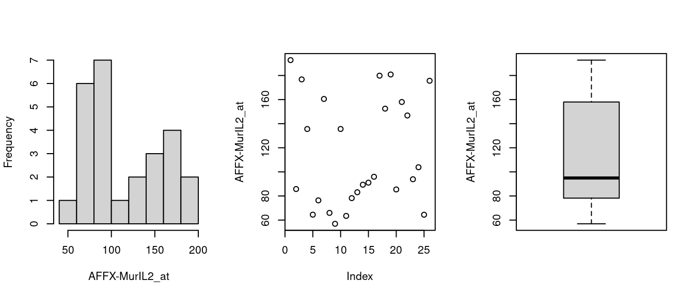
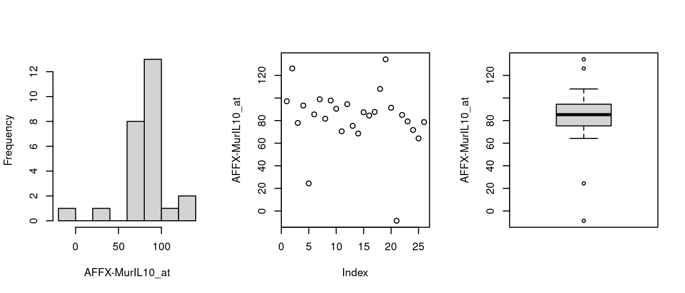
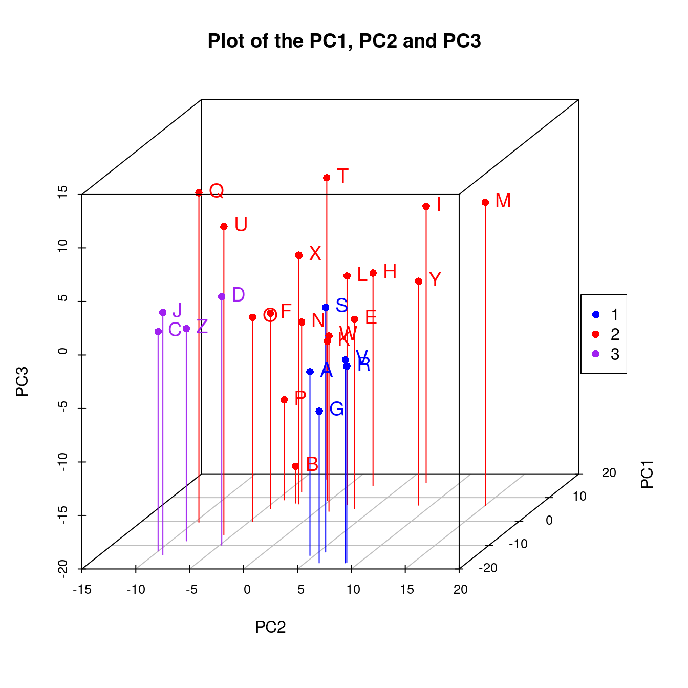
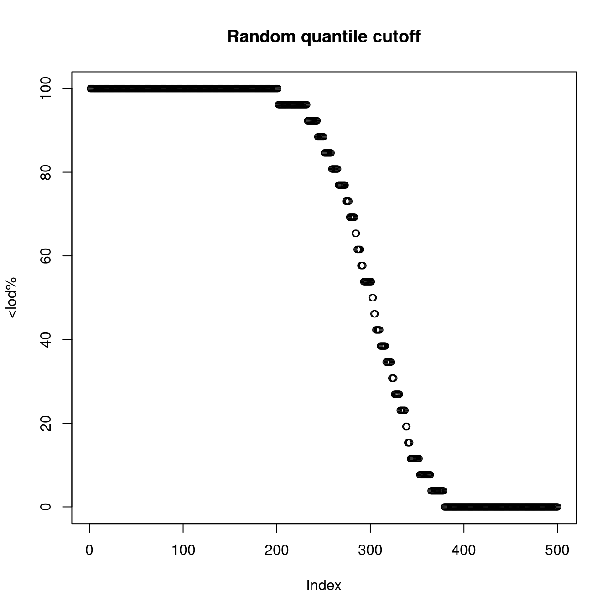
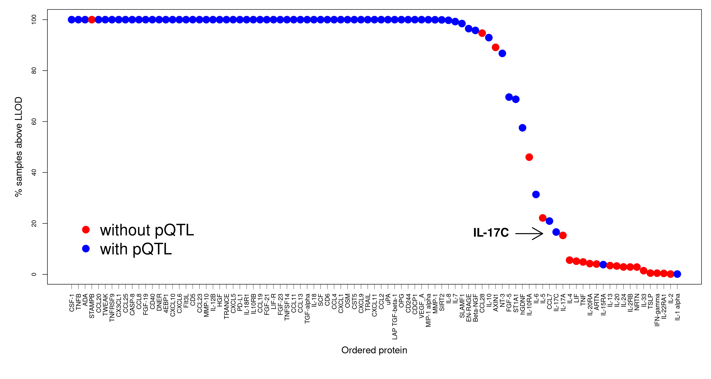

# ExpressionSet/SummarizedExperiment usage

``` r
es_pkgs <- c("Biobase", "arrayQualityMetrics", "dplyr", "knitr", "mclust", "pQTLtools", "rgl", "scatterplot3d")
se_pkgs <- c("BiocGenerics","GenomicRanges","IRanges","MsCoreUtils","S4Vectors","SummarizedExperiment","impute")
pkgs <- c(es_pkgs,se_pkgs)
for (p in pkgs) if (length(grep(paste("^package:", p, "$", sep=""), search())) == 0) {
    if (!requireNamespace(p)) warning(paste0("This vignette needs package `", p, "'; please install"))
}
invisible(suppressMessages(lapply(pkgs, require, character.only = TRUE)))
```

## 1 ExpressionSet

We start with Bioconductor/Biobase’s ExpressionSet example and finish
with a real application.

``` r
dataDirectory <- system.file("extdata", package="Biobase")
exprsFile <- file.path(dataDirectory, "exprsData.txt")
exprs <- as.matrix(read.table(exprsFile, header=TRUE, sep="\t", row.names=1, as.is=TRUE))
pDataFile <- file.path(dataDirectory, "pData.txt")
pData <- read.table(pDataFile, row.names=1, header=TRUE, sep="\t")
all(rownames(pData)==colnames(exprs))
metadata <- data.frame(labelDescription=c("Patient gender",
                                          "Case/control status",
                                          "Tumor progress on XYZ scale"),
                       row.names=c("gender", "type", "score"))
phenoData <- Biobase::AnnotatedDataFrame(data=pData, varMetadata=metadata)
experimentData <- Biobase::MIAME(name="Pierre Fermat",
                                 lab="Francis Galton Lab",
                                 contact="pfermat@lab.not.exist",
                                 title="Smoking-Cancer Experiment",
                                 abstract="An example ExpressionSet",
                                 url="www.lab.not.exist",
                                 other=list(notes="Created from text files"))
exampleSet <- pQTLtools::make_ExpressionSet(exprs,phenoData,experimentData=experimentData,
                                            annotation="hgu95av2")
data(sample.ExpressionSet, package="Biobase")
identical(exampleSet,sample.ExpressionSet)
```

### 1.1 data.frame

The great benefit is to use the object directly as a data.frame.

``` r
lm.result <- Biobase::esApply(exampleSet,1,function(x) lm(score~gender+x))
beta.x <- unlist(lapply(lapply(lm.result,coef),"[",3))
beta.x[1]
#> AFFX-MurIL2_at.x 
#>    -0.0001907472
lm(score~gender+AFFX.MurIL2_at,data=exampleSet)
#> 
#> Call:
#> lm(formula = score ~ gender + AFFX.MurIL2_at, data = exampleSet)
#> 
#> Coefficients:
#>    (Intercept)      genderMale  AFFX.MurIL2_at  
#>      0.5531725       0.0098932      -0.0001907
```

### 1.2 Composite plots

We wish to examine the distribution of each feature via histogram,
scatter and boxplot. One could resort to `esApply()` for its simplicity
as before

``` r
invisible(Biobase::esApply(exampleSet[1:2],1,function(x)
                           {par(mfrow=c(3,1));boxplot(x);hist(x);plot(x)}
))
```

but it is nicer to add feature name in the title.

``` r
par(mfrow=c(1,3))
f <- Biobase::featureNames(exampleSet[1:2])
invisible(sapply(f,function(x) {
                     d <- t(Biobase::exprs(exampleSet[x]))
                     fn <- Biobase::featureNames(exampleSet[x])
                     hist(d,main="",xlab=fn); plot(d, ylab=fn); boxplot(d,ylab=fn)
                   }
          )
)
```



Figure 1.1: Histogram, scatter & boxplots



Figure 1.2: Histogram, scatter & boxplots

where the expression set is indexed using feature name(s).

### 1.3 Outlier detections

This illustrates one mechanism,

``` r
list_outliers <- function(es, method="upperquartile")
                 arrayQualityMetrics::outliers(exprs(es),method=method)
for (method in c("KS","sum","upperquartile"))
{
  ZWK_outliers <- list_outliers(protein_ZWK,method=method)
  print(ZWK_outliers@statistic[ZWK_outliers@which])
}
```

### 1.4 Clustering

We employ model-based clustering absed on principal compoents to see
potential groupings in the data,

``` r
  pca <- prcomp(na.omit(t(Biobase::exprs(exampleSet))), rank=10, scale=TRUE)
  pc1pc2pc3 <- with(pca,x)[,1:3]
  mc <- mclust::Mclust(pc1pc2pc3,G=3)
  with(mc, {
      cols <- c("blue","red", "purple")
      s3d <- scatterplot3d::scatterplot3d(with(pca,x[,c(2,1,3)]),
                                          color=cols[classification],
                                          pch=16,
                                          type="h",
                                          main="Plot of the PC1, PC2 and PC3")
      s3d.coords <- s3d$xyz.convert(with(pca,x[,c(2,1,3)]))
      text(s3d.coords$x, 
           s3d.coords$y,   
           cex = 1.2,
           col = cols[classification],
           labels = row.names(pc1pc2pc3),
           pos = 4)
      legend("right", legend=levels(as.factor(classification)), col=cols[classification], pch=16)
      rgl::open3d(width = 500, height = 500)
      rgl::plot3d(with(pca,x[,c(2,1,3)]),cex=1.2,col=cols[classification],size=5)
      rgl::text3d(with(pca,x[,c(2,1,3)]),cex=1.2,col=cols[classification],texts=row.names(pc1pc2pc3))
      htmlwidgets::saveWidget(rgl::rglwidget(), file = "mcpca3d.html")
  })
```



Figure 1.3: Three-group Clustering

    #> Warning in par3d(userMatrix = structure(c(1, 0, 0, 0, 0, 0.342020143325668, :
    #> parameter "width" cannot be set
    #> Warning in par3d(userMatrix = structure(c(1, 0, 0, 0, 0, 0.342020143325668, :
    #> parameter "height" cannot be set

An interactive version is also available,

### 1.5 Data transformation

Suppose we wish use log2 for those greater than zero but set those
negative values to be missing.

``` r
log2.na <- function(x) log2(ifelse(x>0, x, NA))
Biobase::exprs(exampleSet) <- log2.na(Biobase::exprs(exampleSet))
```

### 1.6 Limit of detection (LOD)

We generate a `lod.max` \~ U\[0,1\] variable to experiment

``` r
Biobase::fData(exampleSet)
#> data frame with 0 columns and 500 rows
Biobase::fData(exampleSet)$lod.max <- apply(Biobase::exprs(exampleSet),1,quantile,runif(nrow(exampleSet)))
lod <- pQTLtools::get.prop.below.LLOD(exampleSet)
x <- dplyr::arrange(Biobase::fData(lod),desc(pc.belowLOD.new))
knitr::kable(head(lod))
```

|     | AFFX.MurIL2_at | AFFX.MurIL10_at | AFFX.MurIL4_at | AFFX.MurFAS_at | AFFX.BioB.5_at | AFFX.BioB.M_at | gender | type    | score |
|:----|---------------:|----------------:|---------------:|---------------:|---------------:|---------------:|:-------|:--------|------:|
| A   |       192.7420 |        97.13700 |       45.81920 |       22.54450 |        96.7875 |        89.0730 | Female | Control |  0.75 |
| B   |        85.7533 |       126.19600 |        8.83135 |        3.60093 |        30.4380 |        25.8461 | Male   | Case    |  0.40 |
| C   |       176.7570 |        77.92160 |       33.06320 |       14.68830 |        46.1271 |        57.2033 | Male   | Control |  0.73 |
| D   |       135.5750 |        93.37130 |       28.70720 |       12.33970 |        70.9319 |        69.9766 | Male   | Case    |  0.42 |
| E   |        64.4939 |        24.39860 |        5.94492 |       36.86630 |        56.1744 |        49.5822 | Female | Case    |  0.93 |
| F   |        76.3569 |        85.50880 |       28.29250 |       11.25680 |        42.6756 |        26.1262 | Male   | Control |  0.22 |
| G   |       160.5050 |        98.90860 |       30.96940 |       23.00340 |        86.5156 |        75.0083 | Male   | Case    |  0.96 |
| H   |        65.9631 |        81.69320 |       14.79230 |       16.21340 |        30.7927 |        42.3352 | Male   | Case    |  0.79 |
| I   |        56.9039 |        97.80150 |       14.23990 |       12.03750 |        19.7183 |        41.1207 | Female | Case    |  0.37 |
| J   |       135.6080 |        90.48380 |       34.48740 |        4.54978 |        46.3520 |        91.5307 | Male   | Control |  0.63 |
| K   |        63.4432 |        70.57330 |       20.35210 |        8.51782 |        39.1326 |        39.9136 | Male   | Case    |  0.26 |
| L   |        78.2126 |        94.54180 |       14.15540 |       27.28520 |        41.7698 |        49.8397 | Female | Control |  0.36 |
| M   |        83.0943 |        75.34550 |       20.62510 |       10.16160 |        80.2197 |        63.4794 | Male   | Case    |  0.41 |
| N   |        89.3372 |        68.58270 |       15.92310 |       20.24880 |        36.4903 |        24.7007 | Male   | Case    |  0.80 |
| O   |        91.0615 |        87.40500 |       20.15790 |       15.78490 |        36.4021 |        47.4641 | Female | Case    |  0.10 |
| P   |        95.9377 |        84.45810 |       27.81390 |       14.32760 |        35.3054 |        47.3578 | Female | Control |  0.41 |
| Q   |       179.8450 |        87.68060 |       32.79110 |       15.94880 |        58.6239 |        58.1331 | Female | Case    |  0.16 |
| R   |       152.4670 |       108.03200 |       33.52920 |       14.67530 |       114.0620 |       104.1220 | Male   | Control |  0.72 |
| S   |       180.8340 |       134.26300 |       19.81720 |       -7.91911 |        93.4402 |       115.8310 | Male   | Case    |  0.17 |
| T   |        85.4146 |        91.40310 |       20.41900 |       12.88750 |        22.5168 |        58.1224 | Female | Case    |  0.74 |
| U   |       157.9890 |        -8.68811 |       26.87200 |       11.91860 |        48.6462 |        73.4221 | Male   | Control |  0.35 |
| V   |       146.8000 |        85.02120 |       31.14880 |       12.83240 |        90.2215 |        64.6066 | Female | Control |  0.77 |
| W   |        93.8829 |        79.29980 |       22.34200 |       11.13900 |        42.0053 |        40.3068 | Male   | Control |  0.27 |
| X   |       103.8550 |        71.65520 |       19.01350 |        7.55564 |        57.5738 |        41.8209 | Male   | Control |  0.98 |
| Y   |        64.4340 |        64.23690 |       12.16860 |       19.98490 |        44.8216 |        46.1087 | Female | Case    |  0.94 |
| Z   |       175.6150 |        78.70680 |       17.37800 |        8.96849 |        61.7044 |        49.4122 | Female | Case    |  0.32 |

``` r
plot(x[,2], main="Random quantile cutoff", ylab="<lod%")
```



Figure 1.4: LOD based on a random cutoff

The quantity has been shown to have a big impact on protein abundance
and therefore pQTL detection as is shown with a real example.

``` r
rm(list=ls())
dir <- "~/rds/post_qc_data/interval/phenotype/olink_proteomics/post-qc/"
eset <- readRDS(paste0(dir,"eset.inf1.flag.out.outlier.in.rds"))
x <- pQTLtools::get.prop.below.LLOD(eset)
annot <- Biobase::fData(x)
annot$MissDataProp <- as.numeric(gsub("\\%$", "", annot$MissDataProp))
plot(annot$MissDataProp, annot$pc.belowLOD.new, xlab="% <LLOD in Original",
     ylab="% <LLOD in post QC dataset", pch=19)
INF <- Sys.getenv("INF")
np <- read.table(paste(INF, "work", "INF1.merge.nosig", sep="/"), header=FALSE,
                 col.names = c("prot", "uniprot"))
kable(np, caption="Proteins with no pQTL")
annot$pQTL <- rep(NA, nrow(annot))
no.pQTL.ind <- which(annot$uniprot.id %in% np$uniprot)
annot$pQTL[no.pQTL.ind] <- "red"
annot$pQTL[-no.pQTL.ind] <- "blue"
annot <- annot[order(annot$pc.belowLOD.new, decreasing = TRUE),]
annot <- annot[-grep("^BDNF$", annot$ID),]
saveRDS(annot,file=file.path("~","pQTLtools","tests","annot.RDS"))
```

``` r
annot <- readRDS(file.path(find.package("pQTLtools"),"tests","annot.RDS")) %>%
         dplyr::left_join(pQTLdata::inf1[c("prot","target.short","alt_name")],by=c("ID"="prot")) %>%
         dplyr::mutate(prot=if_else(is.na(alt_name),target.short,alt_name),order=1:n()) %>%
         dplyr::arrange(desc(order))
xtick <- seq(1, nrow(annot))
attach(annot)
par(mar=c(10,5,1,1))
plot(100-pc.belowLOD.new,cex=2,pch=19,col=pQTL,xaxt="n",xlab="",ylab="",cex.axis=0.8)
text(66,16,"IL-17C",offset=0,pos=2,cex=1.5,font=2,srt=0)
arrows(67,16,71,16,lwd=2)
axis(1, at=xtick, labels=prot, lwd.tick=0.5, lwd=0, las=2, hadj=1, cex.axis=0.8)
mtext("% samples above LLOD",side=2,line=2.5,cex=1.2)
mtext("Ordered protein",side=1,line=6.5,cex=1.2,font=1)
legend(x=1,y=25,c("without pQTL","with pQTL"),box.lwd=0,cex=2,col=c("red","blue"),pch=19)
```



Figure 1.5: LOD in SCALLOP-INF/INTERVAL

``` r
detach(annot)
options(width=120)
knitr::kable(annot,caption="Summary statistics",row.names=FALSE)
```

| ID             | dichot | olink.id           | uniprot.id | lod.max | MissDataProp | pc.belowLOD.new | pQTL | target.short   | alt_name | prot           | order |
|:---------------|:-------|:-------------------|:-----------|--------:|-------------:|----------------:|:-----|:---------------|:---------|:---------------|------:|
| CSF.1          | FALSE  | 196_CSF-1          | P09603     |    1.02 |         0.02 |       0.0000000 | blue | CSF-1          | NA       | CSF-1          |    91 |
| TNFB           | FALSE  | 195_TNFB           | P01374     |    1.10 |         0.04 |       0.0000000 | blue | TNFB           | NA       | TNFB           |    90 |
| ADA            | FALSE  | 194_ADA            | P00813     |    1.80 |         0.04 |       0.0000000 | blue | ADA            | NA       | ADA            |    89 |
| STAMPB         | FALSE  | 192_STAMPB         | O95630     |    1.40 |         0.06 |       0.0000000 | red  | STAMPB         | NA       | STAMPB         |    88 |
| CCL20          | FALSE  | 190_CCL20          | P78556     |    1.42 |         0.02 |       0.0000000 | blue | CCL20          | NA       | CCL20          |    87 |
| TWEAK          | FALSE  | 189_TWEAK          | O43508     |    1.78 |         0.02 |       0.0000000 | blue | TWEAK          | NA       | TWEAK          |    86 |
| TNFRSF9        | FALSE  | 187_TNFRSF9        | Q07011     |    1.86 |         0.02 |       0.0000000 | blue | TNFRSF9        | NA       | TNFRSF9        |    85 |
| CX3CL1         | FALSE  | 186_CX3CL1         | P78423     |    1.76 |         0.02 |       0.0000000 | blue | CX3CL1         | NA       | CX3CL1         |    84 |
| CCL25          | FALSE  | 185_CCL25          | O15444     |    1.32 |         0.02 |       0.0000000 | blue | CCL25          | NA       | CCL25          |    83 |
| CASP.8         | FALSE  | 184_CASP-8         | Q14790     |    1.38 |         0.04 |       0.0000000 | blue | CASP-8         | NA       | CASP-8         |    82 |
| MCP.2          | FALSE  | 183_MCP-2          | P80075     |    2.10 |         0.02 |       0.0000000 | blue | MCP-2          | CCL8     | CCL8           |    81 |
| FGF.19         | FALSE  | 179_FGF-19         | O95750     |    1.25 |         0.02 |       0.0000000 | blue | FGF-19         | NA       | FGF-19         |    80 |
| CD40           | FALSE  | 176_CD40           | P25942     |    1.91 |         0.04 |       0.0000000 | blue | CD40           | NA       | CD40           |    79 |
| DNER           | FALSE  | 174_DNER           | Q8NFT8     |    1.63 |         0.02 |       0.0000000 | blue | DNER           | NA       | DNER           |    78 |
| 4E.BP1         | FALSE  | 170_4E-BP1         | Q13541     |    1.04 |         0.10 |       0.0000000 | blue | 4EBP1          | NA       | 4EBP1          |    77 |
| CXCL10         | FALSE  | 169_CXCL10         | P02778     |    2.03 |         0.02 |       0.0000000 | blue | CXCL10         | NA       | CXCL10         |    76 |
| CXCL6          | FALSE  | 168_CXCL6          | P80162     |    1.80 |         0.02 |       0.0000000 | blue | CXCL6          | CXCL6    | CXCL6          |    75 |
| Flt3L          | FALSE  | 167_Flt3L          | P49771     |    2.12 |         0.02 |       0.0000000 | blue | FIt3L          | NA       | FIt3L          |    74 |
| CD5            | FALSE  | 165_CD5            | P06127     |    1.42 |         0.02 |       0.0000000 | blue | CD5            | NA       | CD5            |    73 |
| CCL23          | FALSE  | 164_CCL23          | P55773     |    2.10 |         0.02 |       0.0000000 | blue | CCL23          | NA       | CCL23          |    72 |
| MMP.10         | FALSE  | 161_MMP-10         | P09238     |    1.56 |         0.02 |       0.0000000 | blue | MMP-10         | NA       | MMP-10         |    71 |
| IL.12B         | FALSE  | 157_IL-12B         | P29460     |    0.85 |         0.02 |       0.0000000 | blue | IL-12B         | NA       | IL-12B         |    70 |
| HGF            | FALSE  | 156_HGF            | P14210     |    1.77 |         0.02 |       0.0000000 | blue | HGF            | NA       | HGF            |    69 |
| TRANCE         | FALSE  | 155_TRANCE         | O14788     |    1.51 |         0.04 |       0.0000000 | blue | TRANCE         | NA       | TRANCE         |    68 |
| CXCL5          | FALSE  | 154_CXCL5          | P42830     |    1.92 |         0.02 |       0.0000000 | blue | CXCL5          | NA       | CXCL5          |    67 |
| PD.L1          | FALSE  | 152_PD-L1          | Q9NZQ7     |    2.14 |         0.04 |       0.0000000 | blue | PD-L1          | NA       | PD-L1          |    66 |
| IL.18R1        | FALSE  | 151_IL-18R1        | Q13478     |    1.21 |         0.02 |       0.0000000 | blue | IL-18R1        | NA       | IL-18R1        |    65 |
| IL.10RB        | FALSE  | 149_IL-10RB        | Q08334     |    1.72 |         0.02 |       0.0000000 | blue | IL10RB         | NA       | IL10RB         |    64 |
| CCL19          | FALSE  | 145_CCL19          | Q99731     |    2.13 |         0.02 |       0.0000000 | blue | CCL19          | NA       | CCL19          |    63 |
| FGF.21         | FALSE  | 144_FGF-21         | Q9NSA1     |    1.14 |         0.02 |       0.0000000 | blue | FGF-21         | NA       | FGF-21         |    62 |
| LIF.R          | FALSE  | 143_LIF-R          | P42702     |    2.08 |         0.04 |       0.0000000 | blue | LIF-R          | NA       | LIF-R          |    61 |
| FGF.23         | FALSE  | 139_FGF-23         | Q9GZV9     |    0.66 |         0.04 |       0.0000000 | blue | FGF-23         | NA       | FGF-23         |    60 |
| TNFSF14        | FALSE  | 138_TNFSF14        | O43557     |    1.81 |         0.02 |       0.0000000 | blue | TNFSF14        | NA       | TNFSF14        |    59 |
| CCL11          | FALSE  | 137_CCL11          | P51671     |    2.09 |         0.02 |       0.0000000 | blue | CCL11          | CCL11    | CCL11          |    58 |
| MCP.4          | FALSE  | 136_MCP-4          | Q99616     |    0.56 |         0.04 |       0.0000000 | blue | MCP-4          | CCL13    | CCL13          |    57 |
| TGF.alpha      | FALSE  | 135_TGF-alpha      | P01135     |    0.07 |         0.02 |       0.0000000 | blue | TGF-alpha      | NA       | TGF-alpha      |    56 |
| IL.18          | FALSE  | 133_IL-18          | Q14116     |    2.79 |         0.02 |       0.0000000 | blue | IL-18          | NA       | IL-18          |    55 |
| SCF            | FALSE  | 132_SCF            | P21583     |    2.30 |         0.02 |       0.0000000 | blue | SCF            | NA       | SCF            |    54 |
| CD6            | FALSE  | 131_CD6            | Q8WWJ7     |    1.78 |         0.04 |       0.0000000 | blue | CD6            | NA       | CD6            |    53 |
| CCL4           | FALSE  | 130_CCL4           | P13236     |    2.15 |         0.02 |       0.0000000 | blue | CCL4           | NA       | CCL4           |    52 |
| CXCL1          | FALSE  | 128_CXCL1          | P09341     |    3.45 |         0.02 |       0.0000000 | blue | CXCL1          | NA       | CXCL1          |    51 |
| OSM            | FALSE  | 126_OSM            | P13725     |    1.32 |         0.06 |       0.0000000 | blue | OSM            | NA       | OSM            |    50 |
| CST5           | FALSE  | 123_CST5           | P28325     |    4.34 |         0.04 |       0.0000000 | blue | CST5           | NA       | CST5           |    49 |
| CXCL9          | FALSE  | 122_CXCL9          | Q07325     |    1.04 |         0.02 |       0.0000000 | blue | CXCL9          | NA       | CXCL9          |    48 |
| TRAIL          | FALSE  | 120_TRAIL          | P50591     |    1.22 |         0.02 |       0.0000000 | blue | TRAIL          | NA       | TRAIL          |    47 |
| CXCL11         | FALSE  | 117_CXCL11         | O14625     |    1.40 |         0.02 |       0.0000000 | blue | CXCL11         | NA       | CXCL11         |    46 |
| MCP.1          | FALSE  | 115_MCP-1          | P13500     |    1.90 |         0.02 |       0.0000000 | blue | MCP-1          | CCL2     | CCL2           |    45 |
| uPA            | FALSE  | 112_uPA            | P00749     |    1.75 |         0.02 |       0.0000000 | blue | uPA            | NA       | uPA            |    44 |
| LAP.TGF.beta.1 | FALSE  | 111_LAP TGF-beta-1 | P01137     |    0.86 |         0.02 |       0.0000000 | blue | LAP TGF-beta-1 | NA       | LAP TGF-beta-1 |    43 |
| OPG            | FALSE  | 110_OPG            | O00300     |    1.81 |         0.02 |       0.0000000 | blue | OPG            | NA       | OPG            |    42 |
| CD244          | FALSE  | 108_CD244          | Q9BZW8     |    1.09 |         0.02 |       0.0000000 | blue | CD244          | NA       | CD244          |    41 |
| CDCP1          | FALSE  | 107_CDCP1          | Q9H5V8     |    0.21 |         0.04 |       0.0000000 | blue | CDCP1          | NA       | CDCP1          |    40 |
| VEGF.A         | FALSE  | 102_VEGF-A         | P15692     |    3.15 |         0.02 |       0.0000000 | blue | VEGF_A         | NA       | VEGF_A         |    39 |
| MIP.1.alpha    | FALSE  | 166_MIP-1 alpha    | P10147     |    1.92 |         0.06 |       0.0203998 | blue | MIP-1 alpha    | NA       | MIP-1 alpha    |    38 |
| MMP.1          | FALSE  | 142_MMP-1          | P03956     |    1.89 |         0.06 |       0.0407997 | blue | MMP-1          | NA       | MMP-1          |    37 |
| SIRT2          | FALSE  | 172_SIRT2          | Q8IXJ6     |    1.52 |         1.00 |       0.0815993 | blue | SIRT2          | NA       | SIRT2          |    36 |
| IL.8           | FALSE  | 101_IL-8           | P10145     |    3.17 |         0.25 |       0.2447980 | blue | IL-8           | NA       | IL-8           |    35 |
| IL.7           | FALSE  | 109_IL-7           | P13232     |    1.39 |         1.43 |       0.7547940 | blue | IL-7           | NA       | IL-7           |    34 |
| SLAMF1         | FALSE  | 134_SLAMF1         | Q13291     |    1.55 |         2.13 |       1.5299878 | blue | SLAMF1         | NA       | SLAMF1         |    33 |
| EN.RAGE        | FALSE  | 175_EN-RAGE        | P80511     |    1.57 |         3.28 |       3.5291718 | blue | EN-RAGE        | NA       | EN-RAGE        |    32 |
| Beta.NGF       | FALSE  | 153_Beta-NGF       | P01138     |    1.23 |         3.96 |       4.2227662 | blue | Beta-NGF       | NA       | Beta-NGF       |    31 |
| CCL28          | FALSE  | 173_CCL28          | Q9NRJ3     |    0.92 |         5.49 |       5.2835577 | red  | CCL28          | NA       | CCL28          |    30 |
| IL.10          | FALSE  | 162_IL-10          | P22301     |    1.50 |         7.71 |       7.0583435 | blue | IL-10          | NA       | IL-10          |    29 |
| AXIN1          | FALSE  | 118_AXIN1          | O15169     |    1.30 |        13.04 |      10.8731130 | red  | AXIN1          | NA       | AXIN1          |    28 |
| NT.3           | FALSE  | 188_NT-3           | P20783     |    0.85 |        12.77 |      13.2394941 | blue | NT-3           | NA       | NT-3           |    27 |
| FGF.5          | FALSE  | 141_FGF-5          | Q8NF90     |    1.00 |        31.71 |      30.3957568 | blue | FGF-5          | NA       | FGF-5          |    26 |
| ST1A1          | FALSE  | 191_ST1A1          | P50225     |    1.34 |        32.68 |      31.2525500 | blue | ST1A1          | NA       | ST1A1          |    25 |
| GDNF           | FALSE  | 106_GDNF           | P39905     |    1.13 |        43.26 |      42.4520604 | blue | hGDNF          | NA       | hGDNF          |    24 |
| IL.10RA        | FALSE  | 140_IL-10RA        | Q13651     |    1.14 |        53.30 |      53.9779682 | red  | IL-10RA        | NA       | IL-10RA        |    23 |
| IL.6           | FALSE  | 113_IL-6           | P05231     |    1.97 |        69.06 |      68.6250510 | blue | IL-6           | NA       | IL-6           |    22 |
| IL.5           | FALSE  | 193_IL-5           | P05113     |    1.55 |        78.21 |      77.8457772 | red  | IL-5           | NA       | IL-5           |    21 |
| MCP.3          | FALSE  | 105_MCP-3          | P80098     |    1.31 |        79.30 |      79.0697674 | blue | MCP-3          | CCL7     | CCL7           |    20 |
| IL.17C         | FALSE  | 114_IL-17C         | Q9P0M4     |    1.28 |        83.07 |      83.3741330 | blue | IL-17C         | NA       | IL-17C         |    19 |
| IL.17A         | FALSE  | 116_IL-17A         | Q16552     |    0.97 |        84.73 |      84.7001224 | red  | IL-17A         | NA       | IL-17A         |    18 |
| IL.4           | FALSE  | 180_IL-4           | P05112     |    1.11 |        93.91 |      94.4104447 | red  | IL-4           | NA       | IL-4           |    17 |
| LIF            | FALSE  | 181_LIF            | P15018     |    1.45 |        94.90 |      94.8184415 | red  | LIF            | NA       | LIF            |    16 |
| TNF            | FALSE  | 163_TNF            | P01375     |    1.19 |        95.22 |      95.1244390 | red  | TNF            | NA       | TNF            |    15 |
| IL.20RA        | FALSE  | 121_IL-20RA        | Q9UHF4     |    0.79 |        95.16 |      95.7772338 | red  | IL-20RA        | NA       | IL-20RA        |    14 |
| ARTN           | FALSE  | 160_ARTN           | Q5T4W7     |    0.73 |        95.84 |      95.9404325 | red  | ARTN           | NA       | ARTN           |    13 |
| IL.15RA        | FALSE  | 148_IL-15RA        | Q13261     |    1.18 |        96.10 |      96.1648307 | blue | IL-15RA        | NA       | IL-15RA        |    12 |
| IL.13          | FALSE  | 159_IL-13          | P35225     |    1.71 |        96.51 |      96.5524276 | red  | IL-13          | NA       | IL-13          |    11 |
| IL.20          | FALSE  | 171_IL-20          | Q9NYY1     |    1.30 |        96.72 |      96.7156263 | red  | IL-20          | NA       | IL-20          |    10 |
| IL.24          | FALSE  | 158_IL-24          | Q13007     |    1.95 |        97.13 |      97.0828233 | red  | IL-24          | NA       | IL-24          |     9 |
| IL.2RB         | FALSE  | 124_IL-2RB         | P14784     |    1.47 |        97.11 |      97.1032232 | red  | IL-2RB         | NA       | IL-2RB         |     8 |
| NRTN           | FALSE  | 182_NRTN           | Q99748     |    1.39 |        97.11 |      97.1236230 | red  | NRTN           | NA       | NRTN           |     7 |
| IL.33          | FALSE  | 177_IL-33          | O95760     |    1.17 |        98.54 |      98.5516116 | red  | IL-33          | NA       | IL-33          |     6 |
| TSLP           | FALSE  | 129_TSLP           | Q969D9     |    1.80 |        99.49 |      99.4900041 | red  | TSLP           | NA       | TSLP           |     5 |
| IFN.gamma      | FALSE  | 178_IFN-gamma      | P01579     |    1.40 |        99.53 |      99.5308038 | red  | IFN-gamma      | NA       | IFN-gamma      |     4 |
| IL.22.RA1      | FALSE  | 150_IL-22 RA1      | Q8N6P7     |    1.79 |        99.61 |      99.6124031 | red  | IL-22RA1       | NA       | IL-22RA1       |     3 |
| IL.2           | FALSE  | 127_IL-2           | P60568     |    0.93 |        99.86 |      99.8776010 | red  | IL-2           | NA       | IL-2           |     2 |
| IL.1.alpha     | FALSE  | 125_IL-1 alpha     | P01583     |    4.76 |        99.88 |      99.8776010 | blue | IL-1 alpha     | NA       | IL-1 alpha     |     1 |

Table 1.1: Summary statistics

### 1.7 maEndtoEnd

Web:
<https://bioconductor.org/packages/release/workflows/html/maEndToEnd.html>.

Examples can be found on PCA, heatmap, normalisation, linear models, and
enrichment analysis from this Bioconductor package.

## 2 SummarizedExperiment

This is a more modern construct. Based on the documentation example,
ranged summarized experiment (rse) and imputation are shown below.

``` r
set.seed(123)
nrows <- 20
ncols <- 4
counts <- matrix(runif(nrows * ncols, 1, 1e4), nrows)
missing_indices <- sample(length(counts), size = 5, replace = FALSE)
counts[missing_indices] <- NA
rowRanges <- GenomicRanges::GRanges(rep(c("chr1", "chr2"), c(1, 3) * nrows / 4),
                            IRanges::IRanges(floor(runif(nrows, 1e5, 1e6)), width=ncols),
                            strand=sample(c("+", "-"), nrows, TRUE),
                            feature_id=sprintf("ID%03d", 1:nrows))
colData <- S4Vectors::DataFrame(Treatment=rep(c("ChIP", "Input"), ncols/2),
                                row.names=LETTERS[1:ncols])
rse <- SummarizedExperiment::SummarizedExperiment(assays=S4Vectors::SimpleList(counts=counts),
                                                  rowRanges=rowRanges, colData=colData)
SummarizedExperiment::assay(rse)
#>               A         B         C           D
#>  [1,] 2876.4876 8895.5036 1428.8574 6651.486831
#>  [2,] 7883.2630 6928.3413 4146.0488  949.311769
#>  [3,] 4090.3602 6405.4276 4137.8295 3840.312408
#>  [4,] 8830.2910 9942.7035 3689.0857 2744.562062
#>  [5,] 9404.7324 6557.4023 1525.2950 8146.585749
#>  [6,]        NA 7085.5962 1388.9218 4485.714898
#>  [7,] 5281.5268 5441.1162 2331.1080 8100.833466
#>  [8,] 8924.2980 5941.8261 4660.1585 8124.082706
#>  [9,] 5514.7987 2892.3082 2660.4604 7943.628869
#> [10,] 4566.6907 1471.9894        NA 4398.877044
#> [11,] 9568.3766        NA  459.2658 7544.997111
#> [12,] 4533.8882 9023.0882 4422.5585          NA
#> [13,] 6776.0288 6907.3621 7989.4495 7102.113831
#> [14,] 5726.7614 7954.8787 1219.8707    7.247108
#> [15,] 1030.1439  247.1122 5609.9189 4753.690424
#> [16,] 8998.3499 4778.4819 2066.1074 2201.968733
#> [17,] 2461.6313 7584.8369 1276.1890 3798.785561
#> [18,]  421.5533 2164.8630 7533.3253 6128.097262
#> [19,] 3279.8793        NA 8950.5585 3518.627295
#> [20,] 9545.0820 2317.0262 3745.2533 1112.243108
imputed <- MsCoreUtils::impute_knn(as.matrix(SummarizedExperiment::assay(rse)),2)
imputed_counts <- MsCoreUtils::impute_RF(as.matrix(SummarizedExperiment::assay(rse)),2)
imputed-imputed_counts
#>              A         B        C        D
#>  [1,]    0.000    0.0000    0.000    0.000
#>  [2,]    0.000    0.0000    0.000    0.000
#>  [3,]    0.000    0.0000    0.000    0.000
#>  [4,]    0.000    0.0000    0.000    0.000
#>  [5,]    0.000    0.0000    0.000    0.000
#>  [6,] 2559.339    0.0000    0.000    0.000
#>  [7,]    0.000    0.0000    0.000    0.000
#>  [8,]    0.000    0.0000    0.000    0.000
#>  [9,]    0.000    0.0000    0.000    0.000
#> [10,]    0.000    0.0000 1791.909    0.000
#> [11,]    0.000 -709.2786    0.000    0.000
#> [12,]    0.000    0.0000    0.000 2467.614
#> [13,]    0.000    0.0000    0.000    0.000
#> [14,]    0.000    0.0000    0.000    0.000
#> [15,]    0.000    0.0000    0.000    0.000
#> [16,]    0.000    0.0000    0.000    0.000
#> [17,]    0.000    0.0000    0.000    0.000
#> [18,]    0.000    0.0000    0.000    0.000
#> [19,]    0.000 1298.3456    0.000    0.000
#> [20,]    0.000    0.0000    0.000    0.000
SummarizedExperiment::assays(rse) <- S4Vectors::SimpleList(counts=imputed_counts)
SummarizedExperiment::assay(rse)
#>               A         B         C           D
#>  [1,] 2876.4876 8895.5036 1428.8574 6651.486831
#>  [2,] 7883.2630 6928.3413 4146.0488  949.311769
#>  [3,] 4090.3602 6405.4276 4137.8295 3840.312408
#>  [4,] 8830.2910 9942.7035 3689.0857 2744.562062
#>  [5,] 9404.7324 6557.4023 1525.2950 8146.585749
#>  [6,] 4439.2947 7085.5962 1388.9218 4485.714898
#>  [7,] 5281.5268 5441.1162 2331.1080 8100.833466
#>  [8,] 8924.2980 5941.8261 4660.1585 8124.082706
#>  [9,] 5514.7987 2892.3082 2660.4604 7943.628869
#> [10,] 4566.6907 1471.9894 4812.3872 4398.877044
#> [11,] 9568.3766 5545.7565  459.2658 7544.997111
#> [12,] 4533.8882 9023.0882 4422.5585 4611.837102
#> [13,] 6776.0288 6907.3621 7989.4495 7102.113831
#> [14,] 5726.7614 7954.8787 1219.8707    7.247108
#> [15,] 1030.1439  247.1122 5609.9189 4753.690424
#> [16,] 8998.3499 4778.4819 2066.1074 2201.968733
#> [17,] 2461.6313 7584.8369 1276.1890 3798.785561
#> [18,]  421.5533 2164.8630 7533.3253 6128.097262
#> [19,] 3279.8793 4566.2289 8950.5585 3518.627295
#> [20,] 9545.0820 2317.0262 3745.2533 1112.243108
SummarizedExperiment::assays(rse) <- S4Vectors::endoapply(SummarizedExperiment::assays(rse), asinh)
SummarizedExperiment::assay(rse)
#>              A        B        C        D
#>  [1,] 8.657472 9.786448 7.957778 9.495743
#>  [2,] 9.665644 9.536523 9.023058 7.548885
#>  [3,] 9.009536 9.458048 9.021074 8.946456
#>  [4,] 9.779090 9.897741 8.906281 8.610524
#>  [5,] 9.842115 9.481497 8.023090 9.698501
#>  [6,] 9.091398 9.558966 7.929430 9.101800
#>  [7,] 9.265118 9.294887 8.447246 9.692869
#>  [8,] 9.789680 9.382919 9.139952 9.695735
#>  [9,] 9.308338 8.662957 8.579402 9.673273
#> [10,] 9.119691 7.987517 9.172096 9.082252
#> [11,] 9.859366 9.313936 6.822778 9.621787
#> [12,] 9.112482 9.800689 9.087621 9.129529
#> [13,] 9.514294 9.533490 9.679024 9.561295
#> [14,] 9.346053 9.674688 7.799647 2.678476
#> [15,] 7.630601 6.202994 9.325439 9.159824
#> [16,] 9.797944 9.165025 8.326569 8.390254
#> [17,] 8.501727 9.627054 7.844781 8.935584
#> [18,] 6.737095 8.373260 9.620239 9.413787
#> [19,] 8.788709 9.119590 9.792618 8.858973
#> [20,] 9.856929 8.441187 8.921392 7.707281

SummarizedExperiment::rowRanges(rse)
#> GRanges object with 20 ranges and 1 metadata column:
#>        seqnames        ranges strand |  feature_id
#>           <Rle>     <IRanges>  <Rle> | <character>
#>    [1]     chr1 409164-409167      - |       ID001
#>    [2]     chr1 691082-691085      + |       ID002
#>    [3]     chr1 388335-388338      + |       ID003
#>    [4]     chr1 268922-268925      - |       ID004
#>    [5]     chr1 804064-804067      - |       ID005
#>    ...      ...           ...    ... .         ...
#>   [16]     chr2 647861-647864      + |       ID016
#>   [17]     chr2 469620-469623      + |       ID017
#>   [18]     chr2 232385-232388      + |       ID018
#>   [19]     chr2 941769-941772      - |       ID019
#>   [20]     chr2 371106-371109      + |       ID020
#>   -------
#>   seqinfo: 2 sequences from an unspecified genome; no seqlengths
SummarizedExperiment::rowData(rse)
#> DataFrame with 20 rows and 1 column
#>      feature_id
#>     <character>
#> 1         ID001
#> 2         ID002
#> 3         ID003
#> 4         ID004
#> 5         ID005
#> ...         ...
#> 16        ID016
#> 17        ID017
#> 18        ID018
#> 19        ID019
#> 20        ID020
SummarizedExperiment::colData(rse)
#> DataFrame with 4 rows and 1 column
#>     Treatment
#>   <character>
#> A        ChIP
#> B       Input
#> C        ChIP
#> D       Input
```
