# An Overview of pQTLtools

The examples here are based on the SCALLOP work¹.

``` r
pkgs <- c("GenomeInfoDb", "GenomicRanges", "TwoSampleMR", "biomaRt",
          "coloc", "dplyr", "gap", "ggplot2", "gwasvcf", "httr",
          "ieugwasr", "karyoploteR", "circlize", "knitr", "meta", "plotly", "pQTLdata", "pQTLtools",
          "rGREAT", "readr", "regioneR", "seqminer")
for (p in pkgs) if (length(grep(paste("^package:", p, "$", sep=""), search())) == 0) {
    if (!requireNamespace(p)) warning(paste0("This vignette needs package `", p, "'; please install"))
}
invisible(suppressMessages(lapply(pkgs, require, character.only=TRUE)))
```

## 1 Forest plots

We start with results on osteoprotegerin (OPG)²,

``` r
data(OPG,package="gap.datasets")
meta::settings.meta(method.tau="DL")
gap::METAL_forestplot(OPGtbl,OPGall,OPGrsid,width=6.75,height=5,digits.TE=2,digits.se=2,
                 rightcols="ci",digits.TE.right=0,
                 col.diamond="black",col.inside="black",col.square="black")
#> Joining with `by = join_by(MarkerName)`
#> Joining with `by = join_by(MarkerName)`
```

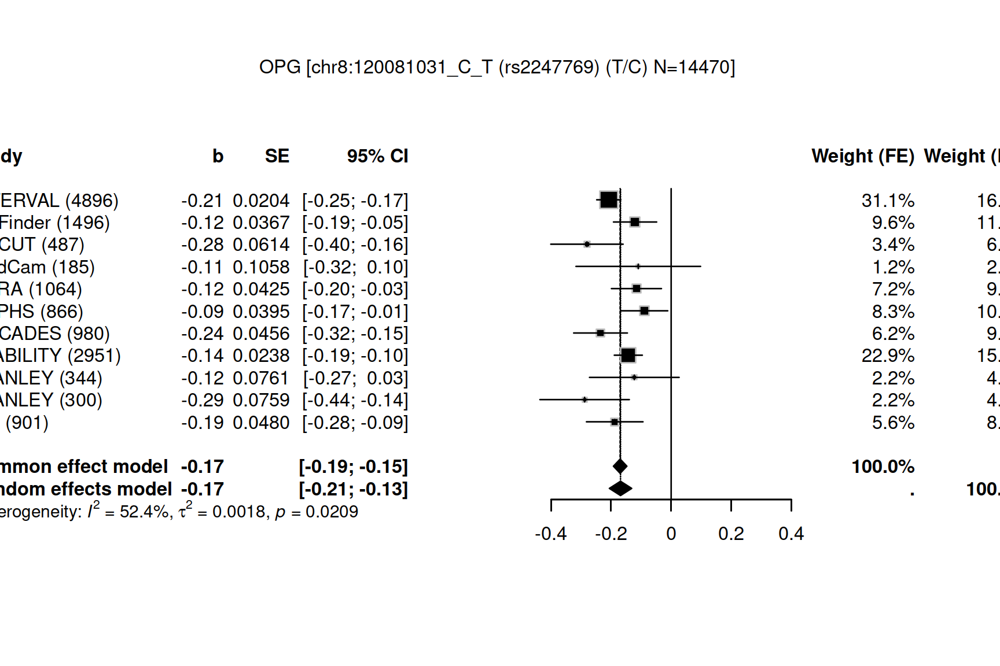

Figure 1.1: Forest plots

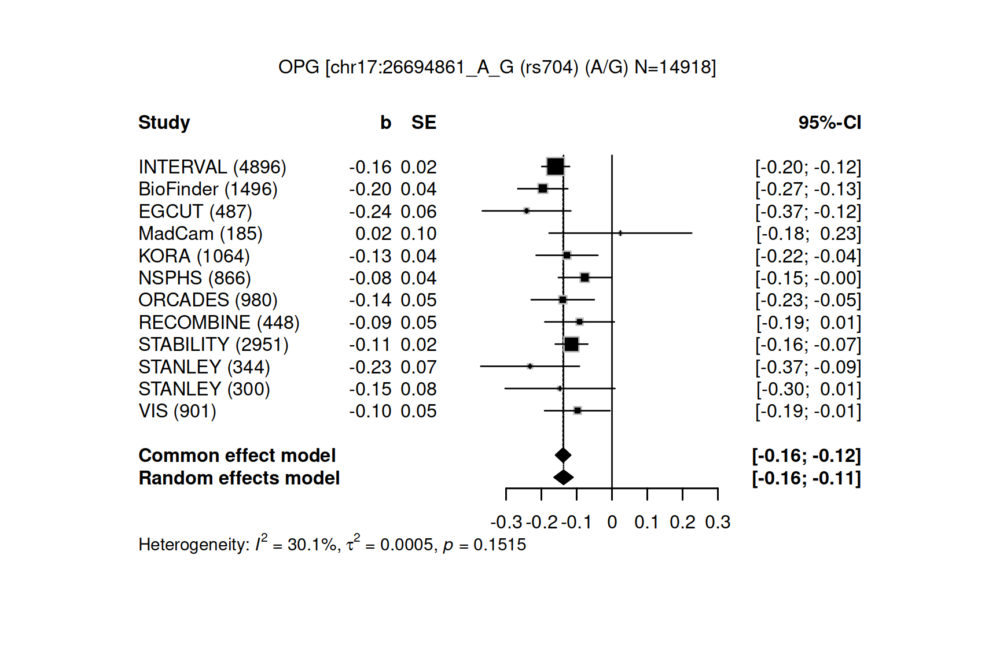

Figure 1.2: Forest plots

``` r
gap::METAL_forestplot(OPGtbl,OPGall,OPGrsid,package="metafor",method="FE",xlab="Effect",
                 showweights=TRUE)
#> Joining with `by = join_by(MarkerName)`
#> Joining with `by = join_by(MarkerName)`
```

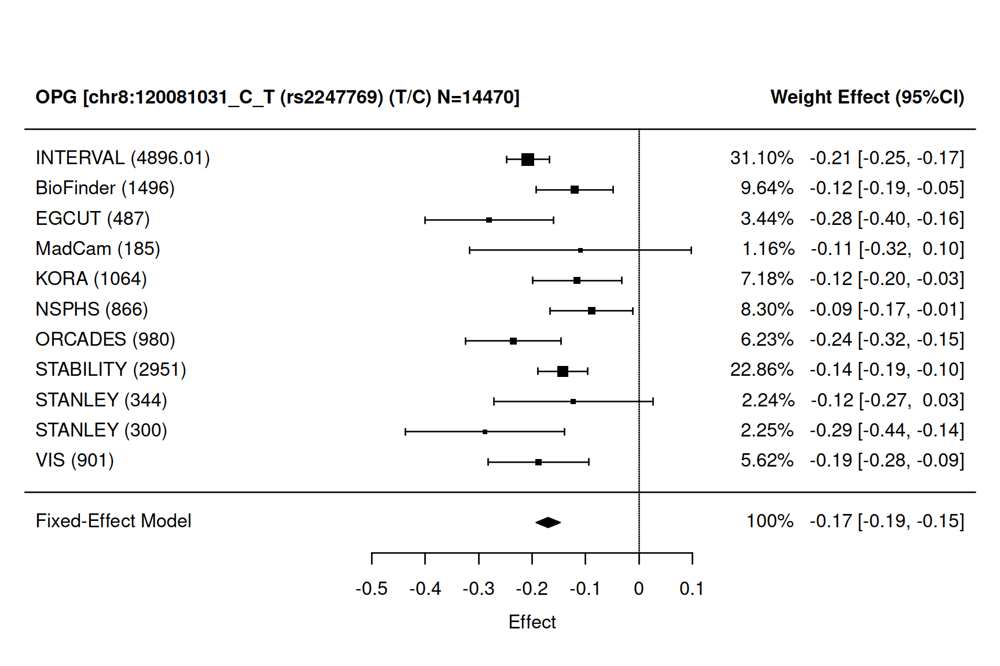

Figure 1.3: Forest plots

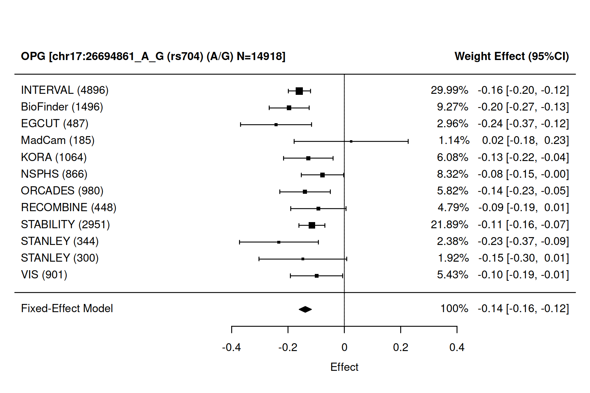

Figure 1.4: Forest plots

involving both a cis and a trans pQTLs. As `meta` inherently includes
random effects, we use a fixed effects (FE) model from `metafor`.

## 2 cis/trans classification

### 2.1 pQTL signals and classification table

``` r
f <- file.path(find.package("pQTLtools"),"tests","INF1.merge")
merged <- read.delim(f,as.is=TRUE)
hits <- merge(merged[c("CHR","POS","MarkerName","prot","log10p")],
              pQTLdata::inf1[c("prot","uniprot")],by="prot") %>%
        dplyr::mutate(log10p=-log10p)
names(hits) <- c("prot","Chr","bp","SNP","log10p","uniprot")
cistrans <- gap::cis.vs.trans.classification(hits,pQTLdata::inf1,"uniprot")
cis.vs.trans <- with(cistrans,data)
knitr::kable(with(cistrans,table),caption="cis/trans classification")
```

|           | cis | trans | total |
|:----------|----:|------:|------:|
| ADA       |   1 |     0 |     1 |
| CASP8     |   1 |     0 |     1 |
| CCL11     |   1 |     4 |     5 |
| CCL13     |   1 |     3 |     4 |
| CCL19     |   1 |     3 |     4 |
| CCL2      |   0 |     3 |     3 |
| CCL20     |   1 |     1 |     2 |
| CCL23     |   1 |     0 |     1 |
| CCL25     |   1 |     3 |     4 |
| CCL3      |   1 |     1 |     2 |
| CCL4      |   1 |     1 |     2 |
| CCL7      |   1 |     2 |     3 |
| CCL8      |   1 |     1 |     2 |
| CD244     |   1 |     2 |     3 |
| CD274     |   1 |     0 |     1 |
| CD40      |   1 |     0 |     1 |
| CD5       |   1 |     2 |     3 |
| CD6       |   1 |     1 |     2 |
| CDCP1     |   1 |     2 |     3 |
| CSF1      |   1 |     0 |     1 |
| CST5      |   1 |     3 |     4 |
| CX3CL1    |   1 |     2 |     3 |
| CXCL1     |   1 |     0 |     1 |
| CXCL10    |   1 |     1 |     2 |
| CXCL11    |   1 |     3 |     4 |
| CXCL5     |   1 |     3 |     4 |
| CXCL6     |   1 |     1 |     2 |
| CXCL9     |   1 |     2 |     3 |
| DNER      |   1 |     0 |     1 |
| EIF4EBP1  |   0 |     1 |     1 |
| FGF19     |   0 |     3 |     3 |
| FGF21     |   1 |     2 |     3 |
| FGF23     |   0 |     2 |     2 |
| FGF5      |   1 |     0 |     1 |
| FLT3LG    |   0 |     6 |     6 |
| GDNF      |   1 |     0 |     1 |
| HGF       |   1 |     1 |     2 |
| IL10      |   1 |     2 |     3 |
| IL10RB    |   1 |     1 |     2 |
| IL12B     |   1 |     7 |     8 |
| IL15RA    |   1 |     0 |     1 |
| IL17C     |   1 |     0 |     1 |
| IL18      |   1 |     1 |     2 |
| IL18R1    |   1 |     1 |     2 |
| IL1A      |   0 |     1 |     1 |
| IL6       |   0 |     1 |     1 |
| IL7       |   1 |     0 |     1 |
| IL8       |   1 |     0 |     1 |
| KITLG     |   0 |     7 |     7 |
| LIFR      |   0 |     1 |     1 |
| LTA       |   1 |     2 |     3 |
| MMP1      |   1 |     2 |     3 |
| MMP10     |   1 |     1 |     2 |
| NGF       |   1 |     1 |     2 |
| NTF3      |   0 |     1 |     1 |
| OSM       |   0 |     2 |     2 |
| PLAU      |   1 |     5 |     6 |
| S100A12   |   1 |     0 |     1 |
| SIRT2     |   1 |     0 |     1 |
| SLAMF1    |   1 |     4 |     5 |
| SULT1A1   |   1 |     1 |     2 |
| TGFA      |   1 |     0 |     1 |
| TGFB1     |   1 |     0 |     1 |
| TNFRSF11B |   1 |     1 |     2 |
| TNFRSF9   |   1 |     1 |     2 |
| TNFSF10   |   1 |     7 |     8 |
| TNFSF11   |   1 |     5 |     6 |
| TNFSF12   |   1 |     4 |     5 |
| TNFSF14   |   1 |     0 |     1 |
| VEGFA     |   1 |     3 |     4 |
| total     |  59 |   121 |   180 |

Table 2.1: cis/trans classification

``` r
with(cistrans,total)
#> [1] 180
T <- with(cistrans,table)
H <- T[rownames(T)!="total","total"]
merge <- merged[c("Chrom","Start","End","prot","MarkerName")]
merge_cvt <- merge(merge,cis.vs.trans,by.x=c("prot","MarkerName"),by.y=c("prot","SNP"))
ord <- with(merge_cvt,order(Chr,bp))
merge_cvt <- merge_cvt[ord,]
```

### 2.2 Genomic associations

This is visualised via a circos plot, highlighting the likely causal
genes for pQTLs,

``` r
pQTLs <- transmute(merge_cvt,chr=paste0("chr",Chr),start=bp,end=bp,log10p)
cis.pQTLs <- subset(merge_cvt,cis) %>%
             dplyr::transmute(chr=paste0("chr",p.chr),start=p.start,end=p.end,gene=p.gene,cols="red")
pQTL_genes <- read.table(file.path(find.package("pQTLtools"),"tests","pQTL_genes.txt"),
                         col.names=c("chr","start","end","gene")) %>%
              dplyr::mutate(chr=gsub("hs","chr",chr)) %>%
              dplyr::left_join(cis.pQTLs) %>%
              dplyr::mutate(cols=ifelse(is.na(cols),"blue",cols))
#> Joining with `by = join_by(chr, start, end, gene)`
par(cex=0.7)
gap::circos.mhtplot2(pQTLs,pQTL_genes,ticks=0:3*10)
#> Warning: Some of the regions have end position values larger than the end of the
#> chromosomes.
#> Note: 7 points are out of plotting region in sector 'chr1', track '5'.
#> Note: 3 points are out of plotting region in sector 'chr2', track '5'.
#> Note: 10 points are out of plotting region in sector 'chr3', track '5'.
#> Note: 7 points are out of plotting region in sector 'chr4', track '5'.
#> Note: 2 points are out of plotting region in sector 'chr5', track '5'.
#> Note: 4 points are out of plotting region in sector 'chr6', track '5'.
#> Note: 2 points are out of plotting region in sector 'chr8', track '5'.
#> Note: 2 points are out of plotting region in sector 'chr9', track '5'.
#> Note: 2 points are out of plotting region in sector 'chr10', track '5'.
#> Note: 4 points are out of plotting region in sector 'chr11', track '5'.
#> Note: 1 point is out of plotting region in sector 'chr12', track '5'.
#> Note: 1 point is out of plotting region in sector 'chr13', track '5'.
#> Note: 1 point is out of plotting region in sector 'chr14', track '5'.
#> Note: 2 points are out of plotting region in sector 'chr16', track '5'.
#> Note: 8 points are out of plotting region in sector 'chr17', track '5'.
#> Note: 8 points are out of plotting region in sector 'chr19', track '5'.
#> Note: 4 points are out of plotting region in sector 'chr20', track '5'.
#> Note: 1 point is out of plotting region in sector 'chr21', track '5'.
```

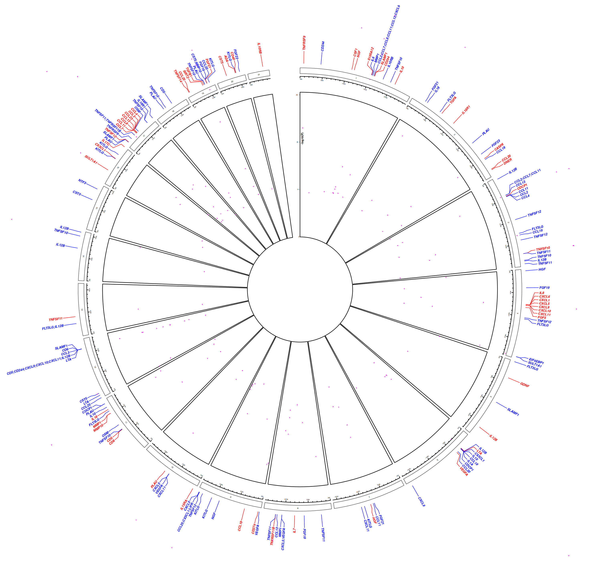

Figure 2.1: Genomic associations

``` r
par(cex=1)
```

where the red and blue colours indicate cis/trans classifications.

### 2.3 Bar chart and circos plot

``` r
barplot(table(H),xlab="No. of pQTL regions",ylab="No. of proteins",
        ylim=c(0,25),col="darkgrey",border="black",cex=0.8,cex.axis=2,cex.names=2,las=1)
```

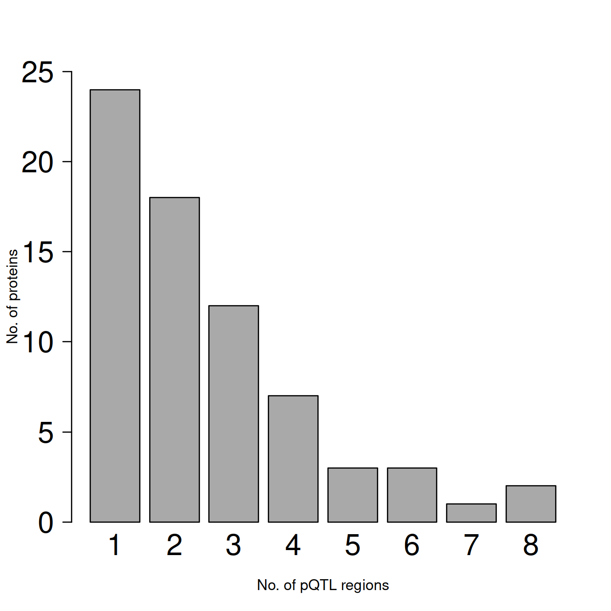

Figure 2.2: Bar chart

``` r
gap::circos.cis.vs.trans.plot(hits=f,pQTLdata::inf1,"uniprot")
```

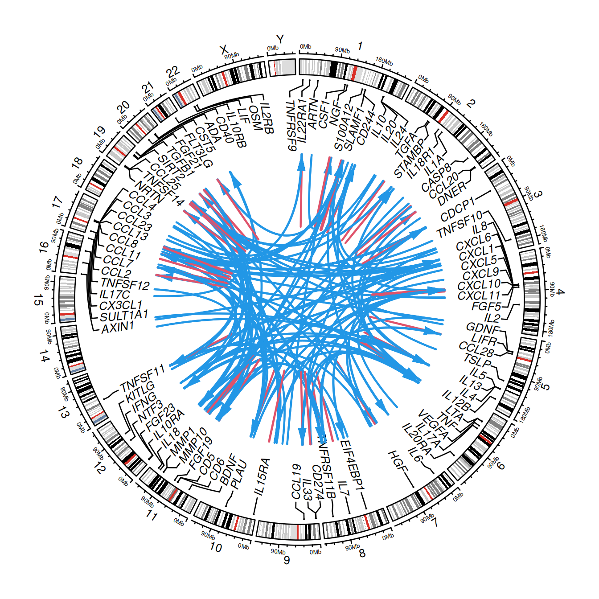

Figure 2.3: circos plot

The circos plot is based on target genes (those encoding proteins) and
somewhat too busy.

### 2.4 *SH2B3*

Here we focus on *SH2B3*.

``` r
  HOTSPOT <- "chr12:111884608_C_T"
  a <- data.frame(chr="chr12",start=111884607,end=111884608,gene="SH2B3")
  b <- dplyr::filter(cis.vs.trans,SNP==HOTSPOT) %>%
       dplyr::mutate(p.chr=paste0("chr",p.chr)) %>%
       dplyr::rename(chr=p.chr,start=p.start,end=p.end,gene=p.gene,cistrans=cis.trans)
  cols <- rep(12,nrow(b))
  cols[b[["cis"]]] <- 10
  labels <- dplyr::bind_rows(b[c("chr","start","end","gene")],a)
  circlize::circos.clear()
  circlize::circos.par(start.degree=90, track.height=0.1, cell.padding=c(0,0,0,0))
  circlize::circos.initializeWithIdeogram(species="hg19", track.height=0.05, ideogram.height=0.06)
  circlize::circos.genomicLabels(labels, labels.column=4, cex=1.1, font=3, side="inside")
  circlize::circos.genomicLink(bind_rows(a,a,a,a,a,a), b[c("chr","start","end")], col=cols,
                     directional=1, border=10, lwd=2)
```

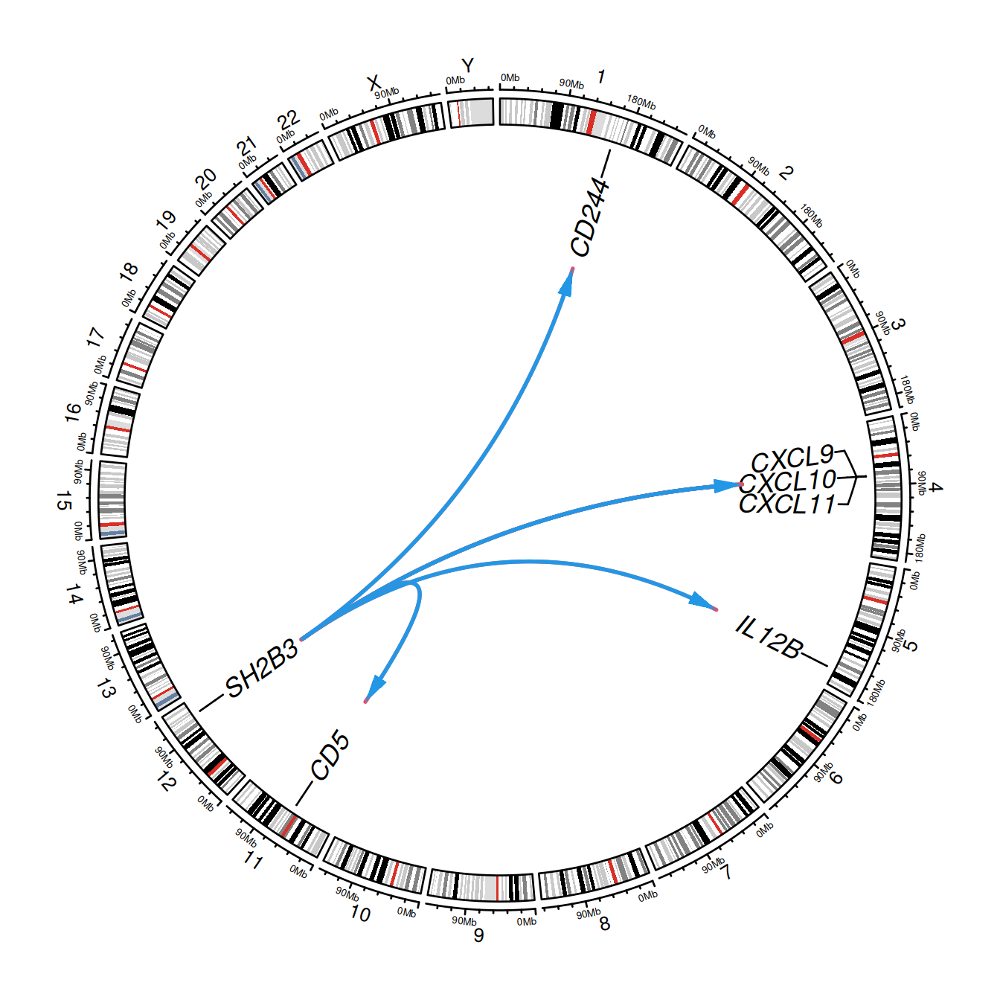

Figure 2.4: *SH2B3* hotspot

A more recent implementation is the `qtlClassifier` function. For this
example we have,

``` r
geneSNP <- merge(merged[c("prot","MarkerName")],pQTLdata::inf1[c("prot","gene")],by="prot")[c("gene","MarkerName","prot")]
SNPPos <- merged[c("MarkerName","CHR","POS")]
genePos <- pQTLdata::inf1[c("gene","chr","start","end")]
cvt <- gap::qtlClassifier(geneSNP,SNPPos,genePos,1e6)
knitr::kable(head(cvt))
```

|     | gene     | MarkerName          | prot     | geneChrom | geneStart |   geneEnd | SNPChrom |    SNPPos | Type  |
|:----|:---------|:--------------------|:---------|----------:|----------:|----------:|---------:|----------:|:------|
| 2   | EIF4EBP1 | chr4:187158034_A\_G | 4E.BP1   |         8 |  37887859 |  37917883 |        4 | 187158034 | trans |
| 3   | ADA      | chr20:43255220_C\_T | ADA      |        20 |  43248163 |  43280874 |       20 |  43255220 | cis   |
| 4   | NGF      | chr1:115829943_A\_C | Beta.NGF |         1 | 115828539 | 115880857 |        1 | 115829943 | cis   |
| 5   | NGF      | chr9:90362040_C\_T  | Beta.NGF |         1 | 115828539 | 115880857 |        9 |  90362040 | trans |
| 6   | CASP8    | chr2:202164805_C\_G | CASP.8   |         2 | 202098166 | 202152434 |        2 | 202164805 | cis   |
| 7   | CCL11    | chr1:159175354_A\_G | CCL11    |        17 |  32612687 |  32615353 |        1 | 159175354 | trans |

``` r
cistrans.check <- merge(cvt[c("gene","MarkerName","Type")],cis.vs.trans[c("p.gene","SNP","cis.trans")],
                        by.x=c("gene","MarkerName"),by.y=c("p.gene","SNP"))
with(cistrans.check,table(Type,cis.trans))
#>        cis.trans
#> Type    cis trans
#>   cis    59     0
#>   trans   0   121
```

### 2.5 pQTL-gene plot

``` r
t2d <- gap::qtl2dplot(cis.vs.trans,xlab="pQTL position",ylab="Gene position")
```

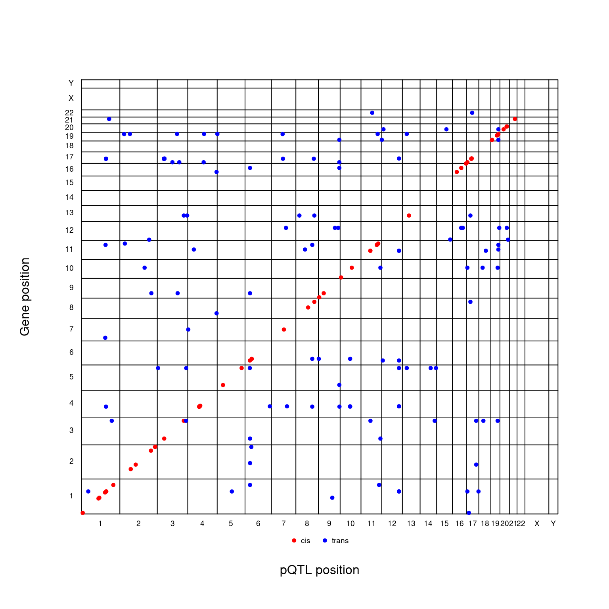

Figure 2.5: pQTL-gene plot

### 2.6 pQTL-gene plotly

The pQTL-gene plot above can be also viewed in a 2-d plotly style,
[fig2d.html](https://jinghuazhao.github.io/pQTLtools/articles/fig2d.md),

``` r
fig2d <- gap::qtl2dplotly(cis.vs.trans,xlab="pQTL position",ylab="Gene position")
htmlwidgets::saveWidget(fig2d,file="fig2d.html")
htmltools::tags$iframe(src = "fig2d.html", width = "100%", height = "650px")
```

and 3-d counterpart,
[fig3d.html](https://jinghuazhao.github.io/pQTLtools/articles/fig3d.md),

``` r
fig3d <- gap::qtl3dplotly(cis.vs.trans,zmax=300,qtl.prefix="pQTL:",xlab="pQTL position",ylab="Gene position")
htmlwidgets::saveWidget(fig3d,file="fig3d.html")
htmltools::tags$iframe(src = "fig3d.html", width = "100%", height = "600px")
```

Both plots are responsive.

### 2.7 Karyoplot

As `biomaRt` is not always on, we keep a copy of hgnc.

``` r
set_config(config(ssl_verifypeer = 0L))
mart <- biomaRt::useMart(biomart = "ensembl", dataset = "hsapiens_gene_ensembl")
attrs <- c("hgnc_symbol", "chromosome_name", "start_position", "end_position", "band")
hgnc <- vector("character",180)
for(i in 1:180)
{
  v <- with(merge_cvt[i,],paste0(Chr,":",bp,":",bp))
  g <- subset(getBM(attributes = attrs, filters="chromosomal_region", values=v, mart=mart),!is.na(hgnc_symbol))
  hgnc[i] <- paste(g[["hgnc_symbol"]],collapse=";")
  cat(i,g[["hgnc_symbol"]],hgnc[i],"\n")
}
save(hgnc,file="hgnc.rda",compress="xz")
```

We now proceed with

``` r
load(file.path(find.package("pQTLtools"),"tests","hgnc.rda"))
merge_cvt <- within(merge_cvt,{
  hgnc <- hgnc
  hgnc[cis] <- p.gene[cis]
})

with(merge_cvt, {
  sentinels <- regioneR::toGRanges(Chr,bp-1,bp,labels=hgnc)
  cis.regions <- regioneR::toGRanges(Chr,cis.start,cis.end)
  loci <- toGRanges(Chr,Start,End)
  colors <- c("red","blue")
  GenomeInfoDb::seqlevelsStyle(sentinels) <- "UCSC"
  kp <- karyoploteR::plotKaryotype(genome="hg19",chromosomes=levels(seqnames(sentinels)))
# karyoploteR::kpAddBaseNumbers(kp)
  karyoploteR::kpPlotRegions(kp, data=loci,r0=0.05,r1=0.15,border="black")
  karyoploteR::kpPlotMarkers(kp, data=sentinels, labels=hgnc, text.orientation="vertical",
                cex=0.5, y=0.3*seq_along(hgnc)/length(hgnc), srt=30,
                ignore.chromosome.ends=TRUE,
                adjust.label.position=TRUE, label.color=colors[2-cis], label.dist=0.002,
                cex.axis=3, cex.lab=3)
  legend("bottomright", bty="n", pch=c(19,19), col=colors, pt.cex=0.4,
         legend=c("cis", "trans"), text.col=colors, cex=0.8, horiz=FALSE)
# panel <- toGRanges(p.chr,p.start,p.end,labels=p.gene)
# kpPlotLinks(kp, data=loci, data2=panel, col=colors[2-cis])
})
#> Chromosome name styles in data ("1") and genome ("chr1") do not match.
#> They must match exactly for karyoploteR to plot anything. It seems it may be a problem with 'chr' in the names?
```

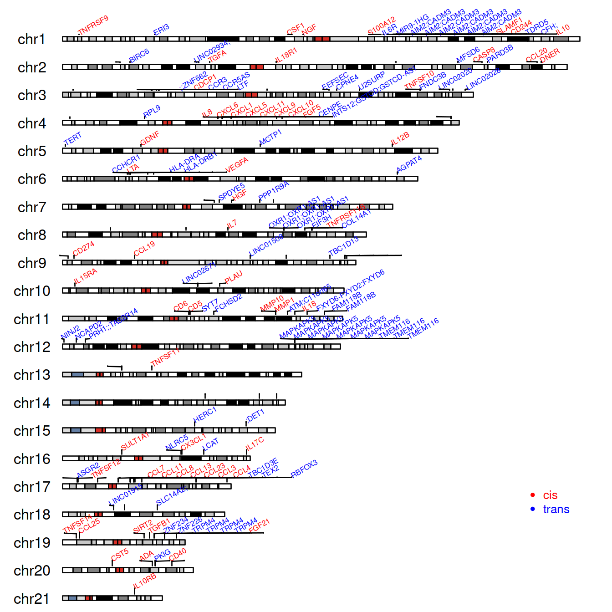

Figure 2.6: Karyoplot of cis/trans pQTLs

## 3 Genomic regions enrichment analysis

It is now considerably easier with Genomic Regions Enrichment of
Annotations Tool (GREAT).

``` r
post <- function(regions)
{
  job <- rGREAT::submitGreatJob(get(regions), species="hg19", version="3.0.0")
  et <- rGREAT::getEnrichmentTables(job,download_by = 'tsv')
  tb <- do.call('rbind',et)
  write.table(tb,file=paste0(regions,".tsv"),quote=FALSE,row.names=FALSE,sep="\t")
  invisible(list(job=job,tb=tb))
}

M <- 1e+6
merge <- merged %>%
         dplyr::mutate(chr=Chrom, start=POS-M, end=POS+M) %>%
         dplyr::mutate(start=if_else(start<1,1,start)) %>%
         dplyr::select(prot,MarkerName,chr,start,end)
cistrans <- dplyr::select(merge, chr,start,end) %>%
            dplyr::arrange(chr,start,end) %>%
            dplyr::distinct()
# All regions
cistrans.post <- post("cistrans")
job <- with(cistrans.post,job)
rGREAT::plotRegionGeneAssociationGraphs(job)
```

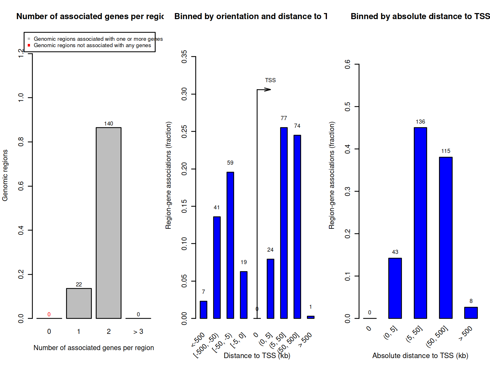

Figure 3.1: GREAT plots

``` r
rGREAT::availableOntologies(job)
# plot of the top term
par(mfcol=c(3,1))
rGREAT::plotRegionGeneAssociationGraphs(job, ontology="GO Molecular Function")
```


Figure 3.2: GREAT plots

``` r
rGREAT::plotRegionGeneAssociationGraphs(job, ontology="GO Biological Process")
rGREAT::plotRegionGeneAssociationGraphs(job, ontology="GO Cellular Component")
# Specific regions
IL12B <- dplyr::filter(merge,prot=="IL.12B") %>% dplyr::select(chr,start,end)
KITLG <- dplyr::filter(merge,prot=="SCF") %>% dplyr::select(chr,start,end)
TNFSF10 <- dplyr::filter(merge,prot=="TRAIL") %>% dplyr::select(chr,start,end)
tb_all <- data.frame()
for (r in c("IL12B","KITLG","TNFSF10"))
{
  r.post <- post(r)
  tb_all <- rbind(tb_all,data.frame(gene=r,with(r.post,tb)))
}
#> Don't make too frequent requests. The time break is 60s.
#> Please wait for 54s for the next request.
#> The time break can be set by `request_interval` argument.
#> Don't make too frequent requests. The time break is 60s.
#> Please wait for 57s for the next request.
#> The time break can be set by `request_interval` argument.
#> Don't make too frequent requests. The time break is 60s.
#> Please wait for 58s for the next request.
#> The time break can be set by `request_interval` argument.
```

The top terms at Binomial p=1e-5 could be extracted as follows,

|                            | gene    | Ontology              | ID          | Desc                                     | BinomRank | BinomP | BinomBonfP | BinomFdrQ | RegionFoldEnrich | ExpRegions | ObsRegions | GenomeFrac | SetCov | HyperRank | HyperP | HyperBonfP | HyperFdrQ | GeneFoldEnrich | ExpGenes | ObsGenes | TotalGenes | GeneSetCov | TermCov | Regions                                                                                                                                                  | Genes                                               |
|:---------------------------|:--------|:----------------------|:------------|:-----------------------------------------|----------:|-------:|-----------:|----------:|-----------------:|-----------:|-----------:|-----------:|-------:|----------:|-------:|-----------:|----------:|---------------:|---------:|---------:|-----------:|-----------:|--------:|:---------------------------------------------------------------------------------------------------------------------------------------------------------|:----------------------------------------------------|
| GO Biological Process.1100 | KITLG   | GO Biological Process | GO: 0010874 | regulation of cholesterol efflux         |         1 |      0 |      0.001 |     0.001 |          272.460 |      0.011 |          3 |      0.002 |  0.429 |         1 |      0 |      0.002 |     0.002 |        265.309 |    0.011 |        3 |         17 |      0.250 |   0.176 | /chr16:55993160-57993161,/chr7:93953894-95953895,/chr9:106661741-108661742                                                                               | ABCA1,CETP,PON1                                     |
| GO Biological Process.2100 | KITLG   | GO Biological Process | GO: 0032374 | regulation of cholesterol transport      |         2 |      0 |      0.004 |     0.002 |          185.189 |      0.016 |          3 |      0.002 |  0.429 |         2 |      0 |      0.012 |     0.006 |        140.945 |    0.021 |        3 |         32 |      0.250 |   0.094 | /chr16:55993160-57993161,/chr7:93953894-95953895,/chr9:106661741-108661742                                                                               | ABCA1,CETP,PON1                                     |
| GO Biological Process.3100 | KITLG   | GO Biological Process | GO: 0032368 | regulation of lipid transport            |         3 |      0 |      0.094 |     0.031 |           67.046 |      0.045 |          3 |      0.006 |  0.429 |         3 |      0 |      0.115 |     0.038 |         66.327 |    0.045 |        3 |         68 |      0.250 |   0.044 | /chr16:55993160-57993161,/chr7:93953894-95953895,/chr9:106661741-108661742                                                                               | ABCA1,CETP,PON1                                     |
| GO Biological Process.1102 | TNFSF10 | GO Biological Process | GO: 0030195 | negative regulation of blood coagulation |         1 |      0 |      0.006 |     0.006 |          170.502 |      0.018 |          3 |      0.002 |  0.375 |         1 |      0 |      0.034 |     0.034 |        100.228 |    0.030 |        3 |         36 |      0.200 |   0.083 | /chr17:63224774-65224775,/chr19:43153099-45153100,/chr3:185449121-187449122                                                                              | APOH,KNG1,PLAUR                                     |
| GO Biological Process.2102 | TNFSF10 | GO Biological Process | GO: 0050819 | negative regulation of coagulation       |         2 |      0 |      0.014 |     0.007 |          129.538 |      0.023 |          3 |      0.003 |  0.375 |         2 |      0 |      0.047 |     0.024 |         90.205 |    0.033 |        3 |         40 |      0.200 |   0.075 | /chr17:63224774-65224775,/chr19:43153099-45153100,/chr3:185449121-187449122                                                                              | APOH,KNG1,PLAUR                                     |
| GO Biological Process.3102 | TNFSF10 | GO Biological Process | GO: 0072376 | protein activation cascade               |         3 |      0 |      0.046 |     0.015 |           87.207 |      0.034 |          3 |      0.004 |  0.375 |         3 |      0 |      0.196 |     0.065 |         56.378 |    0.053 |        3 |         64 |      0.200 |   0.047 | /chr17:63224774-65224775,/chr1:195710915-197710916,/chr3:185449121-187449122                                                                             | APOH,CFH,KNG1                                       |
| GO Cellular Component.119  | TNFSF10 | GO Cellular Component | GO: 0005615 | extracellular space                      |         1 |      0 |      0.008 |     0.008 |            9.342 |      0.642 |          6 |      0.080 |  0.750 |         1 |      0 |      0.000 |     0.000 |         10.934 |    0.732 |        8 |        880 |      0.533 |   0.009 | /chr14:93844946-95844947,/chr17:63224774-65224775,/chr18:28804862-30804863,/chr1:195710915-197710916,/chr3:171274231-173274232,/chr3:185449121-187449122 | APOH,CFH,CFHR3,KNG1,MEP1B,SERPINA1,SERPINA6,TNFSF10 |

Table 3.1: GREAT IL12B-KITLG-TNFSF10 results

## 4 eQTL Catalog for colocalization analysis

See example associated with `import_eQTLCatalogue()`. A related function
is `import_OpenGWAS()` used to fetch data from OpenGWAS. The cis-pQTLs
and 1e+6 flanking regions were considered and data are actually fetched
from files stored locally. Only the first sentinel was used (r=1).

``` r
liftRegion <- function(x,chain,flanking=1e6)
{
  require(GenomicRanges)
  gr <- with(x,GenomicRanges::GRanges(seqnames=chr,IRanges::IRanges(start,end))+flanking)
  GenomeInfoDb::seqlevelsStyle(gr) <- "UCSC"
  gr38 <- rtracklayer::liftOver(gr, chain)
  chr <- gsub("chr","",colnames(table(seqnames(gr38))))
  start <- min(unlist(start(gr38)))
  end <- max(unlist(end(gr38)))
  invisible(list(chr=chr[1],start=start,end=end,region=paste0(chr[1],":",start,"-",end)))
}

sumstats <- function(prot,chr,region37)
{
  cat("GWAS sumstats\n")
  vcf <- file.path(INF,"METAL/gwas2vcf",paste0(prot,".vcf.gz"))
  gwas_stats <- gwasvcf::query_gwas(vcf, chrompos = region37) %>%
                gwasvcf::vcf_to_granges() %>%
                GenomeInfoDb::keepSeqlevels(chr) %>%
                GenomeInfoDb::renameSeqlevels(paste0("chr",chr))
  gwas_stats_hg38 <- rtracklayer::liftOver(gwas_stats, chain) %>%
    unlist() %>%
    dplyr::as_tibble() %>%
    dplyr::transmute(chromosome = seqnames,
                     position = start, REF, ALT, AF, ES, SE, LP, SS) %>%
    dplyr::mutate(id = paste(chromosome, position, sep = ":")) %>%
    dplyr::mutate(MAF = pmin(AF, 1-AF)) %>%
    dplyr::group_by(id) %>%
    dplyr::mutate(row_count = n()) %>%
    dplyr::ungroup() %>%
    dplyr::filter(row_count == 1) %>%
    dplyr::mutate(chromosome=gsub("chr","",chromosome))
  s <- ggplot2::ggplot(gwas_stats_hg38, aes(x = position, y = LP)) +
       ggplot2::theme_bw() +
       ggplot2::geom_point() +
       ggplot2::ggtitle(with(sentinel,paste0(prot,"-",SNP," association plot")))
  s
  gwas_stats_hg38
}

gtex <- function(gwas_stats_hg38,ensGene,region38)
{
  cat("c. GTEx_v8 imported eQTL datasets\n")
  fp <- file.path(find.package("pQTLtools"),"eQTL-Catalogue","tabix_ftp_paths_gtex.tsv")
  web <- read.delim(fp, stringsAsFactors = FALSE) %>% dplyr::as_tibble()
  local <- within(web %>% dplyr::as_tibble(),
        {
          f <- lapply(strsplit(ftp_path,"/imported/|/ge/"),"[",3);
          ftp_path <- paste0("~/rds/public_databases/GTEx/csv/",f)
        })
  gtex_df <- dplyr::filter(local, quant_method == "ge") %>%
             dplyr::mutate(qtl_id = paste(study, qtl_group, sep = "_"))
  ftp_path_list <- setNames(as.list(gtex_df$ftp_path), gtex_df$qtl_id)
  hdr <- file.path(find.package("pQTLtools"),"eQTL-Catalogue","column_names.GTEx")
  column_names <- names(read.delim(hdr))
  safe_import <- purrr::safely(import_eQTLCatalogue)
  summary_list <- purrr::map(ftp_path_list,
                             ~safe_import(., region38, selected_gene_id = ensGene, column_names))
  result_list <- purrr::map(summary_list, ~.$result)
  result_list <- result_list[!unlist(purrr::map(result_list, is.null))]
  result_filtered <- purrr::map(result_list[lapply(result_list,nrow)!=0],
                                ~dplyr::filter(., !is.na(se)))
  purrr::map_df(result_filtered, ~run_coloc(., gwas_stats_hg38), .id = "qtl_id")
}

gtex_coloc <- function(prot,chr,ensGene,chain,region37,region38,out)
{
  gwas_stats_hg38 <- sumstats(prot,chr,region37)
  df_gtex <- gtex(gwas_stats_hg38,ensGene,region38)
  if (!exists("df_gtex")) return
  saveRDS(df_gtex,file=paste0(out,".RDS"))
  dplyr::arrange(df_gtex, -PP.H4.abf)
  p <- ggplot2::ggplot(df_gtex, aes(x = PP.H4.abf)) +
       ggplot2::theme_bw() +
       geom_histogram() +
       ggtitle(with(sentinel,paste0(prot,"-",SNP," PP4 histogram"))) +
       xlab("PP4") + ylab("Frequency")
  p
}

single_run <- function()
{
  chr <- with(sentinel,Chr)
  ss <- subset(inf1,prot==sentinel[["prot"]])
  ensRegion37 <- with(ss,
                      {
                        start <- start-M
                        if (start<0) start <- 0
                        end <- end+M
                        paste0(chr,":",start,"-",end)
                      })
  ensGene <- ss[["ensembl_gene_id"]]
  ensRegion38 <- with(liftRegion(ss,chain),region)
  cat(chr,ensGene,ensRegion37,ensRegion38,"\n")
  f <- with(sentinel,paste0(prot,"-",SNP))
  gtex_coloc(sentinel[["prot"]],chr,ensGene,chain,ensRegion37,ensRegion38,f)
}

HOME <- Sys.getenv("HOME")
HPC_WORK <- Sys.getenv("HPC_WORK")
INF <- Sys.getenv("INF")
M <- 1e6
sentinels <- subset(cis.vs.trans,cis)
f <- file.path(find.package("pQTLtools"),"eQTL-Catalogue","hg19ToHg38.over.chain")
chain <- rtracklayer::import.chain(f)
gwasvcf::set_bcftools(file.path(HPC_WORK,"bin","bcftools"))

r <- 1
sentinel <- sentinels[r,]
single_run()
ktitle <- with(sentinel,paste0("Colocalization results for ",prot,"-",SNP))
```

The results are also loadable as follows.

``` r
coloc_df <- readRDS(file.path(find.package("pQTLtools"),"tests","OPG-rs2247769.RDS")) %>%
            dplyr::rename(Tissue=qtl_id, H0=PP.H0.abf,H1=PP.H1.abf,
                          H2=PP.H2.abf,H3=PP.H3.abf,H4=PP.H4.abf) %>%
            mutate(Tissue=gsub("GTEx_V8_","",Tissue),
                   H0=round(H0,2),H1=round(H1,2),H2=round(H2,2),H3=round(H3,2),H4=round(H4,2)) %>%
                   dplyr::arrange(-H4)
knitr::kable(coloc_df,caption="Colocalization results for OPG-chr8:120081031_C_T")
```

| Tissue                                | nsnps |  H0 |  H1 |   H2 |   H3 |   H4 |
|:--------------------------------------|------:|----:|----:|-----:|-----:|-----:|
| Adrenal_Gland                         |  6741 |   0 |   0 | 0.46 | 0.37 | 0.18 |
| Brain_Hippocampus                     |  6733 |   0 |   0 | 0.54 | 0.36 | 0.10 |
| Brain_Amygdala                        |  6701 |   0 |   0 | 0.55 | 0.37 | 0.08 |
| Brain_Cerebellum                      |  6738 |   0 |   0 | 0.53 | 0.39 | 0.08 |
| Small_Intestine_Terminal_Ileum        |  6738 |   0 |   0 | 0.56 | 0.36 | 0.08 |
| Artery_Tibial                         |  6742 |   0 |   0 | 0.59 | 0.34 | 0.07 |
| Brain_Nucleus_accumbens_basal_ganglia |  6741 |   0 |   0 | 0.55 | 0.39 | 0.06 |
| Liver                                 |  6742 |   0 |   0 | 0.46 | 0.48 | 0.06 |
| Minor_Salivary_Gland                  |  6721 |   0 |   0 | 0.57 | 0.38 | 0.06 |
| Brain_Cortex                          |  6741 |   0 |   0 | 0.47 | 0.47 | 0.05 |
| Brain_Frontal_Cortex_BA9              |  6736 |   0 |   0 | 0.47 | 0.48 | 0.05 |
| Brain_Hypothalamus                    |  6737 |   0 |   0 | 0.50 | 0.46 | 0.05 |
| Brain_Spinal_cord_cervical_c-1        |  6725 |   0 |   0 | 0.56 | 0.39 | 0.05 |
| Spleen                                |  6740 |   0 |   0 | 0.53 | 0.42 | 0.05 |
| Artery_Coronary                       |  6740 |   0 |   0 | 0.48 | 0.49 | 0.04 |
| Brain_Anterior_cingulate_cortex_BA24  |  6728 |   0 |   0 | 0.52 | 0.44 | 0.04 |
| Brain_Cerebellar_Hemisphere           |  6738 |   0 |   0 | 0.53 | 0.42 | 0.04 |
| Brain_Putamen_basal_ganglia           |  6732 |   0 |   0 | 0.57 | 0.39 | 0.04 |
| Brain_Substantia_nigra                |  6706 |   0 |   0 | 0.57 | 0.39 | 0.04 |
| Colon_Sigmoid                         |  6742 |   0 |   0 | 0.52 | 0.44 | 0.04 |
| Kidney_Cortex                         |  6625 |   0 |   0 | 0.53 | 0.43 | 0.04 |
| Ovary                                 |  6739 |   0 |   0 | 0.54 | 0.42 | 0.04 |
| Pituitary                             |  6742 |   0 |   0 | 0.60 | 0.36 | 0.04 |
| Stomach                               |  6742 |   0 |   0 | 0.57 | 0.39 | 0.04 |
| Uterus                                |  6735 |   0 |   0 | 0.56 | 0.40 | 0.04 |
| Vagina                                |  6719 |   0 |   0 | 0.59 | 0.37 | 0.04 |
| Artery_Aorta                          |  6742 |   0 |   0 | 0.59 | 0.39 | 0.03 |
| Brain_Caudate_basal_ganglia           |  6741 |   0 |   0 | 0.56 | 0.41 | 0.03 |
| Breast_Mammary_Tissue                 |  6742 |   0 |   0 | 0.54 | 0.43 | 0.03 |
| Cells_EBV-transformed_lymphocytes     |  6730 |   0 |   0 | 0.47 | 0.50 | 0.03 |
| Esophagus_Gastroesophageal_Junction   |  6742 |   0 |   0 | 0.57 | 0.40 | 0.03 |
| Prostate                              |  6742 |   0 |   0 | 0.51 | 0.46 | 0.03 |
| Testis                                |  6742 |   0 |   0 | 0.61 | 0.36 | 0.03 |
| Esophagus_Mucosa                      |  6742 |   0 |   0 | 0.36 | 0.62 | 0.02 |
| Muscle_Skeletal                       |  6742 |   0 |   0 | 0.60 | 0.37 | 0.02 |
| Skin_Not_Sun_Exposed_Suprapubic       |  6742 |   0 |   0 | 0.55 | 0.43 | 0.02 |
| Skin_Sun_Exposed_Lower_leg            |  6742 |   0 |   0 | 0.42 | 0.56 | 0.02 |
| Esophagus_Muscularis                  |  6742 |   0 |   0 | 0.01 | 0.98 | 0.01 |
| Nerve_Tibial                          |  6742 |   0 |   0 | 0.19 | 0.81 | 0.01 |
| Thyroid                               |  6742 |   0 |   0 | 0.15 | 0.84 | 0.01 |
| Adipose_Subcutaneous                  |  6742 |   0 |   0 | 0.00 | 1.00 | 0.00 |
| Adipose_Visceral_Omentum              |  6742 |   0 |   0 | 0.09 | 0.91 | 0.00 |
| Cells_Cultured_fibroblasts            |  6742 |   0 |   0 | 0.00 | 1.00 | 0.00 |
| Colon_Transverse                      |  6742 |   0 |   0 | 0.01 | 0.99 | 0.00 |
| Heart_Atrial_Appendage                |  6742 |   0 |   0 | 0.00 | 1.00 | 0.00 |
| Heart_Left_Ventricle                  |  6742 |   0 |   0 | 0.02 | 0.97 | 0.00 |
| Lung                                  |  6742 |   0 |   0 | 0.01 | 0.99 | 0.00 |
| Pancreas                              |  6742 |   0 |   0 | 0.02 | 0.98 | 0.00 |

Table 4.1: Colocalization results for OPG-chr8:120081031_C\_T

The function `sumstats()` obtained meta-analysis summary statistics (in
build 37 and therefore lifted over to build 38) to be used in
colocalization analysis. The output are saved in the `.RDS` files. Note
that `ftp_path` changes from eQTL Catalog to local files.

## 5 Mendelian Randomisation (MR)

### 5.1 pQTL-based MR

The function `pqtlMR()` has an attractive feature that multiple pQTLs
can be used together for conducting MR with a list of outcomes from
MR-Base, e.g.,
`outcome <- extract_outcome_data(snps=with(exposure,SNP),outcomes=c("ieu-a-7","ebi-a-GCST007432"))`.
For generic applications, the `run_TwoSampleMR()` function can be used.

``` r
f <- file.path(system.file(package="pQTLtools"),"tests","Ins.csv")
exposure <- TwoSampleMR::format_data(read.csv(f))
caption4 <- "IL6R variant and diseases"
knitr::kable(exposure, caption=paste(caption4,"(instruments)"),digits=3)
```

| SNP       | effect_allele.exposure | other_allele.exposure | eaf.exposure | beta.exposure | se.exposure | pval.exposure | exposure | mr_keep.exposure | pval_origin.exposure | id.exposure |
|:----------|:-----------------------|:----------------------|-------------:|--------------:|------------:|--------------:|:---------|:-----------------|:---------------------|:------------|
| rs2228145 | A                      | C                     |        0.613 |        -0.168 |       0.012 |             0 | IL.6     | TRUE             | reported             | 68ekAE      |

Table 5.1: IL6R variant and diseases (instruments)

``` r
f <- file.path(system.file(package="pQTLtools"),"tests","Out.csv")
outcome <- TwoSampleMR::format_data(read.csv(f),type="outcome")
pqtlMR(exposure, outcome, prefix="IL6R-")
#> Harmonising IL.6 (68ekAE) and Rheumatoid arthritis (AFHj9K)
#> Harmonising IL.6 (68ekAE) and Coronary artery disease (Jxow5B)
#> Harmonising IL.6 (68ekAE) and Atopic dermatitis (oAZeyF)
#> Analysing '68ekAE' on 'AFHj9K'
#> Analysing '68ekAE' on 'Jxow5B'
#> Analysing '68ekAE' on 'oAZeyF'
result <- read.delim("IL6R-result.txt") %>%
          dplyr::select(-id.exposure,-id.outcome)
knitr::kable(result,caption=paste(caption4, "(result)"),digits=3)
```

| outcome                 | exposure | method     | nsnp |      b |    se | pval |
|:------------------------|:---------|:-----------|-----:|-------:|------:|-----:|
| Rheumatoid arthritis    | IL.6     | Wald ratio |    1 | -0.457 | 0.084 |    0 |
| Coronary artery disease | IL.6     | Wald ratio |    1 | -0.231 | 0.031 |    0 |
| Atopic dermatitis       | IL.6     | Wald ratio |    1 | -0.454 | 0.102 |    0 |

Table 5.1: IL6R variant and diseases (result)

``` r
single <- read.delim("IL6R-single.txt") %>%
          dplyr::select(-id.exposure,-id.outcome,-samplesize)
knitr::kable(subset(single,!grepl("All",SNP)), caption=paste(caption4, "(single)"),digits=3)
```

|     | exposure | outcome                 | SNP       | b      | se     | p        |
|:----|:---------|:------------------------|:----------|:-------|:-------|:---------|
| 1   | IL.6     | Rheumatoid arthritis    | rs2228145 | -0.457 | 0.0842 | 5.72e-08 |
| 4   | IL.6     | Coronary artery disease | rs2228145 | -0.231 | 0.0309 | 7.39e-14 |
| 7   | IL.6     | Atopic dermatitis       | rs2228145 | -0.454 | 0.1019 | 8.57e-06 |

Table 5.1: IL6R variant and diseases (single)

We carry on producing a forest plot.

``` r
IL6R <- single %>%
        dplyr::filter(grepl("^rs222",SNP)) %>%
        dplyr::select(outcome,b,se) %>%
        setNames(c("outcome","Effect","StdErr")) %>%
        dplyr::mutate(outcome=gsub("\\b(^[a-z])","\\U\\1",outcome,perl=TRUE),
               Effect=as.numeric(Effect),StdErr=as.numeric(StdErr))
gap::mr_forestplot(IL6R,colgap.forest.left="0.05cm", fontsize=14,
                   leftcols=c("studlab"), leftlabs=c("Outcome"),
                   plotwidth="3.5inch", sm="OR",
                   rightcols=c("effect","ci","pval"), rightlabs=c("OR","95%CI","P"),
                   digits=2, digits.pval=2, scientific.pval=TRUE,
                   common=FALSE, random=FALSE, print.I2=FALSE, print.pval.Q=FALSE, print.tau2=FALSE,
                   addrow=TRUE, backtransf=TRUE, at=c(1:3)*0.5, spacing=1.5, xlim=c(0.5,1.5))
```

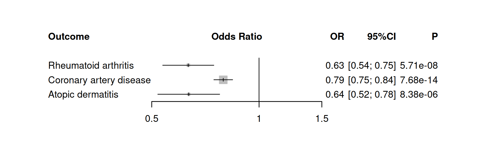

Figure 5.1: pQTL-MR

``` r
invisible(sapply(c("harmonise","result","single"),
                 function(x) unlink(paste0("IL6R-",x,".txt"))))
```

### 5.2 Two-sample MR

The documentation example is quoted here,

``` r
prot <- "MMP.10"
type <- "cis"
f <- paste0(prot,"-",type,".mrx")
d <- read.table(file.path(system.file(package="pQTLtools"),"tests",f),
                header=TRUE)
exposure <- TwoSampleMR::format_data(within(d,{P=10^logP}), phenotype_col="prot", snp_col="rsid",
                        chr_col="Chromosome", pos_col="Posistion",
                        effect_allele_col="Allele1", other_allele_col="Allele2",
                        eaf_col="Freq1", beta_col="Effect", se_col="StdErr",
                        pval_col="P", log_pval=FALSE,
                        samplesize_col="N")
clump <- exposure[sample(1:nrow(exposure),nrow(exposure)/80),] # TwoSampleMR::clump_data(exposure)
outcome <- pQTLtools::import_OpenGWAS("ebi-a-GCST007432","11:102090035-103364929","gwasvcf") %>%
           as.data.frame() %>%
           dplyr::mutate(outcome="FEV1",LP=10^-LP) %>%
           dplyr::select(ID,outcome,REF,ALT,AF,ES,SE,LP,SS,id) %>%
           setNames(c("SNP","outcome",paste0(c("other_allele","effect_allele","eaf","beta","se","pval","samplesize","id"),".outcome")))
unlink("ebi-a-GCST007432.vcf.gz.tbi")
harmonise <- TwoSampleMR::harmonise_data(clump,outcome)
#> Harmonising MMP.10 (jrjVHU) and FEV1 (ebi-a-GCST007432)
prefix <- paste(prot,type,sep="-")
run_TwoSampleMR(harmonise, mr_plot="pQTLtools", prefix=prefix)
#> Analysing 'jrjVHU' on 'ebi-a-GCST007432'
#> `height` was translated to `width`.
```

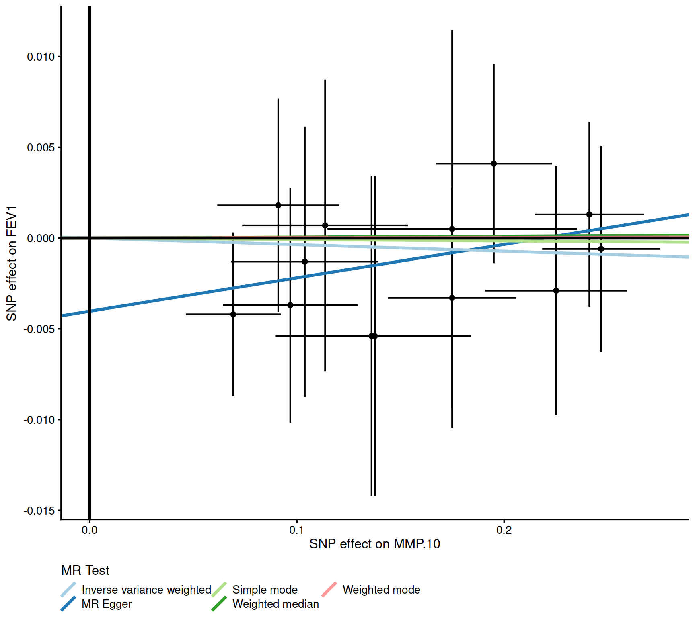

Figure 5.2: Two-sample MR

    #> `height` was translated to `width`.

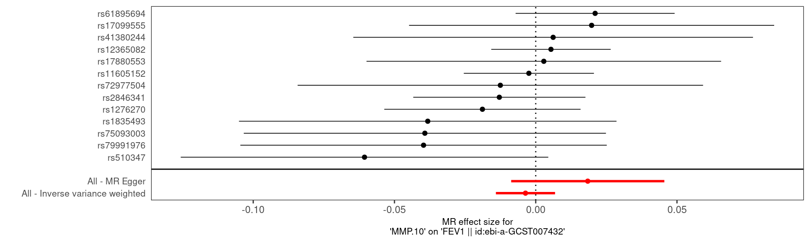

Figure 5.3: Two-sample MR

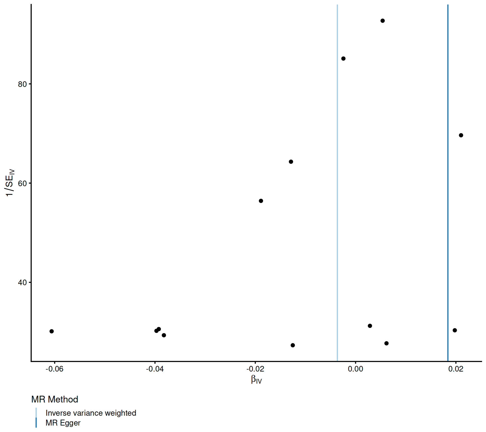

Figure 5.4: Two-sample MR

    #> `height` was translated to `width`.

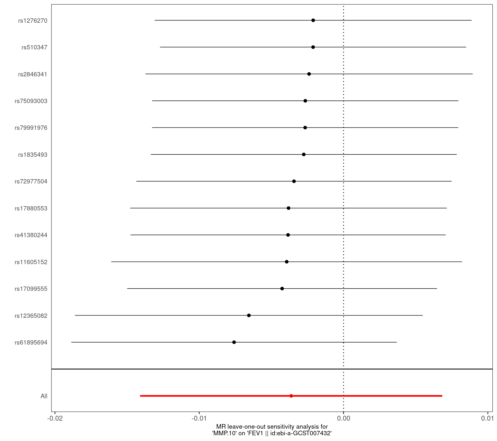

Figure 5.5: Two-sample MR

To avoid issue with TwoSampleMR authentication token, we

-   use 1.25% variants instead of `clump_data` for illustrative purpose.
-   replace `extract_outcome_data`
    (`outcome <- TwoSampleMR::extract_outcome_data(snps=clump$SNP,outcomes="ebi-a-GCST007432")`).

The output is contained in individual `.txt` files, together with the
scatter, forest, funnel and leave-one-out plots.

| id.exposure | id.outcome       | outcome | exposure | method                    | nsnp |      b |    se |  pval |
|:------------|:-----------------|:--------|:---------|:--------------------------|-----:|-------:|------:|------:|
| jrjVHU      | ebi-a-GCST007432 | FEV1    | MMP.10   | MR Egger                  |   13 |  0.018 | 0.014 | 0.210 |
| jrjVHU      | ebi-a-GCST007432 | FEV1    | MMP.10   | Weighted median           |   13 |  0.001 | 0.007 | 0.943 |
| jrjVHU      | ebi-a-GCST007432 | FEV1    | MMP.10   | Inverse variance weighted |   13 | -0.004 | 0.005 | 0.497 |
| jrjVHU      | ebi-a-GCST007432 | FEV1    | MMP.10   | Simple mode               |   13 | -0.001 | 0.012 | 0.950 |
| jrjVHU      | ebi-a-GCST007432 | FEV1    | MMP.10   | Weighted mode             |   13 |  0.000 | 0.017 | 0.992 |

Table 5.2: MMP.10 variants and FEV1 (result)

| id.exposure | id.outcome       | outcome | exposure | method                    |    Q | Q_df | Q_pval |
|:------------|:-----------------|:--------|:---------|:--------------------------|-----:|-----:|-------:|
| jrjVHU      | ebi-a-GCST007432 | FEV1    | MMP.10   | MR Egger                  |  8.8 |   11 |  0.641 |
| jrjVHU      | ebi-a-GCST007432 | FEV1    | MMP.10   | Inverse variance weighted | 11.8 |   12 |  0.463 |

Table 5.2: MMP.10 variants and FEV1 (heterogeneity)

| id.exposure | id.outcome       | outcome | exposure | egger_intercept |    se |  pval |
|:------------|:-----------------|:--------|:---------|----------------:|------:|------:|
| jrjVHU      | ebi-a-GCST007432 | FEV1    | MMP.10   |          -0.004 | 0.002 | 0.112 |

Table 5.2: MMP.10 variants and FEV1 (pleiotropy)

| exposure | outcome | id.exposure | id.outcome       | samplesize | SNP                             |      b |    se |     p |
|:---------|:--------|:------------|:-----------------|-----------:|:--------------------------------|-------:|------:|------:|
| MMP.10   | FEV1    | jrjVHU      | ebi-a-GCST007432 |     321047 | rs11605152                      | -0.002 | 0.012 | 0.836 |
| MMP.10   | FEV1    | jrjVHU      | ebi-a-GCST007432 |     321047 | rs12365082                      |  0.005 | 0.011 | 0.617 |
| MMP.10   | FEV1    | jrjVHU      | ebi-a-GCST007432 |     321047 | rs1276270                       | -0.019 | 0.018 | 0.287 |
| MMP.10   | FEV1    | jrjVHU      | ebi-a-GCST007432 |     321047 | rs17099555                      |  0.020 | 0.033 | 0.548 |
| MMP.10   | FEV1    | jrjVHU      | ebi-a-GCST007432 |     321047 | rs17880553                      |  0.003 | 0.032 | 0.929 |
| MMP.10   | FEV1    | jrjVHU      | ebi-a-GCST007432 |     321047 | rs1835493                       | -0.038 | 0.034 | 0.262 |
| MMP.10   | FEV1    | jrjVHU      | ebi-a-GCST007432 |     321047 | rs2846341                       | -0.013 | 0.016 | 0.407 |
| MMP.10   | FEV1    | jrjVHU      | ebi-a-GCST007432 |     321047 | rs41380244                      |  0.006 | 0.036 | 0.864 |
| MMP.10   | FEV1    | jrjVHU      | ebi-a-GCST007432 |     321047 | rs510347                        | -0.061 | 0.033 | 0.068 |
| MMP.10   | FEV1    | jrjVHU      | ebi-a-GCST007432 |     321047 | rs61895694                      |  0.021 | 0.014 | 0.143 |
| MMP.10   | FEV1    | jrjVHU      | ebi-a-GCST007432 |     321047 | rs72977504                      | -0.013 | 0.037 | 0.732 |
| MMP.10   | FEV1    | jrjVHU      | ebi-a-GCST007432 |     321047 | rs75093003                      | -0.039 | 0.033 | 0.230 |
| MMP.10   | FEV1    | jrjVHU      | ebi-a-GCST007432 |     321047 | rs79991976                      | -0.040 | 0.033 | 0.230 |
| MMP.10   | FEV1    | jrjVHU      | ebi-a-GCST007432 |     321047 | All - Inverse variance weighted | -0.004 | 0.005 | 0.497 |
| MMP.10   | FEV1    | jrjVHU      | ebi-a-GCST007432 |     321047 | All - MR Egger                  |  0.018 | 0.014 | 0.210 |

Table 5.2: MMP.10 variants and FEV1 (single)

| exposure | outcome | id.exposure | id.outcome       | samplesize | SNP        |      b |    se |     p |
|:---------|:--------|:------------|:-----------------|-----------:|:-----------|-------:|------:|------:|
| MMP.10   | FEV1    | jrjVHU      | ebi-a-GCST007432 |     321047 | rs11605152 | -0.004 | 0.006 | 0.525 |
| MMP.10   | FEV1    | jrjVHU      | ebi-a-GCST007432 |     321047 | rs12365082 | -0.007 | 0.006 | 0.286 |
| MMP.10   | FEV1    | jrjVHU      | ebi-a-GCST007432 |     321047 | rs1276270  | -0.002 | 0.006 | 0.707 |
| MMP.10   | FEV1    | jrjVHU      | ebi-a-GCST007432 |     321047 | rs17099555 | -0.004 | 0.005 | 0.437 |
| MMP.10   | FEV1    | jrjVHU      | ebi-a-GCST007432 |     321047 | rs17880553 | -0.004 | 0.006 | 0.496 |
| MMP.10   | FEV1    | jrjVHU      | ebi-a-GCST007432 |     321047 | rs1835493  | -0.003 | 0.005 | 0.610 |
| MMP.10   | FEV1    | jrjVHU      | ebi-a-GCST007432 |     321047 | rs2846341  | -0.002 | 0.006 | 0.680 |
| MMP.10   | FEV1    | jrjVHU      | ebi-a-GCST007432 |     321047 | rs41380244 | -0.004 | 0.006 | 0.490 |
| MMP.10   | FEV1    | jrjVHU      | ebi-a-GCST007432 |     321047 | rs510347   | -0.002 | 0.005 | 0.696 |
| MMP.10   | FEV1    | jrjVHU      | ebi-a-GCST007432 |     321047 | rs61895694 | -0.008 | 0.006 | 0.187 |
| MMP.10   | FEV1    | jrjVHU      | ebi-a-GCST007432 |     321047 | rs72977504 | -0.003 | 0.006 | 0.538 |
| MMP.10   | FEV1    | jrjVHU      | ebi-a-GCST007432 |     321047 | rs75093003 | -0.003 | 0.005 | 0.624 |
| MMP.10   | FEV1    | jrjVHU      | ebi-a-GCST007432 |     321047 | rs79991976 | -0.003 | 0.005 | 0.623 |
| MMP.10   | FEV1    | jrjVHU      | ebi-a-GCST007432 |     321047 | All        | -0.004 | 0.005 | 0.497 |

Table 5.2: MMP.10 variants and FEV1 (loo)

### 5.3 MR using cis, trans and cis+trans (pan) instruments

This is illustrated with IL-12B.

``` r
efo <- read.delim(file.path(find.package("pQTLtools"),"tests","efo.txt"))
d3 <- read.delim(file.path(find.package("pQTLtools"),"tests","IL.12B.txt")) %>%
      dplyr::mutate(MRBASEID=unlist(lapply(strsplit(outcome,"id:"),"[",2)),y=b) %>%
      dplyr::left_join(efo) %>%
      dplyr::mutate(trait=gsub("\\b(^[a-z])","\\U\\1",trait,perl=TRUE)) %>%
      dplyr::select(-outcome,-method) %>%
      dplyr::arrange(cistrans,desc(trait))
#> Joining with `by = join_by(MRBASEID)`
knitr::kable(dplyr::select(d3,MRBASEID,trait,cistrans,nsnp,b,se,pval) %>%
             dplyr::group_by(cistrans),
             caption="MR with IL-12B variants",digits=3)
```

| MRBASEID              | trait                         | cistrans | nsnp |      b |    se |  pval |
|:----------------------|:------------------------------|:---------|-----:|-------:|------:|------:|
| ukb-a-115             | Vitiligo                      | cis      |   54 |  0.000 | 0.000 | 0.410 |
| ukb-b-8814            | Urinary tract infection       | cis      |   18 | -0.001 | 0.000 | 0.279 |
| ukb-b-19386           | Ulcerative colitis            | cis      |    7 |  0.001 | 0.000 | 0.039 |
| ukb-b-15622           | Tuberculosis                  | cis      |    7 |  0.000 | 0.000 | 0.668 |
| ebi-a-GCST003156      | Systemic lupus erythematosus  | cis      |   39 | -0.096 | 0.068 | 0.157 |
| finn-a-M13_SJOGREN    | Sjogren syndrome              | cis      |   29 | -0.248 | 0.141 | 0.080 |
| ieu-b-69              | Sepsis                        | cis      |   56 | -0.033 | 0.027 | 0.209 |
| ieu-a-1112            | Sclerosing cholangitis        | cis      |   32 |  0.052 | 0.068 | 0.446 |
| finn-a-D3_SARCOIDOSIS | Sarcoidosis                   | cis      |   29 | -0.060 | 0.115 | 0.601 |
| ukb-b-9125            | Rheumatoid arthritis          | cis      |   17 |  0.000 | 0.001 | 0.845 |
| ukb-b-10537           | Psoriasis                     | cis      |   17 | -0.004 | 0.001 | 0.000 |
| ebi-a-GCST005581      | Primary biliary cirrhosis     | cis      |    2 |  0.006 | 0.163 | 0.972 |
| ukb-b-15606           | Pneumonia                     | cis      |    7 |  0.000 | 0.000 | 0.376 |
| ieu-b-18              | Multiple sclerosis            | cis      |   26 | -0.026 | 0.043 | 0.548 |
| finn-a-MENINGITIS     | Meningitis infection          | cis      |   29 | -0.217 | 0.191 | 0.257 |
| ebi-a-GCST005528      | Juvenile idiopathic arthritis | cis      |    1 | -0.167 | 0.114 | 0.140 |
| ieu-a-31              | Inflammatory bowel disease    | cis      |   56 |  0.390 | 0.035 | 0.000 |
| ieu-a-1081            | IGA glomerulonephritis        | cis      |    3 |  0.210 | 0.177 | 0.237 |
| ukb-b-19732           | Hypothyroidism                | cis      |   37 |  0.000 | 0.001 | 0.952 |
| finn-a-AB1_HIV        | HIV infection                 | cis      |   29 | -0.129 | 0.280 | 0.645 |
| bbj-a-123             | Graves disease                | cis      |   21 |  0.008 | 0.101 | 0.938 |
| ukb-b-13251           | Gout                          | cis      |   20 |  0.000 | 0.000 | 0.764 |
| ukb-a-552             | Crohn’s disease               | cis      |   54 |  0.001 | 0.000 | 0.000 |
| ieu-a-276             | Celiac disease                | cis      |    3 | -0.017 | 0.121 | 0.887 |
| ukb-b-20141           | Atopic eczema                 | cis      |   26 |  0.000 | 0.001 | 0.988 |
| ukb-b-20208           | Asthma                        | cis      |    7 |  0.000 | 0.000 | 0.756 |
| ukb-b-18194           | Ankylosing spondylitis        | cis      |    5 |  0.000 | 0.000 | 0.710 |
| ukb-b-16702           | Allergy                       | cis      |    7 |  0.000 | 0.000 | 0.265 |
| ukb-b-16499           | Allergic rhinitis             | cis      |   40 |  0.000 | 0.001 | 0.788 |
| ukb-a-115             | Vitiligo                      | pan      |   15 |  0.000 | 0.000 | 0.214 |
| ukb-b-8814            | Urinary tract infection       | pan      |   12 |  0.000 | 0.000 | 0.474 |
| ukb-b-19386           | Ulcerative colitis            | pan      |   10 |  0.000 | 0.000 | 0.266 |
| ukb-b-15622           | Tuberculosis                  | pan      |   11 |  0.000 | 0.000 | 0.481 |
| ebi-a-GCST003156      | Systemic lupus erythematosus  | pan      |   13 |  0.146 | 0.206 | 0.480 |
| finn-a-M13_SJOGREN    | Sjogren syndrome              | pan      |    8 | -0.010 | 0.245 | 0.969 |
| ieu-b-69              | Sepsis                        | pan      |   16 | -0.012 | 0.029 | 0.694 |
| ieu-a-1112            | Sclerosing cholangitis        | pan      |   10 |  0.406 | 0.454 | 0.371 |
| finn-a-D3_SARCOIDOSIS | Sarcoidosis                   | pan      |    8 |  0.088 | 0.195 | 0.653 |
| ukb-b-9125            | Rheumatoid arthritis          | pan      |   12 |  0.000 | 0.001 | 0.818 |
| ukb-b-10537           | Psoriasis                     | pan      |   12 |  0.000 | 0.003 | 0.900 |
| ebi-a-GCST005581      | Primary biliary cirrhosis     | pan      |    5 |  0.015 | 0.161 | 0.927 |
| ukb-b-15606           | Pneumonia                     | pan      |   10 |  0.000 | 0.000 | 0.677 |
| ieu-b-18              | Multiple sclerosis            | pan      |   11 |  0.019 | 0.069 | 0.789 |
| finn-a-MENINGITIS     | Meningitis infection          | pan      |    8 | -0.233 | 0.205 | 0.254 |
| ebi-a-GCST005528      | Juvenile idiopathic arthritis | pan      |    4 | -0.068 | 0.304 | 0.822 |
| ieu-a-31              | Inflammatory bowel disease    | pan      |   15 |  0.274 | 0.067 | 0.000 |
| ieu-a-1081            | IGA glomerulonephritis        | pan      |    4 |  0.228 | 0.190 | 0.230 |
| ukb-b-19732           | Hypothyroidism                | pan      |   14 |  0.001 | 0.006 | 0.806 |
| finn-a-AB1_HIV        | HIV infection                 | pan      |    8 | -0.060 | 0.270 | 0.825 |
| bbj-a-123             | Graves disease                | pan      |   13 | -0.293 | 0.154 | 0.057 |
| ukb-b-13251           | Gout                          | pan      |   13 |  0.000 | 0.001 | 0.787 |
| ukb-a-552             | Crohn’s disease               | pan      |   15 |  0.000 | 0.000 | 0.219 |
| ieu-a-276             | Celiac disease                | pan      |    4 |  0.100 | 0.232 | 0.665 |
| ukb-b-20141           | Atopic eczema                 | pan      |   13 | -0.001 | 0.001 | 0.341 |
| ukb-b-20208           | Asthma                        | pan      |   10 |  0.000 | 0.000 | 0.226 |
| ukb-b-18194           | Ankylosing spondylitis        | pan      |    8 |  0.000 | 0.001 | 0.916 |
| ukb-b-16702           | Allergy                       | pan      |   10 |  0.000 | 0.000 | 0.032 |
| ukb-b-16499           | Allergic rhinitis             | pan      |   14 |  0.000 | 0.002 | 0.962 |
| ukb-a-115             | Vitiligo                      | trans    |   11 |  0.000 | 0.000 | 0.306 |
| ukb-b-8814            | Urinary tract infection       | trans    |    8 |  0.000 | 0.001 | 0.925 |
| ukb-b-19386           | Ulcerative colitis            | trans    |    7 |  0.000 | 0.001 | 0.861 |
| ukb-b-15622           | Tuberculosis                  | trans    |    8 |  0.000 | 0.000 | 0.366 |
| ebi-a-GCST003156      | Systemic lupus erythematosus  | trans    |   10 |  0.839 | 0.368 | 0.023 |
| finn-a-M13_SJOGREN    | Sjogren syndrome              | trans    |    7 |  0.707 | 0.436 | 0.104 |
| ieu-b-69              | Sepsis                        | trans    |   12 |  0.000 | 0.052 | 0.997 |
| ieu-a-1112            | Sclerosing cholangitis        | trans    |    8 |  1.374 | 0.903 | 0.128 |
| finn-a-D3_SARCOIDOSIS | Sarcoidosis                   | trans    |    7 |  0.512 | 0.392 | 0.191 |
| ukb-b-9125            | Rheumatoid arthritis          | trans    |    8 |  0.001 | 0.001 | 0.600 |
| ukb-b-10537           | Psoriasis                     | trans    |    8 |  0.006 | 0.006 | 0.347 |
| ebi-a-GCST005581      | Primary biliary cirrhosis     | trans    |    4 |  0.085 | 0.326 | 0.795 |
| ukb-b-15606           | Pneumonia                     | trans    |    7 |  0.000 | 0.000 | 0.649 |
| ieu-b-18              | Multiple sclerosis            | trans    |    7 |  0.130 | 0.117 | 0.265 |
| finn-a-MENINGITIS     | Meningitis infection          | trans    |    7 | -0.500 | 0.446 | 0.262 |
| ebi-a-GCST005528      | Juvenile idiopathic arthritis | trans    |    3 |  0.636 | 0.918 | 0.488 |
| ieu-a-31              | Inflammatory bowel disease    | trans    |   11 |  0.061 | 0.075 | 0.419 |
| ieu-a-1081            | IGA glomerulonephritis        | trans    |    2 |  0.451 | 1.010 | 0.656 |
| ukb-b-19732           | Hypothyroidism                | trans    |   10 |  0.004 | 0.012 | 0.716 |
| finn-a-AB1_HIV        | HIV infection                 | trans    |    7 |  0.001 | 0.608 | 0.998 |
| bbj-a-123             | Graves disease                | trans    |   10 | -0.628 | 0.224 | 0.005 |
| ukb-b-13251           | Gout                          | trans    |    9 |  0.001 | 0.001 | 0.557 |
| ukb-a-552             | Crohn’s disease               | trans    |   11 |  0.000 | 0.000 | 0.316 |
| ieu-a-276             | Celiac disease                | trans    |    2 |  1.210 | 0.469 | 0.010 |
| ukb-b-20141           | Atopic eczema                 | trans    |    9 | -0.002 | 0.002 | 0.222 |
| ukb-b-20208           | Asthma                        | trans    |    7 |  0.001 | 0.001 | 0.136 |
| ukb-b-18194           | Ankylosing spondylitis        | trans    |    6 |  0.000 | 0.001 | 0.650 |
| ukb-b-16702           | Allergy                       | trans    |    7 |  0.000 | 0.000 | 0.276 |
| ukb-b-16499           | Allergic rhinitis             | trans    |   10 |  0.000 | 0.004 | 0.923 |

Table 5.3: MR with IL-12B variants

``` r
p <- ggplot2::ggplot(d3,aes(y = trait, x = y))+
     ggplot2::theme_bw()+
     ggplot2::geom_point()+
     ggplot2::facet_wrap(~cistrans,ncol=3,scales="free_x")+
     ggplot2::geom_segment(ggplot2::aes(x = b-1.96*se, xend = b+1.96*se, yend = trait))+
     ggplot2::geom_vline(lty=2, ggplot2::aes(xintercept=0), colour = 'red')+
     ggplot2::xlab("Effect size")+
     ggplot2::ylab("")
p
```


Figure 5.6: MR with cis, trans and cis+trans variants of IL-12B

## 6 Literature on pQTLs

References³ ⁴ are included as EndNote libraries which is now part of
pQTLdata package.

## 7 UniProt IDs

The function `uniprot2ids` converts UniProt IDs to others.

## References

1\.

The SCALLOP consortium. Mapping pQTLs of circulating inflammatory
proteins identifies drivers of immune-related disease risk and novel
therapeutic targets. *medRxiv* 2023.03.24.23287680 (2023)
doi:[10.1101/2023.03.24.23287680](https://doi.org/10.1101/2023.03.24.23287680).

2\.

Kwan, J. S. H. *et al.* [Meta-analysis of genome-wide association
studies identifies two loci associated with circulating osteoprotegerin
levels](https://doi.org/10.1093/hmg/ddu386). *Human Molecular Genetics*
**23**, 6684–6693 (2014).

3\.

Sun, B. B. *et al.* [Genomic atlas of the human plasma
proteome](https://doi.org/10.1038/s41586-018-0175-2). *Nature* **558**,
73–79 (2018).

4\.

Suhre, K., McCarthy, M. I. & Schwenk, J. M. Genetics meets proteomics:
Perspectives for large population-based studies. *Nat Rev Genet*
<https://doi.org/10.1038/s41576-020-0268-2> (2020)
doi:[10.1038/s41576-020-0268-2](https://doi.org/10.1038/s41576-020-0268-2).
