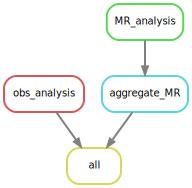
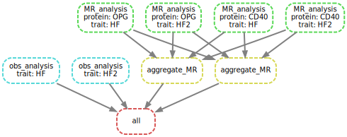

# snakemake showcases

This article provides information on installation of snakemake along
with two examples. Additional information is also available¹.

## 1 Installation

### 1.1 GitHub

[GitHub](https://github.com/snakemake/snakemake)
([documentation](https://snakemake.github.io/),
[stable](https://snakemake.readthedocs.io/en/stable/))

Note that in the following `source` instead of `conda` is used to
activate.

### 1.2 Anaconda3

<https://www.anaconda.com/>

``` bash
wget https://repo.anaconda.com/archive/Anaconda3-2020.07-Linux-x86_64.sh
bash Anaconda3-2020.07-Linux-x86_64.sh
# snakemake
conda create -n anaconda
conda remove -n anaconda snakemake
conda install -c bioconda snakemake
source activate snakemake
conda update -n anaconda snakemake
```

The remove option is useful when resolving compatibility issues.

### 1.3 Miniconda3

<https://docs.conda.io/en/latest/miniconda.html>

``` bash
wget https://repo.continuum.io/miniconda/Miniconda3-latest-Linux-x86_64.sh
bash Miniconda3-latest-Linux-x86_64.sh
conda config --add channels bioconda
conda config --add channels conda-forge
conda create -y --name miniconda python=3.7
source activate miniconda
conda install -c bioconda fastqc
```

## 2 A SLURM example

The Caprion project, <https://jinghuazhao.github.io/Caprion/>,
experiments with a `workflow/config.yaml` as follows,

``` yaml
cluster:
  mkdir -p logs/{rule} &&
  sbatch
    --account={resources.account}
    --partition={resources.partition}
    --qos={resources.qos}
    --cpus-per-task={threads}
    --mem={resources.mem_mb}
    --time={resources.runtime}
    --job-name={rule}-{wildcards}
    --error=logs/{rule}/{wildcards}-prune.err
    --output=logs/{rule}/{wildcards}-prune.out
default-resources:
  - account=CARDIO-SL0-CPU
  - partition=cardio
  - qos=cardio
  - mem_mb=10000
  - runtime='12:00:00'
  - threads=1
restart-times: 3
max-jobs-per-second: 10
max-status-checks-per-second: 1
local-cores: 1
latency-wait: 60
jobs: 1
keep-going: True
rerun-incomplete: True
printshellcmds: True
scheduler: greedy
use-conda: True
```

whose driver routine is as follows,

``` bash
#
module load miniconda3/4.5.1
export csd3path=/rds/project/jmmh2/rds-jmmh2-projects/olink_proteomics/scallop/miniconda37
source ${csd3path}/bin/activate
#
snakemake -s workflow/rules/cojo.smk -j1
snakemake -s workflow/rules/report.smk -j1
snakemake -s workflow/rules/cojo.smk -c --profile workflow
```

and use `--unlock` when necessary.

The specification above can be alternatively done via JSON.

A permenant configuration can also be done.

``` bash
# all users
# sudo ln -s /usr/local/Cluster-Apps/miniconda3/4.5.1/etc/profile.d/conda.sh /etc/profile.d/conda.sh
# current user
echo ". /usr/local/Cluster-Apps/miniconda3/4.5.1/etc/profile.d/conda.sh" >> ~/.bashrc
# conda's base (root) environment on PATH
conda activate
# the base environment on PATH permanently
echo "conda activate" >> ~/.bashrc
# A user profile
mkdir $HOME/.config/Snakemake/slurm
cp slurm.yaml $HOME/.config/Snakemake/slurm
touch $HOME/.config/Snakemake/slurm/slurm.yaml
```

so as to call conda and slurm, respectively.

``` bash
snakemake --j4 --use-conda
snakemake --profile slurm
```

## 3 A Mendelian randomization pipeline

Adapted from published work², the required files are available from the
`snakemake` subdirectory inside the installed package or
`inst/snakemake` directory in the source package.

Steps to set up the environment are outlined below, while
`MendelianRandomization` v0.6.0 is used together with a bug fix in
`workflow/r/MR_functions.R`. The workflow has been heavily edited for
simplicity, efficiency and generality. Currently `input/` contains data
on CD40, OPG and heart failures – to imitate additional trait, HF
statistics are duplicated as HF2.

The code chunks below gives `output`/`MR_HF.csv` (MR results) and
`Obs_HF.csv` (meta-analysis results based on observational studies) and
similarly for HF2.

``` bash
module load miniconda3/4.5.1
export csd3path=/rds/project/jmmh2/rds-jmmh2-projects/olink_proteomics/scallop
source ${csd3path}/miniconda37/bin/activate
# 1. a dry run (-n).
snakemake --dry-run
# 2. run (-c on [all] available cores without --use-conda option as local packages are more up-to-date)
snakemake --cores
# 3. contrast with original output for OPG
# grep OPG output/MR_HF.csv | diff - <(grep OPG ${csd3path}/cvd1-hf/results/res_MR_aggregate.csv)
# 4. Some ancillary work in place.
snakemake --rulegraph | dot -Tsvg > output/rulegraph.svg
snakemake --dag | dot -Tsvg > output/dag.svg
```



Figure 1. Dependency graph of rules



Figure 2. Directed Acyclic Graph (DAG)

## 4 URLs

An introduction,
<https://ucdavis-bioinformatics-training.github.io/2020-Genome_Assembly_Workshop/snakemake/snakemake_intro>;
csd3, <https://cambridge-ceu.github.io/csd3/Python/snakemake.html>;
snakemake-with-R, <https://github.com/fritzbayer/snakemake-with-R>;
snakemake-workflows, <https://github.com/snakemake-workflows/>;
[](https://zenodo.org/badge/latestdoi/429122036).

## References

1\.

Petereit, J. Pipeline automation via snakemake. in *Plant
bioinformatics: Methods and protocols* (ed. Edwards, D.) 181–196
(Springer US, New York, NY, 2022).
doi:[10.1007/978-1-0716-2067-0_9](https://doi.org/10.1007/978-1-0716-2067-0_9).

2\.

Henry, A. *et al.* [Therapeutic targets for heart failure identified
using proteomics and mendelian
randomization](https://doi.org/10.1161/CIRCULATIONAHA.121.056663).
*Circulation* **145**, 1205–1217 (2022).
