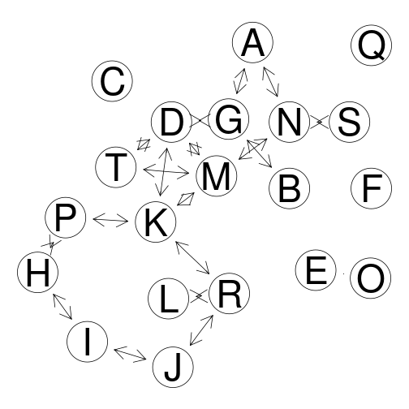
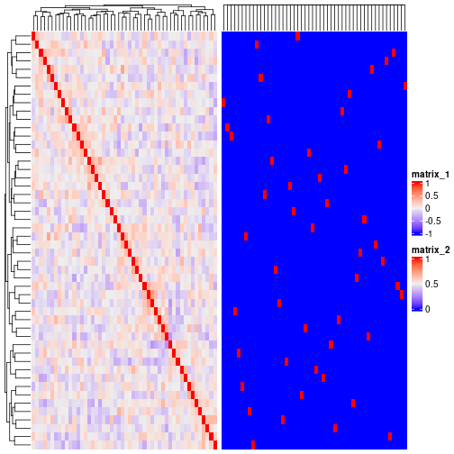

## Normalization

### ComBat

This is the documentation example, based on Bioconductor 3.14.


```r
suppressMessages(library(sva))
#> Warning: package 'sva' was built under R version 4.1.3
#> Error: package 'mgcv' could not be loaded
suppressMessages(library(bladderbatch))
#> Warning: package 'bladderbatch' was built under R version 4.1.3
#> Warning: package 'Biobase' was built under R version 4.1.3
#> Warning: package 'BiocGenerics' was built under R version 4.1.3
data(bladderdata)
dat <- bladderEset[1:50,]

pheno = pData(dat)
edata = exprs(dat)
batch = pheno$batch
mod = model.matrix(~as.factor(cancer), data=pheno)

# 1. parametric adjustment
combat_edata1 = ComBat(dat=edata, batch=batch, mod=NULL, par.prior=TRUE, prior.plots=TRUE)
#> Error in ComBat(dat = edata, batch = batch, mod = NULL, par.prior = TRUE, : could not find function "ComBat"

# 2. non-parametric adjustment, mean-only version
combat_edata2 = ComBat(dat=edata, batch=batch, mod=NULL, par.prior=FALSE, mean.only=TRUE)
#> Error in ComBat(dat = edata, batch = batch, mod = NULL, par.prior = FALSE, : could not find function "ComBat"

# 3. reference-batch version, with covariates
combat_edata3 = ComBat(dat=edata, batch=batch, mod=mod, par.prior=TRUE, ref.batch=3, prior.plots=TRUE)
#> Error in ComBat(dat = edata, batch = batch, mod = mod, par.prior = TRUE, : could not find function "ComBat"
```

### quantro

Again, this is adapted from the package vignette. noting that `FlowSorted.DLPFC.450k` instead of `FlowSorted` is used.


```r
suppressMessages(library(FlowSorted.DLPFC.450k))
#> Warning: package 'FlowSorted.DLPFC.450k' was built under R version 4.1.3
#> Warning: package 'minfi' was built under R version 4.1.3
#> Warning: package 'GenomicRanges' was built under R version 4.1.3
#> Warning: package 'S4Vectors' was built under R version 4.1.3
#> Warning: package 'IRanges' was built under R version 4.1.3
#> Warning: package 'GenomeInfoDb' was built under R version 4.1.3
#> Error: package 'GenomeInfoDb' could not be loaded
p <- getBeta(FlowSorted.DLPFC.450k,offset=100)
#> Error in getBeta(FlowSorted.DLPFC.450k, offset = 100): could not find function "getBeta"
pd <- pData(FlowSorted.DLPFC.450k)
#> Error in h(simpleError(msg, call)): error in evaluating the argument 'object' in selecting a method for function 'pData': object 'FlowSorted.DLPFC.450k' not found
library(quantro)
#> Warning: package 'quantro' was built under R version 4.1.3
#> Error: package or namespace load failed for 'quantro' in dyn.load(file, DLLpath = DLLpath, ...):
#>  unable to load shared object '/rds/user/jhz22/hpc-work/R/Matrix/libs/Matrix.so':
#>   libRlapack.so: cannot open shared object file: No such file or directory
matdensity(p, groupFactor = pd$CellType, xlab = " ", ylab = "density",
           main = "Beta Values", brewer.n = 8, brewer.name = "Dark2")
#> Error in matdensity(p, groupFactor = pd$CellType, xlab = " ", ylab = "density", : could not find function "matdensity"
legend('top', c("NeuN_neg", "NeuN_pos"), col = c(1, 2), lty = 1, lwd = 3)
#> Error in strwidth(legend, units = "user", cex = cex, font = text.font): plot.new has not been called yet
matboxplot(p, groupFactor = pd$CellType, xaxt = "n", main = "Beta Values")
#> Error in matboxplot(p, groupFactor = pd$CellType, xaxt = "n", main = "Beta Values"): could not find function "matboxplot"
qtest <- quantro(object = p, groupFactor = pd$CellType)
#> Error in quantro(object = p, groupFactor = pd$CellType): could not find function "quantro"
library(doParallel)
#> Warning: package 'doParallel' was built under R version 4.1.2
#> Loading required package: foreach
#> Warning: package 'foreach' was built under R version 4.1.2
#> Loading required package: iterators
#> Warning: package 'iterators' was built under R version 4.1.2
#> Loading required package: parallel
registerDoParallel(cores=10)
qtestPerm <- quantro(p, groupFactor = pd$CellType, B = 1000)
#> Error in quantro(p, groupFactor = pd$CellType, B = 1000): could not find function "quantro"
qtestPerm
#> Error in eval(expr, envir, enclos): object 'qtestPerm' not found
quantroPlot(qtestPerm)
#> Error in quantroPlot(qtestPerm): could not find function "quantroPlot"
```

## Differential expression


```r
suppressMessages(library(DESeq2))
#> Warning: package 'DESeq2' was built under R version 4.1.3
#> Warning: package 'GenomicRanges' was built under R version 4.1.3
#> Warning: package 'GenomeInfoDb' was built under R version 4.1.3
#> Error: package 'GenomeInfoDb' could not be loaded
ex <- makeExampleDESeqDataSet(m=4)
#> Error in makeExampleDESeqDataSet(m = 4): could not find function "makeExampleDESeqDataSet"
dds <- DESeq(ex)
#> Error in DESeq(ex): could not find function "DESeq"
res <- results(dds, contrast=c("condition","B","A"))
#> Error in results(dds, contrast = c("condition", "B", "A")): could not find function "results"
rld <- rlogTransformation(ex, blind=TRUE)
#> Error in rlogTransformation(ex, blind = TRUE): could not find function "rlogTransformation"
dat <- plotPCA(rld, intgroup=c("condition"),returnData=TRUE)
#> Error in h(simpleError(msg, call)): error in evaluating the argument 'object' in selecting a method for function 'plotPCA': object 'rld' not found
percentVar <- round(100 * attr(dat,"percentVar"))
suppressMessages(library(ggplot2))
ggplot(dat, aes(PC1, PC2, color=condition, shape=condition)) +
geom_point(size=3) +
xlab(paste0("PC1:",percentVar[1],"% variance")) +
ylab(paste0("PC2:",percentVar[2],"% variance"))
#> Error in `fortify()`:
#> ! `data` must be a data frame, or other object coercible by `fortify()`, not an S4 object with class ExpressionSet.
ex$condition <- relevel(ex$condition, ref="B")
#> Error in relevel(ex$condition, ref = "B"): object 'ex' not found
dds2 <- DESeq(dds)
#> Error in DESeq(dds): could not find function "DESeq"
res <- results(dds2)
#> Error in results(dds2): could not find function "results"
write.csv(as.data.frame(res),file="A_vs_B.csv")
#> Error in h(simpleError(msg, call)): error in evaluating the argument 'x' in selecting a method for function 'as.data.frame': object 'res' not found
```

## Gene co-expression and network analysis

A simple network is furnished with the `GeneNet` documentation example,


```r
library("GeneNet")
#> Warning: package 'GeneNet' was built under R version 4.1.3
#> Loading required package: corpcor
#> Warning: package 'corpcor' was built under R version 4.1.1
#> Loading required package: longitudinal
#> Warning: package 'longitudinal' was built under R version 4.1.3
#> Loading required package: fdrtool
#> Warning: package 'fdrtool' was built under R version 4.1.3

## A random network with 40 nodes 
# it contains 780=40*39/2 edges of which 5 percent (=39) are non-zero
true.pcor <- ggm.simulate.pcor(40)
  
# A data set with 40 observations
m.sim <- ggm.simulate.data(40, true.pcor)

# A simple estimate of partial correlations
estimated.pcor <- cor2pcor( cor(m.sim) )

# A comparison of estimated and true values
sum((true.pcor-estimated.pcor)^2)
#> [1] 482.2539

# A slightly better estimate ...
estimated.pcor.2 <- ggm.estimate.pcor(m.sim)
#> Estimating optimal shrinkage intensity lambda (correlation matrix): 0.3255
sum((true.pcor-estimated.pcor.2)^2)
#> [1] 10.17632

## ecoli data 
data(ecoli)

# partial correlation matrix 
inferred.pcor <- ggm.estimate.pcor(ecoli)
#> Estimating optimal shrinkage intensity lambda (correlation matrix): 0.1804

# p-values, q-values and posterior probabilities for each potential edge 
test.results <- network.test.edges(inferred.pcor)
#> Estimate (local) false discovery rates (partial correlations):
#> Step 1... determine cutoff point
#> Step 2... estimate parameters of null distribution and eta0
#> Step 3... compute p-values and estimate empirical PDF/CDF
#> Step 4... compute q-values and local fdr
#> Step 5... prepare for plotting

# best 20 edges (strongest correlation)
test.results[1:20,]
#>           pcor node1 node2         pval         qval      prob
#> 1   0.23185664    51    53 2.220446e-16 3.612205e-13 1.0000000
#> 2   0.22405545    52    53 2.220446e-16 3.612205e-13 1.0000000
#> 3   0.21507824    51    52 2.220446e-16 3.612205e-13 1.0000000
#> 4   0.17328863     7    93 3.108624e-15 3.792816e-12 0.9999945
#> 5  -0.13418892    29    86 1.120811e-09 1.093997e-06 0.9999516
#> 6   0.12594697    21    72 1.103836e-08 8.978558e-06 0.9998400
#> 7   0.11956105    28    86 5.890921e-08 3.853588e-05 0.9998400
#> 8  -0.11723897    26    80 1.060525e-07 5.816169e-05 0.9998400
#> 9  -0.11711625    72    89 1.093654e-07 5.930496e-05 0.9972804
#> 10  0.10658013    20    21 1.366610e-06 5.925272e-04 0.9972804
#> 11  0.10589778    21    73 1.596859e-06 6.678426e-04 0.9972804
#> 12  0.10478689    20    91 2.053403e-06 8.024421e-04 0.9972804
#> 13  0.10420836     7    52 2.338381e-06 8.778601e-04 0.9944557
#> 14  0.10236077    87    95 3.525185e-06 1.224963e-03 0.9944557
#> 15  0.10113550    27    95 4.610442e-06 1.500047e-03 0.9920084
#> 16  0.09928954    21    51 6.868355e-06 2.046548e-03 0.9920084
#> 17  0.09791914    21    88 9.192370e-06 2.520615e-03 0.9920084
#> 18  0.09719685    18    95 1.070232e-05 2.790101e-03 0.9920084
#> 19  0.09621791    28    90 1.313007e-05 3.171816e-03 0.9920084
#> 20  0.09619099    12    80 1.320373e-05 3.182525e-03 0.9920084

# network containing edges with prob > 0.9 (i.e. local fdr < 0.1)
net <- extract.network(test.results, cutoff.ggm=0.9)
#> 
#> Significant edges:  65 
#>     Corresponding to  1.26 %  of possible edges
net
#>           pcor node1 node2         pval         qval      prob
#> 1   0.23185664    51    53 2.220446e-16 3.612205e-13 1.0000000
#> 2   0.22405545    52    53 2.220446e-16 3.612205e-13 1.0000000
#> 3   0.21507824    51    52 2.220446e-16 3.612205e-13 1.0000000
#> 4   0.17328863     7    93 3.108624e-15 3.792816e-12 0.9999945
#> 5  -0.13418892    29    86 1.120811e-09 1.093997e-06 0.9999516
#> 6   0.12594697    21    72 1.103836e-08 8.978558e-06 0.9998400
#> 7   0.11956105    28    86 5.890921e-08 3.853588e-05 0.9998400
#> 8  -0.11723897    26    80 1.060525e-07 5.816169e-05 0.9998400
#> 9  -0.11711625    72    89 1.093654e-07 5.930496e-05 0.9972804
#> 10  0.10658013    20    21 1.366610e-06 5.925272e-04 0.9972804
#> 11  0.10589778    21    73 1.596859e-06 6.678426e-04 0.9972804
#> 12  0.10478689    20    91 2.053403e-06 8.024421e-04 0.9972804
#> 13  0.10420836     7    52 2.338381e-06 8.778601e-04 0.9944557
#> 14  0.10236077    87    95 3.525185e-06 1.224963e-03 0.9944557
#> 15  0.10113550    27    95 4.610442e-06 1.500047e-03 0.9920084
#> 16  0.09928954    21    51 6.868355e-06 2.046548e-03 0.9920084
#> 17  0.09791914    21    88 9.192370e-06 2.520615e-03 0.9920084
#> 18  0.09719685    18    95 1.070232e-05 2.790101e-03 0.9920084
#> 19  0.09621791    28    90 1.313007e-05 3.171816e-03 0.9920084
#> 20  0.09619099    12    80 1.320373e-05 3.182525e-03 0.9920084
#> 21  0.09576091    89    95 1.443542e-05 3.354775e-03 0.9891317
#> 22  0.09473210     7    51 1.784126e-05 3.864824e-03 0.9891317
#> 23 -0.09386896    53    58 2.127621e-05 4.313589e-03 0.9891317
#> 24 -0.09366615    29    83 2.217012e-05 4.421098e-03 0.9891317
#> 25 -0.09341148    21    89 2.334320e-05 4.556945e-03 0.9810727
#> 26 -0.09156391    49    93 3.380042e-05 5.955970e-03 0.9810727
#> 27 -0.09150710    80    90 3.418362e-05 6.002081e-03 0.9810727
#> 28  0.09101505     7    53 3.767965e-05 6.408100e-03 0.9810727
#> 29  0.09050688    21    84 4.164469e-05 6.838780e-03 0.9810727
#> 30  0.08965490    72    73 4.919364e-05 7.581864e-03 0.9810727
#> 31 -0.08934025    29    99 5.229603e-05 7.861414e-03 0.9810727
#> 32 -0.08906819     9    95 5.512706e-05 8.104756e-03 0.9810727
#> 33  0.08888345     2    49 5.713142e-05 8.270670e-03 0.9810727
#> 34  0.08850681    86    90 6.143361e-05 8.610158e-03 0.9810727
#> 35  0.08805868    17    53 6.695168e-05 9.015173e-03 0.9810727
#> 36  0.08790809    28    48 6.890882e-05 9.151288e-03 0.9810727
#> 37  0.08783471    33    58 6.988208e-05 9.217594e-03 0.9682377
#> 38 -0.08705796     7    49 8.101242e-05 1.021362e-02 0.9682377
#> 39  0.08645033    20    46 9.086544e-05 1.102466e-02 0.9682377
#> 40  0.08609950    48    86 9.705860e-05 1.150392e-02 0.9682377
#> 41  0.08598769    21    52 9.911455e-05 1.165816e-02 0.9682377
#> 42  0.08555275    32    95 1.075098e-04 1.226435e-02 0.9682377
#> 43  0.08548231    17    51 1.089310e-04 1.236336e-02 0.9424722
#> 44  0.08470370    80    83 1.258658e-04 1.382356e-02 0.9424722
#> 45  0.08442510    80    82 1.325062e-04 1.437067e-02 0.9174573
#> 46  0.08271606    80    93 1.810274e-04 1.845631e-02 0.9174573
#> 47  0.08235175    46    91 1.933328e-04 1.941579e-02 0.9174573
#> 48  0.08217787    25    95 1.994788e-04 1.988432e-02 0.9174573
#> 49 -0.08170331    29    87 2.171998e-04 2.119714e-02 0.9174573
#> 50  0.08123632    19    29 2.360716e-04 2.253605e-02 0.9174573
#> 51  0.08101702    51    84 2.454546e-04 2.318024e-02 0.9174573
#> 52  0.08030748    16    93 2.782642e-04 2.532795e-02 0.9174573
#> 53  0.08006503    28    52 2.903869e-04 2.608270e-02 0.9174573
#> 54 -0.07941656    41    80 3.252832e-04 2.814823e-02 0.9174573
#> 55  0.07941410    54    89 3.254228e-04 2.815619e-02 0.9174573
#> 56 -0.07934653    28    80 3.292783e-04 2.837510e-02 0.9174573
#> 57  0.07916783    29    92 3.396801e-04 2.895701e-02 0.9174573
#> 58 -0.07866905    17    86 3.703634e-04 3.060292e-02 0.9174573
#> 59  0.07827749    16    29 3.962445e-04 3.191461e-02 0.9174573
#> 60 -0.07808262    73    89 4.097451e-04 3.257289e-02 0.9174573
#> 61  0.07766261    52    67 4.403164e-04 3.400206e-02 0.9174573
#> 62  0.07762917    25    87 4.428395e-04 3.411636e-02 0.9174573
#> 63 -0.07739378     9    93 4.609871e-04 3.492294e-02 0.9174573
#> 64  0.07738885    31    80 4.613746e-04 3.493987e-02 0.9174573
#> 65 -0.07718681    80    94 4.775134e-04 3.563443e-02 0.9174573

# significant based on FDR cutoff Q=0.05?
num.significant.1 <- sum(test.results$qval <= 0.05)
test.results[1:num.significant.1,]
#>           pcor node1 node2         pval         qval      prob
#> 1   0.23185664    51    53 2.220446e-16 3.612205e-13 1.0000000
#> 2   0.22405545    52    53 2.220446e-16 3.612205e-13 1.0000000
#> 3   0.21507824    51    52 2.220446e-16 3.612205e-13 1.0000000
#> 4   0.17328863     7    93 3.108624e-15 3.792816e-12 0.9999945
#> 5  -0.13418892    29    86 1.120811e-09 1.093997e-06 0.9999516
#> 6   0.12594697    21    72 1.103836e-08 8.978558e-06 0.9998400
#> 7   0.11956105    28    86 5.890921e-08 3.853588e-05 0.9998400
#> 8  -0.11723897    26    80 1.060525e-07 5.816169e-05 0.9998400
#> 9  -0.11711625    72    89 1.093654e-07 5.930496e-05 0.9972804
#> 10  0.10658013    20    21 1.366610e-06 5.925272e-04 0.9972804
#> 11  0.10589778    21    73 1.596859e-06 6.678426e-04 0.9972804
#> 12  0.10478689    20    91 2.053403e-06 8.024421e-04 0.9972804
#> 13  0.10420836     7    52 2.338381e-06 8.778601e-04 0.9944557
#> 14  0.10236077    87    95 3.525185e-06 1.224963e-03 0.9944557
#> 15  0.10113550    27    95 4.610442e-06 1.500047e-03 0.9920084
#> 16  0.09928954    21    51 6.868355e-06 2.046548e-03 0.9920084
#> 17  0.09791914    21    88 9.192370e-06 2.520615e-03 0.9920084
#> 18  0.09719685    18    95 1.070232e-05 2.790101e-03 0.9920084
#> 19  0.09621791    28    90 1.313007e-05 3.171816e-03 0.9920084
#> 20  0.09619099    12    80 1.320373e-05 3.182525e-03 0.9920084
#> 21  0.09576091    89    95 1.443542e-05 3.354775e-03 0.9891317
#> 22  0.09473210     7    51 1.784126e-05 3.864824e-03 0.9891317
#> 23 -0.09386896    53    58 2.127621e-05 4.313589e-03 0.9891317
#> 24 -0.09366615    29    83 2.217012e-05 4.421098e-03 0.9891317
#> 25 -0.09341148    21    89 2.334320e-05 4.556945e-03 0.9810727
#> 26 -0.09156391    49    93 3.380042e-05 5.955970e-03 0.9810727
#> 27 -0.09150710    80    90 3.418362e-05 6.002081e-03 0.9810727
#> 28  0.09101505     7    53 3.767965e-05 6.408100e-03 0.9810727
#> 29  0.09050688    21    84 4.164469e-05 6.838780e-03 0.9810727
#> 30  0.08965490    72    73 4.919364e-05 7.581864e-03 0.9810727
#> 31 -0.08934025    29    99 5.229603e-05 7.861414e-03 0.9810727
#> 32 -0.08906819     9    95 5.512706e-05 8.104756e-03 0.9810727
#> 33  0.08888345     2    49 5.713142e-05 8.270670e-03 0.9810727
#> 34  0.08850681    86    90 6.143361e-05 8.610158e-03 0.9810727
#> 35  0.08805868    17    53 6.695168e-05 9.015173e-03 0.9810727
#> 36  0.08790809    28    48 6.890882e-05 9.151288e-03 0.9810727
#> 37  0.08783471    33    58 6.988208e-05 9.217594e-03 0.9682377
#> 38 -0.08705796     7    49 8.101242e-05 1.021362e-02 0.9682377
#> 39  0.08645033    20    46 9.086544e-05 1.102466e-02 0.9682377
#> 40  0.08609950    48    86 9.705860e-05 1.150392e-02 0.9682377
#> 41  0.08598769    21    52 9.911455e-05 1.165816e-02 0.9682377
#> 42  0.08555275    32    95 1.075098e-04 1.226435e-02 0.9682377
#> 43  0.08548231    17    51 1.089310e-04 1.236336e-02 0.9424722
#> 44  0.08470370    80    83 1.258658e-04 1.382356e-02 0.9424722
#> 45  0.08442510    80    82 1.325062e-04 1.437067e-02 0.9174573
#> 46  0.08271606    80    93 1.810274e-04 1.845631e-02 0.9174573
#> 47  0.08235175    46    91 1.933328e-04 1.941579e-02 0.9174573
#> 48  0.08217787    25    95 1.994788e-04 1.988432e-02 0.9174573
#> 49 -0.08170331    29    87 2.171998e-04 2.119714e-02 0.9174573
#> 50  0.08123632    19    29 2.360716e-04 2.253605e-02 0.9174573
#> 51  0.08101702    51    84 2.454546e-04 2.318024e-02 0.9174573
#> 52  0.08030748    16    93 2.782642e-04 2.532795e-02 0.9174573
#> 53  0.08006503    28    52 2.903869e-04 2.608270e-02 0.9174573
#> 54 -0.07941656    41    80 3.252832e-04 2.814823e-02 0.9174573
#> 55  0.07941410    54    89 3.254228e-04 2.815619e-02 0.9174573
#> 56 -0.07934653    28    80 3.292783e-04 2.837510e-02 0.9174573
#> 57  0.07916783    29    92 3.396801e-04 2.895701e-02 0.9174573
#> 58 -0.07866905    17    86 3.703634e-04 3.060292e-02 0.9174573
#> 59  0.07827749    16    29 3.962445e-04 3.191461e-02 0.9174573
#> 60 -0.07808262    73    89 4.097451e-04 3.257289e-02 0.9174573
#> 61  0.07766261    52    67 4.403164e-04 3.400206e-02 0.9174573
#> 62  0.07762917    25    87 4.428395e-04 3.411636e-02 0.9174573
#> 63 -0.07739378     9    93 4.609871e-04 3.492294e-02 0.9174573
#> 64  0.07738885    31    80 4.613746e-04 3.493987e-02 0.9174573
#> 65 -0.07718681    80    94 4.775134e-04 3.563443e-02 0.9174573
#> 66  0.07706275    27    58 4.876830e-04 3.606178e-02 0.8297811
#> 67 -0.07610709    16    83 5.730531e-04 4.085919e-02 0.8297811
#> 68  0.07550557    53    84 6.337142e-04 4.406471e-02 0.8297811

# significant based on "local fdr" cutoff (prob > 0.9)?
num.significant.2 <- sum(test.results$prob > 0.9)
test.results[test.results$prob > 0.9,]
#>           pcor node1 node2         pval         qval      prob
#> 1   0.23185664    51    53 2.220446e-16 3.612205e-13 1.0000000
#> 2   0.22405545    52    53 2.220446e-16 3.612205e-13 1.0000000
#> 3   0.21507824    51    52 2.220446e-16 3.612205e-13 1.0000000
#> 4   0.17328863     7    93 3.108624e-15 3.792816e-12 0.9999945
#> 5  -0.13418892    29    86 1.120811e-09 1.093997e-06 0.9999516
#> 6   0.12594697    21    72 1.103836e-08 8.978558e-06 0.9998400
#> 7   0.11956105    28    86 5.890921e-08 3.853588e-05 0.9998400
#> 8  -0.11723897    26    80 1.060525e-07 5.816169e-05 0.9998400
#> 9  -0.11711625    72    89 1.093654e-07 5.930496e-05 0.9972804
#> 10  0.10658013    20    21 1.366610e-06 5.925272e-04 0.9972804
#> 11  0.10589778    21    73 1.596859e-06 6.678426e-04 0.9972804
#> 12  0.10478689    20    91 2.053403e-06 8.024421e-04 0.9972804
#> 13  0.10420836     7    52 2.338381e-06 8.778601e-04 0.9944557
#> 14  0.10236077    87    95 3.525185e-06 1.224963e-03 0.9944557
#> 15  0.10113550    27    95 4.610442e-06 1.500047e-03 0.9920084
#> 16  0.09928954    21    51 6.868355e-06 2.046548e-03 0.9920084
#> 17  0.09791914    21    88 9.192370e-06 2.520615e-03 0.9920084
#> 18  0.09719685    18    95 1.070232e-05 2.790101e-03 0.9920084
#> 19  0.09621791    28    90 1.313007e-05 3.171816e-03 0.9920084
#> 20  0.09619099    12    80 1.320373e-05 3.182525e-03 0.9920084
#> 21  0.09576091    89    95 1.443542e-05 3.354775e-03 0.9891317
#> 22  0.09473210     7    51 1.784126e-05 3.864824e-03 0.9891317
#> 23 -0.09386896    53    58 2.127621e-05 4.313589e-03 0.9891317
#> 24 -0.09366615    29    83 2.217012e-05 4.421098e-03 0.9891317
#> 25 -0.09341148    21    89 2.334320e-05 4.556945e-03 0.9810727
#> 26 -0.09156391    49    93 3.380042e-05 5.955970e-03 0.9810727
#> 27 -0.09150710    80    90 3.418362e-05 6.002081e-03 0.9810727
#> 28  0.09101505     7    53 3.767965e-05 6.408100e-03 0.9810727
#> 29  0.09050688    21    84 4.164469e-05 6.838780e-03 0.9810727
#> 30  0.08965490    72    73 4.919364e-05 7.581864e-03 0.9810727
#> 31 -0.08934025    29    99 5.229603e-05 7.861414e-03 0.9810727
#> 32 -0.08906819     9    95 5.512706e-05 8.104756e-03 0.9810727
#> 33  0.08888345     2    49 5.713142e-05 8.270670e-03 0.9810727
#> 34  0.08850681    86    90 6.143361e-05 8.610158e-03 0.9810727
#> 35  0.08805868    17    53 6.695168e-05 9.015173e-03 0.9810727
#> 36  0.08790809    28    48 6.890882e-05 9.151288e-03 0.9810727
#> 37  0.08783471    33    58 6.988208e-05 9.217594e-03 0.9682377
#> 38 -0.08705796     7    49 8.101242e-05 1.021362e-02 0.9682377
#> 39  0.08645033    20    46 9.086544e-05 1.102466e-02 0.9682377
#> 40  0.08609950    48    86 9.705860e-05 1.150392e-02 0.9682377
#> 41  0.08598769    21    52 9.911455e-05 1.165816e-02 0.9682377
#> 42  0.08555275    32    95 1.075098e-04 1.226435e-02 0.9682377
#> 43  0.08548231    17    51 1.089310e-04 1.236336e-02 0.9424722
#> 44  0.08470370    80    83 1.258658e-04 1.382356e-02 0.9424722
#> 45  0.08442510    80    82 1.325062e-04 1.437067e-02 0.9174573
#> 46  0.08271606    80    93 1.810274e-04 1.845631e-02 0.9174573
#> 47  0.08235175    46    91 1.933328e-04 1.941579e-02 0.9174573
#> 48  0.08217787    25    95 1.994788e-04 1.988432e-02 0.9174573
#> 49 -0.08170331    29    87 2.171998e-04 2.119714e-02 0.9174573
#> 50  0.08123632    19    29 2.360716e-04 2.253605e-02 0.9174573
#> 51  0.08101702    51    84 2.454546e-04 2.318024e-02 0.9174573
#> 52  0.08030748    16    93 2.782642e-04 2.532795e-02 0.9174573
#> 53  0.08006503    28    52 2.903869e-04 2.608270e-02 0.9174573
#> 54 -0.07941656    41    80 3.252832e-04 2.814823e-02 0.9174573
#> 55  0.07941410    54    89 3.254228e-04 2.815619e-02 0.9174573
#> 56 -0.07934653    28    80 3.292783e-04 2.837510e-02 0.9174573
#> 57  0.07916783    29    92 3.396801e-04 2.895701e-02 0.9174573
#> 58 -0.07866905    17    86 3.703634e-04 3.060292e-02 0.9174573
#> 59  0.07827749    16    29 3.962445e-04 3.191461e-02 0.9174573
#> 60 -0.07808262    73    89 4.097451e-04 3.257289e-02 0.9174573
#> 61  0.07766261    52    67 4.403164e-04 3.400206e-02 0.9174573
#> 62  0.07762917    25    87 4.428395e-04 3.411636e-02 0.9174573
#> 63 -0.07739378     9    93 4.609871e-04 3.492294e-02 0.9174573
#> 64  0.07738885    31    80 4.613746e-04 3.493987e-02 0.9174573
#> 65 -0.07718681    80    94 4.775134e-04 3.563443e-02 0.9174573

# parameters of the mixture distribution used to compute p-values etc.
c <- fdrtool(sm2vec(inferred.pcor), statistic="correlation")
#> Step 1... determine cutoff point
#> Step 2... estimate parameters of null distribution and eta0
#> Step 3... compute p-values and estimate empirical PDF/CDF
#> Step 4... compute q-values and local fdr
#> Step 5... prepare for plotting
```



```r
c$param
#>          cutoff N.cens      eta0     eta0.SE    kappa kappa.SE
#> [1,] 0.03553068   4352 0.9474623 0.005656465 2043.378 94.72266

## A random network with 20 nodes and 10 percent (=19) edges
true.pcor <- ggm.simulate.pcor(20, 0.1)

# convert to edge list
test.results <- ggm.list.edges(true.pcor)[1:19,]
nlab <- LETTERS[1:20]

# graphviz
network.make.dot(filename="test.dot", test.results, nlab, main = "A graph")
system("fdp -T svg -o test.svg test.dot")

# Rgraphviz
gr <- network.make.graph( test.results, nlab)
gr
#> A graphNEL graph with directed edges
#> Number of Nodes = 20 
#> Number of Edges = 38
num.nodes(gr)
#> [1] 20
edge.info(gr)
#> $weight
#>      A~I      A~C      A~T      A~L      B~M      B~K      C~G      C~I 
#> -0.16339  0.16397 -0.33646  0.62925 -0.10836  0.66416 -0.28844 -0.29846 
#>      C~E      D~M      G~Q      G~S      G~N      H~Q      I~T      J~Q 
#>  0.60053  0.94764 -0.11248  0.13178  0.52525 -0.39155  0.50970 -0.51114 
#>      K~Q      N~Q      Q~S 
#> -0.34855 -0.27504 -0.22645 
#> 
#> $dir
#>    A~I    A~C    A~T    A~L    B~M    B~K    C~G    C~I    C~E    D~M    G~Q 
#> "none" "none" "none" "none" "none" "none" "none" "none" "none" "none" "none" 
#>    G~S    G~N    H~Q    I~T    J~Q    K~Q    N~Q    Q~S 
#> "none" "none" "none" "none" "none" "none" "none" "none"
gr2 <- network.make.graph( test.results, nlab, drop.singles=TRUE)
gr2
#> A graphNEL graph with directed edges
#> Number of Nodes = 16 
#> Number of Edges = 38
num.nodes(gr2)
#> [1] 16
edge.info(gr2)
#> $weight
#>      A~I      A~C      A~T      A~L      B~M      B~K      C~G      C~I 
#> -0.16339  0.16397 -0.33646  0.62925 -0.10836  0.66416 -0.28844 -0.29846 
#>      C~E      D~M      G~Q      G~S      G~N      H~Q      I~T      J~Q 
#>  0.60053  0.94764 -0.11248  0.13178  0.52525 -0.39155  0.50970 -0.51114 
#>      K~Q      N~Q      Q~S 
#> -0.34855 -0.27504 -0.22645 
#> 
#> $dir
#>    A~I    A~C    A~T    A~L    B~M    B~K    C~G    C~I    C~E    D~M    G~Q 
#> "none" "none" "none" "none" "none" "none" "none" "none" "none" "none" "none" 
#>    G~S    G~N    H~Q    I~T    J~Q    K~Q    N~Q    Q~S 
#> "none" "none" "none" "none" "none" "none" "none" "none"

# plot network
library("Rgraphviz")
#> Warning: package 'Rgraphviz' was built under R version 4.1.3
#> Loading required package: graph
#> Warning: package 'graph' was built under R version 4.1.3
#> Loading required package: grid
#> 
#> Attaching package: 'Rgraphviz'
#> The following objects are masked from 'package:IRanges':
#> 
#>     from, to
#> The following objects are masked from 'package:S4Vectors':
#> 
#>     from, to
plot(gr, "fdp")
```


```r
plot(gr2, "fdp")
```


A side-by-side heatmaps


```r
suppressMessages(library(ComplexHeatmap))
#> Warning: package 'ComplexHeatmap' was built under R version 4.1.3
set.seed(123454321)
m <- matrix(runif(2500),50)
r <- cor(m)
g <- as.matrix(r>=0.7)+0
f1 <- Heatmap(r)
f2 <- Heatmap(g)
f <- f1+f2
draw(f)
```



```r

suppressMessages(library(RColorBrewer))
#> Warning: package 'RColorBrewer' was built under R version 4.1.3
suppressMessages(library(heatmaply))
#> Warning: package 'heatmaply' was built under R version 4.1.1
#> Warning: package 'plotly' was built under R version 4.1.1
#> Error: package 'plotly' could not be loaded
df <- normalize(mtcars)
#> Error in (function (classes, fdef, mtable) : unable to find an inherited method for function 'normalize' for signature '"data.frame"'
heatmaply(df,k_col=5,k_row=5,colors = colorRampPalette(brewer.pal(3, "RdBu"))(256))
#> Error in heatmaply(df, k_col = 5, k_row = 5, colors = colorRampPalette(brewer.pal(3, : could not find function "heatmaply"
```

and a module analysis with WGCNA,

```r
suppressMessages(require(WGCNA))
suppressMessages(require(cluster))

pwr <- c(1:10, seq(from=12, to=30, by=2))
sft <- pickSoftThreshold(dat, powerVector=pwr, verbose=5)
ADJ <- abs(cor(dat, method="pearson", use="pairwise.complete.obs"))^6
dissADJ <- 1-ADJ
dissTOM <- TOMdist(ADJ)
TOM <- TOMsimilarityFromExpr(dat)
Tree <- hclust(as.dist(1-TOM), method="average")
for(j in pwr)
{
  pam_name <- paste0("pam",j)
  assign(pam_name, pam(as.dist(dissADJ),j))
  pamTOM_name <- paste0("pamTOM",j)
  assign(pamTOM_name,pam(as.dist(dissTOM),j))
  tc <- table(get(pam_name)$clustering,get(pamTOM_name)$clustering)
  print(tc)
  print(diag(tc))
}
colorStaticTOM <- as.character(cutreeStaticColor(Tree,cutHeight=.99,minSize=5))
colorDynamicTOM <- labels2colors(cutreeDynamic(Tree,method="tree",minClusterSize=5))
Colors <- data.frame(pamTOM6$clustering,colorStaticTOM,colorDynamicTOM)
plotDendroAndColors(Tree, Colors, dendroLabels=FALSE, hang=0.03, addGuide=TRUE, guideHang=0.05)
meg <- moduleEigengenes(dat, color=1:ncol(dat), softPower=6)
```

## Meta-data

```r
suppressMessages(library(recount3))
hs <- available_projects()
dim(subset(hs,file_source=="gtex"))
annotation_options("human")
blood_rse <- create_rse(subset(hs,project=="BLOOD"))
metadata(blood_rse)
dim(blood_rse)
rowRanges(blood_rse)
colnames(colData(blood_rse))
expand_sra_attributes(blood_rse)
```

## Pathway and enrichment analysis

```r
library(graphite)
reactome <- pathways("hsapiens", "reactome")
kegg <- pathways("hsapiens","kegg")
pharmgkb <- pathways("hsapiens","pharmgkb")
nodes(kegg)
suppressMessages(library(plyr))
kegg_t2g <- ldply(lapply(kegg, nodes), data.frame)
names(kegg_t2g) <- c("gs_name", "gene_symbol")
suppress(library(clusterProfiler))
eKEGG <- enricher(gene = , TERM2GENE = kegg_t2g,
                  universe = ,
                  pAdjustMethod = "BH",
                  pvalueCutoff = 0.1, qvalueCutoff = 0.05,
                  minGSSize = 10, maxGSSize = 500)

```

## Transcript databases

An overview of annotation is available@carlson16.

```r
options(width=200)

suppressMessages(library(AnnotationDbi))
suppressMessages(library(org.Hs.eg.db))
columns(org.Hs.eg.db)
keyref <- keys(org.Hs.eg.db, keytype="ENTREZID")
symbol_uniprot <- select(org.Hs.eg.db,keys=keyref,columns = c("SYMBOL","UNIPROT"))
subset(symbol_uniprot,SYMBOL=="MC4R")

suppressMessages(library(EnsDb.Hsapiens.v86))
x <- EnsDb.Hsapiens.v86
listColumns(x, "protein", skip.keys=TRUE)
listGenebiotypes(x)
listTxbiotypes(x)
listTables(x)
metadata(x)
organism(x)
returnFilterColumns(x)
seqinfo(x)
seqlevels(x)
updateEnsDb(x)

suppressMessages(library(ensembldb))
genes(x, columns=c("gene_name"), filter=list(SeqNameFilter("X"), GeneBiotypeFilter("protein_coding")))
transcripts(x, columns=listColumns(x, "tx"), filter = AnnotationFilterList(), order.type = "asc", return.type = "GRanges")

library(RMariaDB)
library(GenomicFeatures)
txdbEnsemblGRCh38 <- makeTxDbFromEnsembl(organism="Homo sapiens", release=98)
txdb <- as.list(txdbEnsemblGRCh38)
lapply(txdb,head)

library(TxDb.Hsapiens.UCSC.hg38.knownGene)
txdb <- TxDb.Hsapiens.UCSC.hg38.knownGene

library(INSPEcT)
liverExprs <- quantifyExpressionsFromBWs(txdb = txdb,BWfiles=,experimentalDesign=)
```

---

## A list of Bioconductor/CRAN packages

Package | Description
--------|------------
**Bioconductor** |
AnnotationDbi | AnnotationDb objects and their progeny, methods etc.
Biobase | Base functions for Bioconductor
org.Hs.eg.db | Conversion of Entrez ID -- gene symbols
EnsDb.Hsapiens.v86 | Exposes an annotation databases generated from Ensembl
ensembldb | Retrieve annotation data from an Ensembl based package
TxDb.Hsapiens.UCSC.hg38.knownGene | Annotation of the human genome
INSPEcT | Quantification of the intronic and exonic gene features and the post-transcriptional regulation analysis
graphite | GRAPH Interaction from pathway topological environment
clusterProfiler | Functional profiles for genes and gene clusters
DESSeq2 | Differential gene expression analysis based on the negative binomial distribution
edgeR | Empirical analysis of digital gene expression
WGCNA | Weighted correlation network analysis
ComplexHeatmap | Make complex heatmaps
recount3 | Interface to uniformly processed RNA-seq data
Pi | Priority index, leveraging genetic evidence to prioritise drug targets at the gene and pathway level
quantro | A test for when to use quantile normalization
FlowSorted.DLPFC.450k | Illumina HumanMethylation data on sorted frontal cortex cell populations
Rgraphiz | Interfaces R with the AT&T graphviz library for plotting R graph objects from the graph package
sva | Surrogate Variable Analysis
doParallel | Foreach Parallel Adaptor for the 'parallel' Package
**CRAN** |
GeneNet | Modeling and Inferring Gene Networks
RColorBrewer | ColorBrewer Palettes
ggplot2 | Data Visualisations Using the grammar of graphics
heatmaply | Interactive Cluster Heat Maps Using `plotly` and `ggplot2`
pheatmap | results visualisation
plyr | Splitting, applying and combining data

## References
