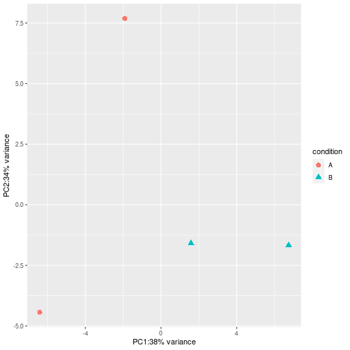

## Normalization

This is the documentation example, based on Bioconductor 3.14.


```r
library(bladderbatch)
#> Loading required package: Biobase
#> Loading required package: BiocGenerics
#> 
#> Attaching package: 'BiocGenerics'
#> The following objects are masked from 'package:stats':
#> 
#>     IQR, mad, sd, var, xtabs
#> The following objects are masked from 'package:base':
#> 
#>     anyDuplicated, append, as.data.frame, basename, cbind, colnames,
#>     dirname, do.call, duplicated, eval, evalq, Filter, Find, get, grep,
#>     grepl, intersect, is.unsorted, lapply, Map, mapply, match, mget,
#>     order, paste, pmax, pmax.int, pmin, pmin.int, Position, rank,
#>     rbind, Reduce, rownames, sapply, setdiff, sort, table, tapply,
#>     union, unique, unsplit, which.max, which.min
#> Welcome to Bioconductor
#> 
#>     Vignettes contain introductory material; view with
#>     'browseVignettes()'. To cite Bioconductor, see
#>     'citation("Biobase")', and for packages 'citation("pkgname")'.
data(bladderdata)
dat <- bladderEset[1:50,]

pheno = pData(dat)
edata = exprs(dat)
batch = pheno$batch
mod = model.matrix(~as.factor(cancer), data=pheno)

# 1. parametric adjustment
combat_edata1 = ComBat(dat=edata, batch=batch, mod=NULL, par.prior=TRUE, prior.plots=TRUE)
#> Error in ComBat(dat = edata, batch = batch, mod = NULL, par.prior = TRUE, : could not find function "ComBat"

# 2. non-parametric adjustment, mean-only version
combat_edata2 = ComBat(dat=edata, batch=batch, mod=NULL, par.prior=FALSE, mean.only=TRUE)
#> Error in ComBat(dat = edata, batch = batch, mod = NULL, par.prior = FALSE, : could not find function "ComBat"

# 3. reference-batch version, with covariates
combat_edata3 = ComBat(dat=edata, batch=batch, mod=mod, par.prior=TRUE, ref.batch=3, prior.plots=TRUE)
#> Error in ComBat(dat = edata, batch = batch, mod = mod, par.prior = TRUE, : could not find function "ComBat"
```

## Differential expression


```r
suppressMessages(library(DESeq2))
ex <- makeExampleDESeqDataSet(m=4)
dds <- DESeq(ex)
#> estimating size factors
#> estimating dispersions
#> gene-wise dispersion estimates
#> mean-dispersion relationship
#> final dispersion estimates
#> fitting model and testing
res <- results(dds, contrast=c("condition","B","A"))
rld <- rlogTransformation(ex, blind=TRUE)
dat <- plotPCA(rld, intgroup=c("condition"),returnData=TRUE)
percentVar <- round(100 * attr(dat,"percentVar"))
suppressMessages(library(ggplot2))
ggplot(dat, aes(PC1, PC2, color=condition, shape=condition)) +
geom_point(size=3) +
xlab(paste0("PC1:",percentVar[1],"% variance")) +
ylab(paste0("PC2:",percentVar[2],"% variance"))
```



```r
ex$condition <- relevel(ex$condition, ref="B")
dds2 <- DESeq(dds)
#> using pre-existing size factors
#> estimating dispersions
#> found already estimated dispersions, replacing these
#> gene-wise dispersion estimates
#> mean-dispersion relationship
#> final dispersion estimates
#> fitting model and testing
res <- results(dds2)
write.csv(as.data.frame(res),file="A_vs_B.csv")
```

## Gene co-expression and network analysis

A simple network is furnished with the `GeneNet` documentation example,


```r
library("GeneNet")
#> Loading required package: corpcor
#> Loading required package: longitudinal
#> Loading required package: fdrtool

## A random network with 40 nodes 
# it contains 780=40*39/2 edges of which 5 percent (=39) are non-zero
true.pcor <- ggm.simulate.pcor(40)
  
# A data set with 40 observations
m.sim <- ggm.simulate.data(40, true.pcor)

# A simple estimate of partial correlations
estimated.pcor <- cor2pcor( cor(m.sim) )

# A comparison of estimated and true values
sum((true.pcor-estimated.pcor)^2)
#> [1] 485.3661

# A slightly better estimate ...
estimated.pcor.2 <- ggm.estimate.pcor(m.sim)
#> Estimating optimal shrinkage intensity lambda (correlation matrix): 0.4146
sum((true.pcor-estimated.pcor.2)^2)
#> [1] 9.409779

## ecoli data 
data(ecoli)

# partial correlation matrix 
inferred.pcor <- ggm.estimate.pcor(ecoli)
#> Estimating optimal shrinkage intensity lambda (correlation matrix): 0.1804

# p-values, q-values and posterior probabilities for each potential edge 
test.results <- network.test.edges(inferred.pcor)
#> Estimate (local) false discovery rates (partial correlations):
#> Step 1... determine cutoff point
#> Step 2... estimate parameters of null distribution and eta0
#> Step 3... compute p-values and estimate empirical PDF/CDF
#> Step 4... compute q-values and local fdr
#> Step 5... prepare for plotting

# best 20 edges (strongest correlation)
test.results[1:20,]
#>           pcor node1 node2         pval         qval      prob
#> 1   0.23185664    51    53 2.220446e-16 3.612205e-13 1.0000000
#> 2   0.22405545    52    53 2.220446e-16 3.612205e-13 1.0000000
#> 3   0.21507824    51    52 2.220446e-16 3.612205e-13 1.0000000
#> 4   0.17328863     7    93 3.108624e-15 3.792816e-12 0.9999945
#> 5  -0.13418892    29    86 1.120813e-09 1.093998e-06 0.9999516
#> 6   0.12594697    21    72 1.103837e-08 8.978569e-06 0.9998400
#> 7   0.11956105    28    86 5.890927e-08 3.853592e-05 0.9998400
#> 8  -0.11723897    26    80 1.060526e-07 5.816175e-05 0.9998400
#> 9  -0.11711625    72    89 1.093655e-07 5.930502e-05 0.9972804
#> 10  0.10658013    20    21 1.366611e-06 5.925278e-04 0.9972804
#> 11  0.10589778    21    73 1.596860e-06 6.678431e-04 0.9972804
#> 12  0.10478689    20    91 2.053404e-06 8.024428e-04 0.9972804
#> 13  0.10420836     7    52 2.338383e-06 8.778608e-04 0.9944557
#> 14  0.10236077    87    95 3.525188e-06 1.224964e-03 0.9944557
#> 15  0.10113550    27    95 4.610445e-06 1.500048e-03 0.9920084
#> 16  0.09928954    21    51 6.868360e-06 2.046550e-03 0.9920084
#> 17  0.09791914    21    88 9.192376e-06 2.520617e-03 0.9920084
#> 18  0.09719685    18    95 1.070233e-05 2.790103e-03 0.9920084
#> 19  0.09621791    28    90 1.313008e-05 3.171818e-03 0.9920084
#> 20  0.09619099    12    80 1.320374e-05 3.182527e-03 0.9920084

# network containing edges with prob > 0.9 (i.e. local fdr < 0.1)
net <- extract.network(test.results, cutoff.ggm=0.9)
#> 
#> Significant edges:  65 
#>     Corresponding to  1.26 %  of possible edges
net
#>           pcor node1 node2         pval         qval      prob
#> 1   0.23185664    51    53 2.220446e-16 3.612205e-13 1.0000000
#> 2   0.22405545    52    53 2.220446e-16 3.612205e-13 1.0000000
#> 3   0.21507824    51    52 2.220446e-16 3.612205e-13 1.0000000
#> 4   0.17328863     7    93 3.108624e-15 3.792816e-12 0.9999945
#> 5  -0.13418892    29    86 1.120813e-09 1.093998e-06 0.9999516
#> 6   0.12594697    21    72 1.103837e-08 8.978569e-06 0.9998400
#> 7   0.11956105    28    86 5.890927e-08 3.853592e-05 0.9998400
#> 8  -0.11723897    26    80 1.060526e-07 5.816175e-05 0.9998400
#> 9  -0.11711625    72    89 1.093655e-07 5.930502e-05 0.9972804
#> 10  0.10658013    20    21 1.366611e-06 5.925278e-04 0.9972804
#> 11  0.10589778    21    73 1.596860e-06 6.678431e-04 0.9972804
#> 12  0.10478689    20    91 2.053404e-06 8.024428e-04 0.9972804
#> 13  0.10420836     7    52 2.338383e-06 8.778608e-04 0.9944557
#> 14  0.10236077    87    95 3.525188e-06 1.224964e-03 0.9944557
#> 15  0.10113550    27    95 4.610445e-06 1.500048e-03 0.9920084
#> 16  0.09928954    21    51 6.868360e-06 2.046550e-03 0.9920084
#> 17  0.09791914    21    88 9.192376e-06 2.520617e-03 0.9920084
#> 18  0.09719685    18    95 1.070233e-05 2.790103e-03 0.9920084
#> 19  0.09621791    28    90 1.313008e-05 3.171818e-03 0.9920084
#> 20  0.09619099    12    80 1.320374e-05 3.182527e-03 0.9920084
#> 21  0.09576091    89    95 1.443542e-05 3.354778e-03 0.9891317
#> 22  0.09473210     7    51 1.784127e-05 3.864827e-03 0.9891317
#> 23 -0.09386896    53    58 2.127623e-05 4.313591e-03 0.9891317
#> 24 -0.09366615    29    83 2.217013e-05 4.421101e-03 0.9891317
#> 25 -0.09341148    21    89 2.334321e-05 4.556948e-03 0.9810727
#> 26 -0.09156391    49    93 3.380044e-05 5.955974e-03 0.9810727
#> 27 -0.09150710    80    90 3.418364e-05 6.002084e-03 0.9810727
#> 28  0.09101505     7    53 3.767967e-05 6.408104e-03 0.9810727
#> 29  0.09050688    21    84 4.164472e-05 6.838785e-03 0.9810727
#> 30  0.08965490    72    73 4.919367e-05 7.581868e-03 0.9810727
#> 31 -0.08934025    29    99 5.229606e-05 7.861419e-03 0.9810727
#> 32 -0.08906819     9    95 5.512710e-05 8.104761e-03 0.9810727
#> 33  0.08888345     2    49 5.713146e-05 8.270675e-03 0.9810727
#> 34  0.08850681    86    90 6.143364e-05 8.610164e-03 0.9810727
#> 35  0.08805868    17    53 6.695172e-05 9.015178e-03 0.9810727
#> 36  0.08790809    28    48 6.890886e-05 9.151294e-03 0.9810727
#> 37  0.08783471    33    58 6.988213e-05 9.217600e-03 0.9682377
#> 38 -0.08705796     7    49 8.101246e-05 1.021362e-02 0.9682377
#> 39  0.08645033    20    46 9.086550e-05 1.102467e-02 0.9682377
#> 40  0.08609950    48    86 9.705865e-05 1.150393e-02 0.9682377
#> 41  0.08598769    21    52 9.911461e-05 1.165817e-02 0.9682377
#> 42  0.08555275    32    95 1.075099e-04 1.226435e-02 0.9682377
#> 43  0.08548231    17    51 1.089311e-04 1.236337e-02 0.9424721
#> 44  0.08470370    80    83 1.258659e-04 1.382357e-02 0.9424721
#> 45  0.08442510    80    82 1.325063e-04 1.437068e-02 0.9174572
#> 46  0.08271606    80    93 1.810275e-04 1.845632e-02 0.9174572
#> 47  0.08235175    46    91 1.933329e-04 1.941580e-02 0.9174572
#> 48  0.08217787    25    95 1.994789e-04 1.988433e-02 0.9174572
#> 49 -0.08170331    29    87 2.171999e-04 2.119715e-02 0.9174572
#> 50  0.08123632    19    29 2.360717e-04 2.253606e-02 0.9174572
#> 51  0.08101702    51    84 2.454547e-04 2.318025e-02 0.9174572
#> 52  0.08030748    16    93 2.782643e-04 2.532796e-02 0.9174572
#> 53  0.08006503    28    52 2.903870e-04 2.608272e-02 0.9174572
#> 54 -0.07941656    41    80 3.252834e-04 2.814825e-02 0.9174572
#> 55  0.07941410    54    89 3.254230e-04 2.815621e-02 0.9174572
#> 56 -0.07934653    28    80 3.292785e-04 2.837512e-02 0.9174572
#> 57  0.07916783    29    92 3.396803e-04 2.895702e-02 0.9174572
#> 58 -0.07866905    17    86 3.703636e-04 3.060294e-02 0.9174572
#> 59  0.07827749    16    29 3.962447e-04 3.191463e-02 0.9174572
#> 60 -0.07808262    73    89 4.097453e-04 3.257290e-02 0.9174572
#> 61  0.07766261    52    67 4.403166e-04 3.400207e-02 0.9174572
#> 62  0.07762917    25    87 4.428397e-04 3.411638e-02 0.9174572
#> 63 -0.07739378     9    93 4.609873e-04 3.492296e-02 0.9174572
#> 64  0.07738885    31    80 4.613748e-04 3.493988e-02 0.9174572
#> 65 -0.07718681    80    94 4.775137e-04 3.563445e-02 0.9174572

# significant based on FDR cutoff Q=0.05?
num.significant.1 <- sum(test.results$qval <= 0.05)
test.results[1:num.significant.1,]
#>           pcor node1 node2         pval         qval      prob
#> 1   0.23185664    51    53 2.220446e-16 3.612205e-13 1.0000000
#> 2   0.22405545    52    53 2.220446e-16 3.612205e-13 1.0000000
#> 3   0.21507824    51    52 2.220446e-16 3.612205e-13 1.0000000
#> 4   0.17328863     7    93 3.108624e-15 3.792816e-12 0.9999945
#> 5  -0.13418892    29    86 1.120813e-09 1.093998e-06 0.9999516
#> 6   0.12594697    21    72 1.103837e-08 8.978569e-06 0.9998400
#> 7   0.11956105    28    86 5.890927e-08 3.853592e-05 0.9998400
#> 8  -0.11723897    26    80 1.060526e-07 5.816175e-05 0.9998400
#> 9  -0.11711625    72    89 1.093655e-07 5.930502e-05 0.9972804
#> 10  0.10658013    20    21 1.366611e-06 5.925278e-04 0.9972804
#> 11  0.10589778    21    73 1.596860e-06 6.678431e-04 0.9972804
#> 12  0.10478689    20    91 2.053404e-06 8.024428e-04 0.9972804
#> 13  0.10420836     7    52 2.338383e-06 8.778608e-04 0.9944557
#> 14  0.10236077    87    95 3.525188e-06 1.224964e-03 0.9944557
#> 15  0.10113550    27    95 4.610445e-06 1.500048e-03 0.9920084
#> 16  0.09928954    21    51 6.868360e-06 2.046550e-03 0.9920084
#> 17  0.09791914    21    88 9.192376e-06 2.520617e-03 0.9920084
#> 18  0.09719685    18    95 1.070233e-05 2.790103e-03 0.9920084
#> 19  0.09621791    28    90 1.313008e-05 3.171818e-03 0.9920084
#> 20  0.09619099    12    80 1.320374e-05 3.182527e-03 0.9920084
#> 21  0.09576091    89    95 1.443542e-05 3.354778e-03 0.9891317
#> 22  0.09473210     7    51 1.784127e-05 3.864827e-03 0.9891317
#> 23 -0.09386896    53    58 2.127623e-05 4.313591e-03 0.9891317
#> 24 -0.09366615    29    83 2.217013e-05 4.421101e-03 0.9891317
#> 25 -0.09341148    21    89 2.334321e-05 4.556948e-03 0.9810727
#> 26 -0.09156391    49    93 3.380044e-05 5.955974e-03 0.9810727
#> 27 -0.09150710    80    90 3.418364e-05 6.002084e-03 0.9810727
#> 28  0.09101505     7    53 3.767967e-05 6.408104e-03 0.9810727
#> 29  0.09050688    21    84 4.164472e-05 6.838785e-03 0.9810727
#> 30  0.08965490    72    73 4.919367e-05 7.581868e-03 0.9810727
#> 31 -0.08934025    29    99 5.229606e-05 7.861419e-03 0.9810727
#> 32 -0.08906819     9    95 5.512710e-05 8.104761e-03 0.9810727
#> 33  0.08888345     2    49 5.713146e-05 8.270675e-03 0.9810727
#> 34  0.08850681    86    90 6.143364e-05 8.610164e-03 0.9810727
#> 35  0.08805868    17    53 6.695172e-05 9.015178e-03 0.9810727
#> 36  0.08790809    28    48 6.890886e-05 9.151294e-03 0.9810727
#> 37  0.08783471    33    58 6.988213e-05 9.217600e-03 0.9682377
#> 38 -0.08705796     7    49 8.101246e-05 1.021362e-02 0.9682377
#> 39  0.08645033    20    46 9.086550e-05 1.102467e-02 0.9682377
#> 40  0.08609950    48    86 9.705865e-05 1.150393e-02 0.9682377
#> 41  0.08598769    21    52 9.911461e-05 1.165817e-02 0.9682377
#> 42  0.08555275    32    95 1.075099e-04 1.226435e-02 0.9682377
#> 43  0.08548231    17    51 1.089311e-04 1.236337e-02 0.9424721
#> 44  0.08470370    80    83 1.258659e-04 1.382357e-02 0.9424721
#> 45  0.08442510    80    82 1.325063e-04 1.437068e-02 0.9174572
#> 46  0.08271606    80    93 1.810275e-04 1.845632e-02 0.9174572
#> 47  0.08235175    46    91 1.933329e-04 1.941580e-02 0.9174572
#> 48  0.08217787    25    95 1.994789e-04 1.988433e-02 0.9174572
#> 49 -0.08170331    29    87 2.171999e-04 2.119715e-02 0.9174572
#> 50  0.08123632    19    29 2.360717e-04 2.253606e-02 0.9174572
#> 51  0.08101702    51    84 2.454547e-04 2.318025e-02 0.9174572
#> 52  0.08030748    16    93 2.782643e-04 2.532796e-02 0.9174572
#> 53  0.08006503    28    52 2.903870e-04 2.608272e-02 0.9174572
#> 54 -0.07941656    41    80 3.252834e-04 2.814825e-02 0.9174572
#> 55  0.07941410    54    89 3.254230e-04 2.815621e-02 0.9174572
#> 56 -0.07934653    28    80 3.292785e-04 2.837512e-02 0.9174572
#> 57  0.07916783    29    92 3.396803e-04 2.895702e-02 0.9174572
#> 58 -0.07866905    17    86 3.703636e-04 3.060294e-02 0.9174572
#> 59  0.07827749    16    29 3.962447e-04 3.191463e-02 0.9174572
#> 60 -0.07808262    73    89 4.097453e-04 3.257290e-02 0.9174572
#> 61  0.07766261    52    67 4.403166e-04 3.400207e-02 0.9174572
#> 62  0.07762917    25    87 4.428397e-04 3.411638e-02 0.9174572
#> 63 -0.07739378     9    93 4.609873e-04 3.492296e-02 0.9174572
#> 64  0.07738885    31    80 4.613748e-04 3.493988e-02 0.9174572
#> 65 -0.07718681    80    94 4.775137e-04 3.563445e-02 0.9174572
#> 66  0.07706275    27    58 4.876832e-04 3.606179e-02 0.8297810
#> 67 -0.07610709    16    83 5.730534e-04 4.085920e-02 0.8297810
#> 68  0.07550557    53    84 6.337144e-04 4.406473e-02 0.8297810

# significant based on "local fdr" cutoff (prob > 0.9)?
num.significant.2 <- sum(test.results$prob > 0.9)
test.results[test.results$prob > 0.9,]
#>           pcor node1 node2         pval         qval      prob
#> 1   0.23185664    51    53 2.220446e-16 3.612205e-13 1.0000000
#> 2   0.22405545    52    53 2.220446e-16 3.612205e-13 1.0000000
#> 3   0.21507824    51    52 2.220446e-16 3.612205e-13 1.0000000
#> 4   0.17328863     7    93 3.108624e-15 3.792816e-12 0.9999945
#> 5  -0.13418892    29    86 1.120813e-09 1.093998e-06 0.9999516
#> 6   0.12594697    21    72 1.103837e-08 8.978569e-06 0.9998400
#> 7   0.11956105    28    86 5.890927e-08 3.853592e-05 0.9998400
#> 8  -0.11723897    26    80 1.060526e-07 5.816175e-05 0.9998400
#> 9  -0.11711625    72    89 1.093655e-07 5.930502e-05 0.9972804
#> 10  0.10658013    20    21 1.366611e-06 5.925278e-04 0.9972804
#> 11  0.10589778    21    73 1.596860e-06 6.678431e-04 0.9972804
#> 12  0.10478689    20    91 2.053404e-06 8.024428e-04 0.9972804
#> 13  0.10420836     7    52 2.338383e-06 8.778608e-04 0.9944557
#> 14  0.10236077    87    95 3.525188e-06 1.224964e-03 0.9944557
#> 15  0.10113550    27    95 4.610445e-06 1.500048e-03 0.9920084
#> 16  0.09928954    21    51 6.868360e-06 2.046550e-03 0.9920084
#> 17  0.09791914    21    88 9.192376e-06 2.520617e-03 0.9920084
#> 18  0.09719685    18    95 1.070233e-05 2.790103e-03 0.9920084
#> 19  0.09621791    28    90 1.313008e-05 3.171818e-03 0.9920084
#> 20  0.09619099    12    80 1.320374e-05 3.182527e-03 0.9920084
#> 21  0.09576091    89    95 1.443542e-05 3.354778e-03 0.9891317
#> 22  0.09473210     7    51 1.784127e-05 3.864827e-03 0.9891317
#> 23 -0.09386896    53    58 2.127623e-05 4.313591e-03 0.9891317
#> 24 -0.09366615    29    83 2.217013e-05 4.421101e-03 0.9891317
#> 25 -0.09341148    21    89 2.334321e-05 4.556948e-03 0.9810727
#> 26 -0.09156391    49    93 3.380044e-05 5.955974e-03 0.9810727
#> 27 -0.09150710    80    90 3.418364e-05 6.002084e-03 0.9810727
#> 28  0.09101505     7    53 3.767967e-05 6.408104e-03 0.9810727
#> 29  0.09050688    21    84 4.164472e-05 6.838785e-03 0.9810727
#> 30  0.08965490    72    73 4.919367e-05 7.581868e-03 0.9810727
#> 31 -0.08934025    29    99 5.229606e-05 7.861419e-03 0.9810727
#> 32 -0.08906819     9    95 5.512710e-05 8.104761e-03 0.9810727
#> 33  0.08888345     2    49 5.713146e-05 8.270675e-03 0.9810727
#> 34  0.08850681    86    90 6.143364e-05 8.610164e-03 0.9810727
#> 35  0.08805868    17    53 6.695172e-05 9.015178e-03 0.9810727
#> 36  0.08790809    28    48 6.890886e-05 9.151294e-03 0.9810727
#> 37  0.08783471    33    58 6.988213e-05 9.217600e-03 0.9682377
#> 38 -0.08705796     7    49 8.101246e-05 1.021362e-02 0.9682377
#> 39  0.08645033    20    46 9.086550e-05 1.102467e-02 0.9682377
#> 40  0.08609950    48    86 9.705865e-05 1.150393e-02 0.9682377
#> 41  0.08598769    21    52 9.911461e-05 1.165817e-02 0.9682377
#> 42  0.08555275    32    95 1.075099e-04 1.226435e-02 0.9682377
#> 43  0.08548231    17    51 1.089311e-04 1.236337e-02 0.9424721
#> 44  0.08470370    80    83 1.258659e-04 1.382357e-02 0.9424721
#> 45  0.08442510    80    82 1.325063e-04 1.437068e-02 0.9174572
#> 46  0.08271606    80    93 1.810275e-04 1.845632e-02 0.9174572
#> 47  0.08235175    46    91 1.933329e-04 1.941580e-02 0.9174572
#> 48  0.08217787    25    95 1.994789e-04 1.988433e-02 0.9174572
#> 49 -0.08170331    29    87 2.171999e-04 2.119715e-02 0.9174572
#> 50  0.08123632    19    29 2.360717e-04 2.253606e-02 0.9174572
#> 51  0.08101702    51    84 2.454547e-04 2.318025e-02 0.9174572
#> 52  0.08030748    16    93 2.782643e-04 2.532796e-02 0.9174572
#> 53  0.08006503    28    52 2.903870e-04 2.608272e-02 0.9174572
#> 54 -0.07941656    41    80 3.252834e-04 2.814825e-02 0.9174572
#> 55  0.07941410    54    89 3.254230e-04 2.815621e-02 0.9174572
#> 56 -0.07934653    28    80 3.292785e-04 2.837512e-02 0.9174572
#> 57  0.07916783    29    92 3.396803e-04 2.895702e-02 0.9174572
#> 58 -0.07866905    17    86 3.703636e-04 3.060294e-02 0.9174572
#> 59  0.07827749    16    29 3.962447e-04 3.191463e-02 0.9174572
#> 60 -0.07808262    73    89 4.097453e-04 3.257290e-02 0.9174572
#> 61  0.07766261    52    67 4.403166e-04 3.400207e-02 0.9174572
#> 62  0.07762917    25    87 4.428397e-04 3.411638e-02 0.9174572
#> 63 -0.07739378     9    93 4.609873e-04 3.492296e-02 0.9174572
#> 64  0.07738885    31    80 4.613748e-04 3.493988e-02 0.9174572
#> 65 -0.07718681    80    94 4.775137e-04 3.563445e-02 0.9174572

# parameters of the mixture distribution used to compute p-values etc.
c <- fdrtool(sm2vec(inferred.pcor), statistic="correlation")
#> Step 1... determine cutoff point
#> Step 2... estimate parameters of null distribution and eta0
#> Step 3... compute p-values and estimate empirical PDF/CDF
#> Step 4... compute q-values and local fdr
#> Step 5... prepare for plotting
```


```r
c$param
#>          cutoff N.cens      eta0     eta0.SE    kappa kappa.SE
#> [1,] 0.03553068   4352 0.9474623 0.005656465 2043.377 94.72264

## A random network with 20 nodes and 10 percent (=19) edges
true.pcor <- ggm.simulate.pcor(20, 0.1)

# convert to edge list
test.results <- ggm.list.edges(true.pcor)[1:19,]
nlab <- LETTERS[1:20]

# graphviz
network.make.dot(filename="test.dot", test.results, nlab, main = "A graph")
system("fdp -T svg -o test.svg test.dot")

# Rgraphviz
gr <- network.make.graph( test.results, nlab)
gr
#> A graphNEL graph with directed edges
#> Number of Nodes = 20 
#> Number of Edges = 38
num.nodes(gr)
#> [1] 20
edge.info(gr)
#> $weight
#>      A~S      A~K      A~F      A~H      B~E      C~D      C~K      D~O 
#> -0.15336  0.26614 -0.39258  0.61266  0.64742  0.07149 -0.70853  0.44840 
#>      D~M      E~P      E~Q      F~N      F~M      I~P      L~Q      L~R 
#> -0.55883  0.35639 -0.46159  0.28920 -0.31394  0.75689 -0.17690 -0.36683 
#>      L~N      M~S      N~R 
#>  0.44811  0.42591 -0.45427 
#> 
#> $dir
#>    A~S    A~K    A~F    A~H    B~E    C~D    C~K    D~O    D~M    E~P    E~Q 
#> "none" "none" "none" "none" "none" "none" "none" "none" "none" "none" "none" 
#>    F~N    F~M    I~P    L~Q    L~R    L~N    M~S    N~R 
#> "none" "none" "none" "none" "none" "none" "none" "none"
gr2 <- network.make.graph( test.results, nlab, drop.singles=TRUE)
gr2
#> A graphNEL graph with directed edges
#> Number of Nodes = 17 
#> Number of Edges = 38
num.nodes(gr2)
#> [1] 17
edge.info(gr2)
#> $weight
#>      A~S      A~K      A~F      A~H      B~E      C~D      C~K      D~O 
#> -0.15336  0.26614 -0.39258  0.61266  0.64742  0.07149 -0.70853  0.44840 
#>      D~M      E~P      E~Q      F~N      F~M      I~P      L~Q      L~R 
#> -0.55883  0.35639 -0.46159  0.28920 -0.31394  0.75689 -0.17690 -0.36683 
#>      L~N      M~S      N~R 
#>  0.44811  0.42591 -0.45427 
#> 
#> $dir
#>    A~S    A~K    A~F    A~H    B~E    C~D    C~K    D~O    D~M    E~P    E~Q 
#> "none" "none" "none" "none" "none" "none" "none" "none" "none" "none" "none" 
#>    F~N    F~M    I~P    L~Q    L~R    L~N    M~S    N~R 
#> "none" "none" "none" "none" "none" "none" "none" "none"

# plot network
library("Rgraphviz")
#> Loading required package: graph
#> Loading required package: grid
#> 
#> Attaching package: 'Rgraphviz'
#> The following objects are masked from 'package:IRanges':
#> 
#>     from, to
#> The following objects are masked from 'package:S4Vectors':
#> 
#>     from, to
plot(gr, "fdp")
```


```r
plot(gr2, "fdp")
```


and a more involved version

```r
set.seed(123454321)
m <- matrix(runif(2500),50)
r <- cor(m)
g <- as.matrix(r>=0.7)+0
f1 <- Heatmap(r)
f2 <- Heatmap(g)
f <- f1+f2
draw(f) # f2 is somewhat twisted
suppressMessages(library(WGCNA))
pwr <- c(1:10, seq(from = 12, to=30, by=2))
sft <- pickSoftThreshold(dat, powerVector = pwr, verbose = 5)
meg <- moduleEigengenes(t(tpm), color=Colors, softPower=6)
TOM <- TOMsimilarity(adjMatrix)
Tree <- hclust(as.dist(1-TOM), method = "average")
plotDendroAndColors(Tree, colors, "Dynamic Tree Cut", dendroLabels = FALSE, hang = 0.03, addGuide = TRUE, guideHang = 0.05)
```

## Meta-data

```r
suppressMessages(library(recount3))
hs <- available_projects()
dim(subset(hs,file_source=="gtex"))
annotation_options("human")
blood_rse <- create_rse(subset(hs,project=="BLOOD"))
metadata(blood_rse)
dim(blood_rse)
rowRanges(blood_rse)
colnames(colData(blood_rse))
expand_sra_attributes(blood_rse)
```

## Pathway and enrichment analysis

```r
library(graphite)
reactome <- pathways("hsapiens", "reactome")
kegg <- pathways("hsapiens","kegg")
pharmgkb <- pathways("hsapiens","pharmgkb")
nodes(kegg)
suppressMessages(library(plyr))
kegg_t2g <- ldply(lapply(kegg, nodes), data.frame)
names(kegg_t2g) <- c("gs_name", "gene_symbol")
suppress(library(clusterProfiler))
eKEGG <- enricher(gene = , TERM2GENE = kegg_t2g,
                  universe = ,
                  pAdjustMethod = "BH",
                  pvalueCutoff = 0.1, qvalueCutoff = 0.05,
                  minGSSize = 10, maxGSSize = 500)

```

## Transcript databases

```r
options(width=200)

suppressMessages(library(AnnotationDbi))
suppressMessages(library(org.Hs.eg.db))
columns(org.Hs.eg.db)
keyref <- keys(org.Hs.eg.db, keytype="ENTREZID")
symbol_uniprot <- select(org.Hs.eg.db,keys=keyref,columns = c("SYMBOL","UNIPROT"))
subset(symbol_uniprot,SYMBOL=="MC4R")

suppressMessages(library(EnsDb.Hsapiens.v86))
x <- EnsDb.Hsapiens.v86
listColumns(x, "protein", skip.keys=TRUE)
listGenebiotypes(x)
listTxbiotypes(x)
listTables(x)
metadata(x)
organism(x)
returnFilterColumns(x)
seqinfo(x)
seqlevels(x)
updateEnsDb(x)

suppressMessages(library(ensembldb))
genes(x, columns=c("gene_name"), filter=list(SeqNameFilter("X"), GeneBiotypeFilter("protein_coding")))
transcripts(x, columns=listColumns(x, "tx"), filter = AnnotationFilterList(), order.type = "asc", return.type = "GRanges")

library(RMariaDB)
library(GenomicFeatures)
txdbEnsemblGRCh38 <- makeTxDbFromEnsembl(organism="Homo sapiens", release=98)
txdb <- as.list(txdbEnsemblGRCh38)
lapply(txdb,head)

library(TxDb.Hsapiens.UCSC.hg38.knownGene)
txdb <- TxDb.Hsapiens.UCSC.hg38.knownGene

library(INSPEcT)
liverExprs <- quantifyExpressionsFromBWs(txdb = txdb,BWfiles=,experimentalDesign=)
```

---

## A list of Bioconductor/CRAN packages

Package | Description
--------|------------
**Bioconductor** |
AnnotationDbi | AnnotationDb objects and their progeny, methods etc.
Biobase | Base functions for Bioconductor
org.Hs.eg.db | Conversion of Entrez ID -- gene symbols
EnsDb.Hsapiens.v86 | Exposes an annotation databases generated from Ensembl
ensembldb | Retrieve annotation data from an Ensembl based package
TxDb.Hsapiens.UCSC.hg38.knownGene | Annotation of the human genome
INSPEcT | Quantification of the intronic and exonic gene features and the post-transcriptional regulation analysis
graphite | GRAPH Interaction from pathway topological environment
clusterProfiler | Functional profiles for genes and gene clusters
DESSeq2 | Differential gene expression analysis based on the negative binomial distribution
edgeR | Empirical analysis of digital gene expression
WGCNA | Weighted correlation network analysis
ComplexHeatmap | Make complex heatmaps
recount3 | Interface to uniformly processed RNA-seq data
Pi | Priority index, leveraging genetic evidence to prioritise drug targets at the gene and pathway level
Rgraphiz | Interfaces R with the AT&T graphviz library for plotting R graph objects from the graph package
sva | Surrogate Variable Analysis
**CRAN** |
GeneNet | Modeling and Inferring Gene Networks
ggplot2 | Data Visualisations Using the grammar of graphics
pheatmap | results visualisation
plyr | Splitting, applying and combining data
