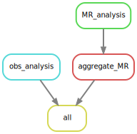
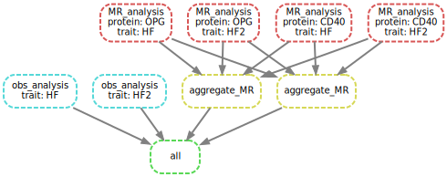

# Mendelian randomization analysis

[](https://www.ahajournals.org/doi/10.1161/CIRCULATIONAHA.121.056663)
[](https://zenodo.org/badge/latestdoi/429122036)

Steps to set up the environment are outlined in [notes](notes/README.md), while `MendelianRandomization` v0.6.0 is used together with a bug fix in `workflow/r/MR_functions.R`. The workflow has been heavily edited for simplicity, efficiency and generality.
Currently `input/` contains data on CD40, OPG and heart failures -- to imitate additional trait, HF statistics are duplicated as HF2.

The document is knitted from `Rscript -e 'knitr::knit("README.Rmd")'` running code chunks below to give `output`/`MR_HF.csv` (MR results) and `Obs_HF.csv` (meta-analysis results based on observational studies) and similarly for HF2.

```{bash snakemake, message=FALSE, results="hide", warning=FALSE}
module load miniconda3/4.5.1
export csd3path=/rds/project/jmmh2/rds-jmmh2-projects/olink_proteomics/scallop
source activate ${csd3path}/miniconda37
# 1. a dry run (-n).
snakemake --dry-run
# 2. run (-c on [all] available cores without --use-conda option as local packages are more up-to-date)
snakemake --cores
# 3. contrast with original output for OPG
# grep OPG output/MR_HF.csv | diff - <(grep OPG ${csd3path}/cvd1-hf/results/res_MR_aggregate.csv)
# 4. Some ancillary work in place.
snakemake --rulegraph | dot -Tsvg > output/rulegraph.svg
snakemake --dag | dot -Tsvg > output/dag.svg
```

## Dependency graph of rules



## Directed Acyclic Graph (DAG)



