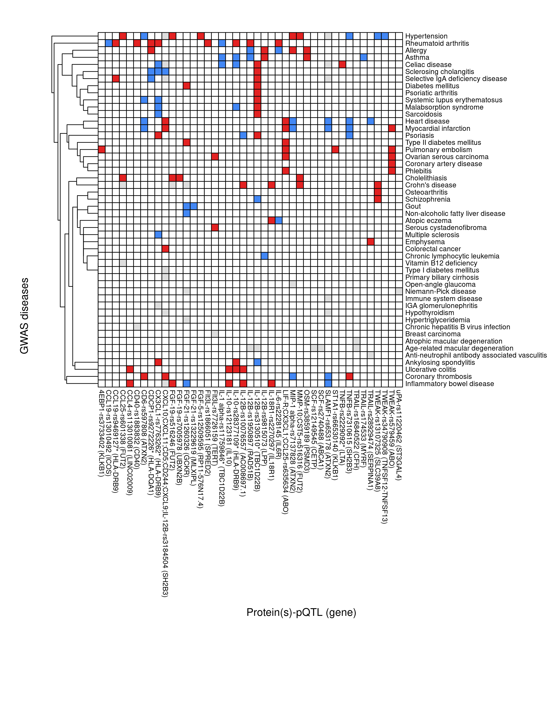

```{r setup, include=FALSE}
set.seed(0)
knitr::opts_chunk$set(
  out.extra = 'style="display:block; margin: auto"',
  fig.align = "center",
  fig.path = "figures/",
  collapse = TRUE,
  comment = "#>",
  dev = "png")
```

This article provides details of pQTL/disease overlap and colocalization analysis.

# pQTL/disease overlap

The ontology of traits/disease is available through Experimental Factor Ontology (EFO) @malone10, which can be used to build lists of diseases and immune-mediated traits and filter search results from PhenoScanner @kamat19.

## Diseases

```r
library(ontologyIndex)
# http://www.ebi.ac.uk/efo/efo.obo
INF <- Sys.getenv("INF")
file <- file.path(INF,"ebi","efo-3.26.0","efo.obo")
get_relation_names(file)
efo <- get_ontology(file, extract_tags="everything")

id <- function(ontology)
{
  length(ontology)
  length(ontology$id)
  inf <- grep(ontology$name,pattern="immune|inflammatory")
  data.frame(id=ontology$id[inf],name=ontology$name[inf])
}

goidname <- id(go)
efoidname <- id(efo)
# all diseases
efo_diseases <- get_descendants(efo,"EFO:0000408")
diseases_name <- efo$name[efo_diseases]
diseases <- data.frame(efo_diseases,diseases_name)
write.table(diseases,file=file.path(INF,"ebi","efo-3.26.0","efo_diseases.csv"),col.names=FALSE,row.names=FALSE,sep=",")
# immune system diseases (isd)
efo_0000540 <- get_descendants(efo,"EFO:0000540")
efo_0000540name <- efo$name[efo_0000540]
isd <- data.frame(efo_0000540,efo_0000540name)
library(ontologyPlot)
onto_plot(efo,efo_0000540)
```

## Lookup

```r
options(width=200)

suppressMessages(library(dplyr))
suppressMessages(library(gap))
suppressMessages(library(pQTLtools))

inf1_prot <- vector()
for(i in 1:92) inf1_prot[inf1[i,"prot"]] <- mutate(inf1[i,],target.short=if_else(!is.na(alt_name),alt_name,target.short))[["target.short"]]
INF1_metal <- within(read.delim(file.path("~","pQTLtools","tests","INF1.METAL"),as.is=TRUE),{
                    hg19_coordinates=paste0("chr",Chromosome,":",Position)}) %>%
                    rename(INF1_rsid=rsid, Total=N) %>%
                    left_join(pQTLdata::inf1[c("prot","gene","target.short","alt_name")]) %>%
                    mutate(target.short=if_else(!is.na(alt_name),alt_name,target.short)) %>%
                    select(-alt_name)
INF1_aggr <- INF1_metal %>%
             select(Chromosome,Position,target.short,gene,hg19_coordinates,
                    MarkerName,Allele1,Allele2,Freq1,Effect,StdErr,log.P.,cis.trans,INF1_rsid) %>%
             group_by(Chromosome,Position,MarkerName,INF1_rsid,hg19_coordinates) %>%
             summarise(nprots=n(),
                       prots=paste(target.short,collapse=";"),
                       Allele1=paste(toupper(Allele1),collapse=";"),
                       Allele2=paste(toupper(Allele2),collapse=";"),
                       EAF=paste(Freq1,collapse=";"),
                       Effects=paste(Effect,collapse=";"),
                       SEs=paste(StdErr,collapse=";"),
                       log10P=paste(log.P.,collapse=";"),
                       cistrans=paste(cis.trans,collapse=";")) %>%
             data.frame()
rsid <- INF1_aggr[["INF1_rsid"]]
catalogue <- "GWAS"
proxies <- "EUR"
p <- 5e-8
r2 <- 0.8
build <- 37

INF <- Sys.getenv("INF")
efo_diseases <- read.table(file.path(INF,"ebi","efo-3.26.0","efo_diseases.csv"),col.names=c("efo","disease"),as.is=TRUE,sep=",") %>%
                mutate(efo=gsub(":", "_", efo))

r <- snpqueries(rsid, catalogue=catalogue, proxies=proxies, p=p, r2=r2, build=build)
lapply(r,dim)
snps_results <- with(r,right_join(snps,results))
ps <- subset(snps_results,select=-c(hg38_coordinates,ref_hg38_coordinates,pos_hg38,ref_pos_hg38,dprime))
aggr <- subset(within(INF1_aggr,{HLA <- as.numeric(Chromosome==6 & Position >= 25392021 & Position <= 33392022)}),
               select=-c(Chromosome,Position,INF1_rsid))
short <- merge(aggr,ps,by="hg19_coordinates")

gwas <- function()
{
  short <- merge(aggr,ps,by="hg19_coordinates") %>%
           filter(efo %in% pull(efo_diseases,efo)) %>%
           left_join(efo_diseases)
  v <- c("prots","hgnc","MarkerName","cistrans","Effects","Allele1","Allele2","rsid","a1","a2","efo",
         "ref_rsid","ref_a1","ref_a2","proxy","r2",
         "HLA","beta","se","p","disease","n_cases","n_controls","unit","ancestry","pmid","study")
  mat <- within(short[v],
  {
    flag <- (HLA==1)
    prefix <- paste0(prots,"-",rsid)
    prefix[flag] <- paste0(prefix[flag],"*")
    rsidProts <- paste0(prefix," (",hgnc,")")
    efoTraits <- gsub("\\b(^[a-z])","\\U\\1",disease,perl=TRUE)
    qtl_direction <- sign(as.numeric(beta))
  })
  combined <- group_by(mat,efoTraits,rsidProts,desc(n_cases)) %>%
              summarize(direction=paste(qtl_direction,collapse=";"),
                        betas=paste(beta,collapse=";"),
                        units=paste(unit,collapse=";"),
                        studies=paste(study,collapse=";"),
                        diseases=paste(disease,collapse=";"),
                        cases=paste(n_cases,collapse=";")
                       ) %>%
              data.frame()
  rxc <- with(combined,table(efoTraits,rsidProts))
  for(cn in colnames(rxc)) for(rn in rownames(rxc)) {
     cnrn <- subset(combined,efoTraits==rn & rsidProts==cn)
     if(nrow(cnrn)==0) next
     rxc[rn,cn] <- as.numeric(unlist(strsplit(cnrn[["direction"]],";"))[1])
  }
  write.table(mat,file=file.path(INF,"work","pQTL-disease-GWAS.csv"),row.names=FALSE,quote=FALSE,sep=",")
  write.table(combined,file=file.path(INF,"work","pQTL-disease-GWAS-combined.csv"),row.names=FALSE,quote=FALSE,sep=",")
  rxc
}

rxc <- gwas()
```

## Visualization

```r
SF <- function(rxc, f="SF-pQTL-GWAS.png", ch=21, cw=21, h=13, w=18)
{
  library(pheatmap)
  col <- colorRampPalette(c("#4287f5","#ffffff","#e32222"))(3)
  library(grid)
  png(file.path(INF,f),res=300,width=w,height=h,units="in")
  setHook("grid.newpage", function() pushViewport(viewport(x=1,y=1,width=0.9, height=0.9, name="vp", just=c("right","top"))), action="prepend")
  colnames(rxc) <- gsub("^[0-9]*-","",colnames(rxc))
  pheatmap(rxc, legend=FALSE, angle_col="270", border_color="black", color=col, cellheight=ch, cellwidth=cw, cluster_rows=TRUE, cluster_cols=FALSE, fontsize=8)
  setHook("grid.newpage", NULL, "replace")
  grid.text("Protein(s)-pQTL (gene)", y=0.03125, gp=gpar(fontsize=12))
  grid.text("GWAS diseases", x=-0.0625, rot=90, gp=gpar(fontsize=12))
  dev.off()
}

SF(rxc,f="SF-pQTL-GWAS.png",ch=8,cw=8,h=11,w=8.6)
```

```{r gwas, echo=FALSE, fig.align="left", fig.cap="pQTL-disease overlap", fig.height=8, fig.width=8}

```

# Colocalization

This is the actual script for cis-pQTL colocalization analysis on GTEx v8 for SCALLOP-INF.

## Data

The data were GWAS summary statistics in GRCh37 and VCF format, converted by `gwasvcf`. The GTEx association statistics were in GRCh38 and downloaded from the eQTL Catalogue and stored locally. Data on microarray and RNA-Seq remain on the eQTL Catalogue website.

## The driver program

It is in Bash.

```bash
#!/usr/bin/bash

for r in {1..59}
do
   export r=${r}
   export cvt=${INF}/work/INF1.merge.cis.vs.trans
   read prot MarkerName < \
                        <(awk -vFS="," '$14=="cis"' ${cvt} | \
                          awk -vFS="," -vr=${r} 'NR==r{print $2,$5}')
   echo ${r} - ${prot} - ${MarkerName}
   export prot=${prot}
   export MarkerName=${MarkerName}
   if [ ! -f ${INF}/coloc/${prot}-${MarkerName}.pdf ] || \
      [ ! -f ${INF}/coloc/${prot}-${MarkerName}.RDS ]; then
     cd ${INF}/coloc
     R --no-save < ${INF}/rsid/coloc.R 2>&1 | \
     tee ${prot}-${MarkerName}.log
#    ls *tbi | xargs -I {} bash -c "rm {}"
     cd -
   fi
done
```

## coloc.R

It contains minor modification to the documentation example,

```r
liftRegion <- function(x,chain,flanking=1e6)
{
  require(GenomicRanges)
  gr <- with(x,GenomicRanges::GRanges(seqnames=chr,IRanges::IRanges(start,end))+flanking)
  seqlevelsStyle(gr) <- "UCSC"
  gr38 <- rtracklayer::liftOver(gr, chain)
  chr <- gsub("chr","",colnames(table(seqnames(gr38))))
  start <- min(unlist(start(gr38)))
  end <- max(unlist(end(gr38)))
  invisible(list(chr=chr,start=start,end=end,region=paste0(chr,":",start,"-",end)))
}

sumstats <- function(prot,chr,region37)
{
  cat("GWAS sumstats\n")
  vcf <- file.path(INF,"METAL/gwas2vcf",paste0(prot,".vcf.gz"))
  gwas_stats <- gwasvcf::query_gwas(vcf, chrompos = region37)
  gwas_stats <- gwasvcf::vcf_to_granges(gwas_stats) %>%
                keepSeqlevels(chr) %>%
                renameSeqlevels(paste0("chr",chr))
  gwas_stats_hg38 <- rtracklayer::liftOver(gwas_stats, chain) %>%
    unlist() %>%
    renameSeqlevels(chr) %>%
    dplyr::as_tibble() %>%
    dplyr::transmute(chromosome = seqnames,
                     position = start, REF, ALT, AF, ES, SE, LP, SS) %>%
    dplyr::mutate(id = paste(chromosome, position, sep = ":")) %>%
    dplyr::mutate(MAF = pmin(AF, 1-AF)) %>%
    dplyr::group_by(id) %>%
    dplyr::mutate(row_count = n()) %>%
    dplyr::ungroup() %>%
    dplyr::filter(row_count == 1)
}

microarray <- function(gwas_stats_hg38,ensGene,region38)
{
  cat("a. eQTL datasets\n")
  microarray_df <- dplyr::filter(tabix_paths, quant_method == "microarray") %>%
                   dplyr::mutate(qtl_id = paste(study, qtl_group, sep = "_"))
  ftp_path_list <- setNames(as.list(microarray_df$ftp_path), microarray_df$qtl_id[1])
  hdr <- file.path(path.package("pQTLtools"),"eQTL-Catalogue","column_names.CEDAR")
  column_names <- names(read.delim(hdr))
  summary_list <- purrr::map(ftp_path_list, ~import_eQTLCatalogue(., region38,
                             selected_gene_id = ensGene, column_names))
  purrr::map_df(summary_list[lapply(summary_list,nrow)!=0],
                ~run_coloc(., gwas_stats_hg38), .id = "qtl_id")
}

rnaseq <- function(gwas_stats_hg38,ensGene,region38)
{
  cat("b. Uniformly processed RNA-seq datasets\n")
  rnaseq_df <- dplyr::filter(tabix_paths, quant_method == "ge") %>%
               dplyr::mutate(qtl_id = paste(study, qtl_group, sep = "_"))
  ftp_path_list <- setNames(as.list(rnaseq_df$ftp_path), rnaseq_df$qtl_id)
  hdr <- file.path(path.package("pQTLtools"),"eQTL-Catalogue","column_names.Alasoo")
  column_names <- names(read.delim(hdr))
  safe_import <- purrr::safely(import_eQTLCatalogue)
  summary_list <- purrr::map(ftp_path_list, ~safe_import(., region38,
                             selected_gene_id = ensGene, column_names))
  result_list <- purrr::map(summary_list[lapply(result_list,nrow)!=0], ~.$result)
  result_list <- result_list[!unlist(purrr::map(result_list, is.null))]
  purrr::map_df(result_list, ~run_coloc(., gwas_stats_hg38), .id = "qtl_id")
}

gtex <- function(gwas_stats_hg38,ensGene,region38)
{
  cat("c. GTEx_v8 imported eQTL datasets\n")
  rnaseq_df <- dplyr::filter(imported_tabix_paths, quant_method == "ge") %>%
               dplyr::mutate(qtl_id = paste(study, qtl_group, sep = "_"))
  ftp_path_list <- setNames(as.list(rnaseq_df$ftp_path), rnaseq_df$qtl_id)
  hdr <- file.path(path.package("pQTLtools"),"eQTL-Catalogue","column_names.GTEx")
  column_names <- names(read.delim(hdr))
  safe_import <- purrr::safely(import_eQTLCatalogue)
  summary_list <- purrr::map(ftp_path_list,
                             ~safe_import(., region38, selected_gene_id = ensGene, column_names))
  result_list <- purrr::map(summary_list, ~.$result)
  result_list <- result_list[!unlist(purrr::map(result_list, is.null))]
  result_filtered <- purrr::map(result_list[lapply(result_list,nrow)!=0],
                                ~dplyr::filter(., !is.na(se)))
  purrr::map_df(result_filtered, ~run_coloc(., gwas_stats_hg38), .id = "qtl_id")
}

coloc <- function(prot,chr,ensGene,chain,region37,region38,out,run_all=FALSE)
{
  gwas_stats_hg38 <- sumstats(prot,chr,region37)
  if (run_all)
  {
    df_microarray <- microarray(gwas_stats_hg38,ensGene,region38)
    df_rnaseq <- rnaseq(gwas_stats_hg38,ensGene,region38)
    df_gtex <- gtex(gwas_stats_hg38,ensGene,region38)
    if (exists("df_microarray") & exits("df_rnaseq") & exists("df_gtex"))
    {
      coloc_df = dplyr::bind_rows(df_microarray, df_rnaseq, df_gtex)
      saveRDS(coloc_df, file=paste0(out,".RDS"))
      dplyr::arrange(coloc_df, -PP.H4.abf)
      p <- ggplot(coloc_df, aes(x = PP.H4.abf)) + geom_histogram()
    }
  } else {
    df_gtex <- gtex(gwas_stats_hg38,ensGene,region38)
    if (exists("df_gtex"))
    {
      saveRDS(df_gtex,file=paste0(out,".RDS"))
      dplyr::arrange(df_gtex, -PP.H4.abf)
      p <- ggplot(df_gtex, aes(x = PP.H4.abf)) + geom_histogram()
    }
  }
  s <- ggplot(gwas_stats_hg38, aes(x = position, y = LP)) + geom_point()
  ggsave(plot = s, filename = paste0(out, "-assoc.pdf"), path = "", device = "pdf",
         height = 15, width = 15, units = "cm", dpi = 300)
  ggsave(plot = p, filename = paste0(out, "-hist.pdf"), path = "", device = "pdf",
         height = 15, width = 15, units = "cm", dpi = 300)
}

single_run <- function(r)
{
  sentinel <- sentinels[r,]
  isnpid <- within(gap::inv_chr_pos_a1_a2(sentinel[["SNP"]]),
  {
    chr <- gsub("chr","",chr)
    pos <- as.integer(pos)
    start <- pos-M
    if (start<0) start <- 0
    end <- pos+M
  })
  chr <- with(isnpid,chr)
  region37 <- with(isnpid, paste0(chr,":",start,"-",end))
  ensRegion37 <- with(subset(inf1,prot==sentinel[["prot"]]),
                      {
                        start <- start-M
                        if (start<0) start <- 0
                        end <- end+M
                        paste0(chr,":",start,"-",end)
                      })
  region38 <- with(liftRegion(isnpid,chain),region)
  ensGene <- subset(inf1,prot==sentinel[["prot"]])[["ensembl_gene_id"]]
  ensRegion38 <- with(liftRegion(subset(inf1,prot==sentinel[["prot"]]),chain),region)
  f <- file.path(INF,"coloc",with(sentinel,paste0(prot,"-",SNP)))
  cat(chr,region37,region38,ensGene,ensRegion37,ensRegion38,"\n")
# coloc(sentinel[["prot"]],chr,ensGene,chain,region37,region38,f)
  coloc(sentinel[["prot"]],chr,ensGene,chain,ensRegion37,ensRegion38,f)
}

# slow with the following loop:
loop <- function() for (r in 1:nrow(sentinels)) single_run(r)

library(pQTLtools)
f <- file.path(path.package("pQTLtools"),"eQTL-Catalogue","hg19ToHg38.over.chain")
chain <- rtracklayer::import.chain(f)
pkgs <- c("dplyr", "ggplot2", "readr", "coloc", "GenomicRanges","seqminer")
invisible(lapply(pkgs, require, character.only = TRUE))
HPC_WORK <- Sys.getenv("HPC_WORK")
gwasvcf::set_bcftools(file.path(HPC_WORK,"bin","bcftools"))
f <- file.path(path.package("pQTLtools"),"eQTL-Catalogue","tabix_ftp_paths.tsv")
tabix_paths <- read.delim(f, stringsAsFactors = FALSE) %>% dplyr::as_tibble()
HOME <- Sys.getenv("HOME")
fp <- file.path(path.package("pQTLtools"),"eQTL-Catalogue","tabix_ftp_paths_gtex.tsv")
imported_tabix_paths <- within(read.delim(fp, stringsAsFactors = FALSE) %>% dplyr::as_tibble(),
      {
         f <- lapply(strsplit(ftp_path,"/csv/|/ge/"),"[",3)
         ftp_path <- paste0("~/rds/public_databases/GTEx/csv"),f)
      })
options(width=200)
library(dplyr)
INF <- Sys.getenv("INF")
M <- 1e6
sentinels <- subset(read.csv(file.path(INF,"work","INF1.merge.cis.vs.trans")),cis)
cvt_rsid <- file.path(INF,"work","INF1.merge.cis.vs.trans-rsid")
prot_rsid <- subset(read.delim(cvt_rsid,sep=" "),cis,select=c(prot,SNP))
# Faster with parallel Bash runs.
r <- as.integer(Sys.getenv("r"))
single_run(r)
```

where options for protein GWAS, microarray, RNA-Seq are available with respect to variant-flanking or gene regions. When no results are generated,
there would have problem with `dplyr::arrange(df_gtex, -PP.H4.abf);p <- ggplot(df_gtex, aes(x = PP.H4.abf)) + geom_histogram()`.

## Collection of results

When these are furnished we keep results as follows,

```r
collect <- function()
{
  df_coloc <- data.frame()
  for(r in 1:nrow(sentinels))
  {
    prot <- sentinels[["prot"]][r]
    snpid <- sentinels[["SNP"]][r]
    rsid <- prot_rsid[["SNP"]][r]
    f <- file.path(INF,"coloc",paste0(prot,"-",snpid,".RDS"))
    if (!file.exists(f)) next
    cat(prot,"-",rsid,"\n")
    rds <- readRDS(f)
    if (nrow(rds)==0) next
    df_coloc <- rbind(df_coloc,data.frame(prot=prot,rsid=rsid,snpid=snpid,rds))
  }
  df_coloc <- within(df_coloc,{qtl_id <- gsub("GTEx_V8_","",qtl_id)}) %>%
              rename(H0=PP.H0.abf,H1=PP.H1.abf,H2=PP.H2.abf,H3=PP.H3.abf,H4=PP.H4.abf)
  write.table(subset(df_coloc,H3+H4>=0.9 & H4/H3>=3),
              file=file.path(INF,"coloc","GTEx.tsv"),
              quote=FALSE,row.names=FALSE,sep="\t")
}
collect()
```

i.e., PP3+PP4>=0.9 and PP4/PP3>=3.

## Parallel computing

To speed up the analysis, we resort to [SLURM](https://slurm.schedmd.com/documentation.html),

```bash
#!/usr/bin/bash

#SBATCH --job-name=_coloc
#SBATCH --account CARDIO-SL0-CPU
#SBATCH --partition cardio
#SBATCH --qos=cardio
#SBATCH --array=1-59
#SBATCH --mem=28800
#SBATCH --time=5-00:00:00
#SBATCH --error=/rds/user/jhz22/hpc-work/work/_coloc_%A_%a.err
#SBATCH --output=/rds/user/jhz22/hpc-work/work/_coloc_%A_%a.out
#SBATCH --export ALL

export job=${SLURM_ARRAY_TASK_ID}
export trait=$(awk -v job=${job} 'NR==job {print $1}' ${INF}/work/inf1.tmp)

function gtex()
{
  export r=${SLURM_ARRAY_TASK_ID}
  export cvt=${INF}/work/INF1.merge.cis.vs.trans
  read prot MarkerName < \
                       <(awk -vFS="," '$14=="cis"' ${cvt} | \
                         awk -vFS="," -vr=${r} 'NR==r{print $2,$5}')
  echo ${r} - ${prot} - ${MarkerName}
  export prot=${prot}
  export MarkerName=${MarkerName}
  if [ ! -f ${INF}/coloc/${prot}-${MarkerName}.pdf ] || \
     [ ! -f ${INF}/coloc/${prot}-${MarkerName}.RDS ]; then
    cd ${INF}/coloc
    R --no-save < ${INF}/rsid/coloc.R 2>&1 | \
    tee ${prot}-${MarkerName}.log
    cd -
  fi
}

gtex
```

### References
