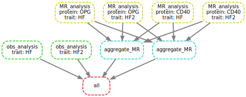

```{r setup, include=FALSE}
set.seed(0)
knitr::opts_chunk$set(
  out.extra = 'style="display:block; margin: auto"',
  fig.align = "center",
  fig.path = "es/",
  collapse = TRUE,
  comment = "#>",
  dev = "png")
```

## Mendelian randomization analysis

The required files are available from the `snakemake` subdirectory inside the installed package or `inst/snakemake` directory in the source package.

Steps to set up the environment are outlined below, while `MendelianRandomization` v0.6.0 is used together with a bug fix in `workflow/r/MR_functions.R`. The workflow has been heavily edited for simplicity, efficiency and generality.
Currently `input/` contains data on CD40, OPG and heart failures -- to imitate additional trait, HF statistics are duplicated as HF2.

The code chunks below gives `output`/`MR_HF.csv` (MR results) and `Obs_HF.csv` (meta-analysis results based on observational studies) and similarly for HF2.

```bash
module load miniconda3/4.5.1
export csd3path=/rds/project/jmmh2/rds-jmmh2-projects/olink_proteomics/scallop
source ${csd3path}/miniconda37/bin/activate
# 1. a dry run (-n).
snakemake --dry-run
# 2. run (-c on [all] available cores without --use-conda option as local packages are more up-to-date)
snakemake --cores
# 3. contrast with original output for OPG
# grep OPG output/MR_HF.csv | diff - <(grep OPG ${csd3path}/cvd1-hf/results/res_MR_aggregate.csv)
# 4. Some ancillary work in place.
snakemake --rulegraph | dot -Tsvg > output/rulegraph.svg
snakemake --dag | dot -Tsvg > output/dag.svg
```




## References

[https://github.com/snakemake-workflows/](https://github.com/snakemake-workflows/)

[](https://www.ahajournals.org/doi/10.1161/CIRCULATIONAHA.121.056663)
[](https://zenodo.org/badge/latestdoi/429122036)

## Appendix: Installation

### GitHub

[GitHub](https://github.com/snakemake/snakemake) ([documentation](https://snakemake.github.io/), [stable](https://snakemake.readthedocs.io/en/stable/))

Note that in the following `source` instead of `conda` is used to activate.

### Anaconda3

[https://www.anaconda.com/](https://www.anaconda.com/)

```bash
wget https://repo.anaconda.com/archive/Anaconda3-2020.07-Linux-x86_64.sh
bash Anaconda3-2020.07-Linux-x86_64.sh
# snakemake
conda create -n anaconda
conda remove -n anaconda snakemake
conda install -c bioconda snakemake
source activate snakemake
conda update -n anaconda snakemake
```

The remove option is useful when resolving compatibility issues.

### Miniconda3

[https://docs.conda.io/en/latest/miniconda.html](https://docs.conda.io/en/latest/miniconda.html)

```bash
wget https://repo.continuum.io/miniconda/Miniconda3-latest-Linux-x86_64.sh
bash Miniconda3-latest-Linux-x86_64.sh
conda config --add channels bioconda
conda config --add channels conda-forge
conda create -y --name miniconda python=3.7
source activate miniconda
conda install -c bioconda fastqc
```

or to do this permenantly.

```bash
# all users
# sudo ln -s /usr/local/Cluster-Apps/miniconda3/4.5.1/etc/profile.d/conda.sh /etc/profile.d/conda.sh
# current user
echo ". /usr/local/Cluster-Apps/miniconda3/4.5.1/etc/profile.d/conda.sh" >> ~/.bashrc
# conda's base (root) environment on PATH
conda activate
# the base environment on PATH permanently
echo "conda activate" >> ~/.bashrc
```

such that

```bash
snakemake --j4 --use-conda
snakemake --profile slurm
```

The first line calls for conda and the second links to slurm.

```bash
mkdir $HOME/.config/Snakemake/slurm
cp slurm.yaml $HOME/.config/Snakemake/slurm
touch $HOME/.config/Snakemake/slurm/slurm.yaml
```

Additional information is available from here, [https://ucdavis-bioinformatics-training.github.io/2020-Genome_Assembly_Workshop/snakemake/snakemake_intro](https://ucdavis-bioinformatics-training.github.io/2020-Genome_Assembly_Workshop/snakemake/snakemake_intro). In particular, the parameters are specified through `cluster.json`

```json
{
    "__default__" :
    {
        "time" : "0:20:00",
        "nodes": 1,
        "ntasks": 1,
        "cpus" : 1,
        "mem": 2000,
        "output": "snakemake%A.out",
        "error": "snakemake%A.err",
        "reservation": "genome_workshop",
        "partition": "production",
        "account": "genome_workshop"
    }
}
```

and our call becomes

```bash
snakemake -j 99 --cluster-config cluster.json --cluster "sbatch -t {cluster.time} --output {cluster.output} --error {cluster.error} --nodes {cluster.nodes} --ntasks {cluster.ntasks} --cpus-per-task {cluster.cpus} --mem {cluster.mem} --partition {cluster.partition} --account {cluster.account} --reservation {cluster.reservation}" --use-conda --latency-wait 50
```

### Further information

Edwards D (2022). Plant Bioinformatics-Methods and Protocols, 3e. https://link.springer.com/book/10.1007/978-1-0716-2067-0. [Chapter 11](https://link.springer.com/protocol/10.1007/978-1-0716-2067-0_11); [Chapter 9](https://link.springer.com/protocol/10.1007/978-1-0716-2067-0_9).

csd3, [https://cambridge-ceu.github.io/csd3/applications/snakemake.html](https://cambridge-ceu.github.io/csd3/applications/snakemake.html).

snakemake-with-R, [https://github.com/fritzbayer/snakemake-with-R](https://github.com/fritzbayer/snakemake-with-R).
